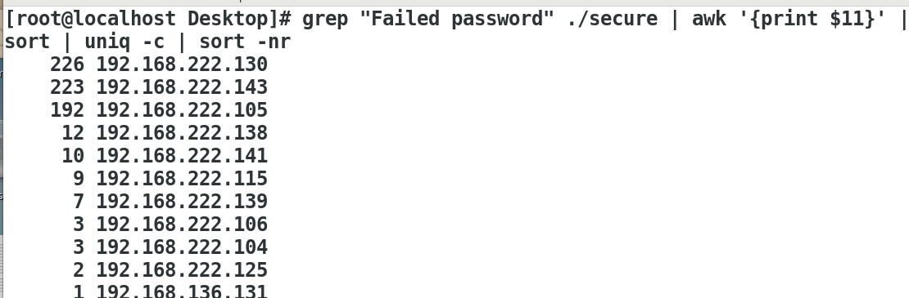
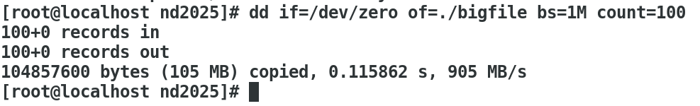
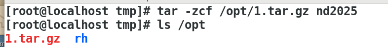
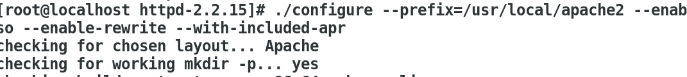
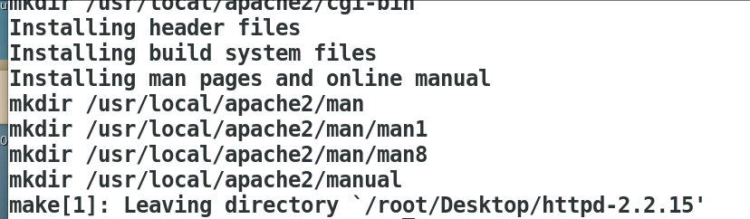
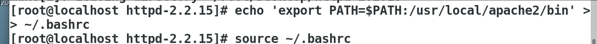
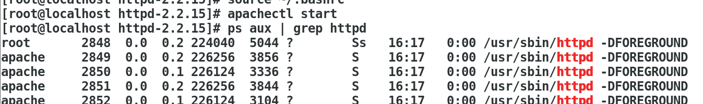
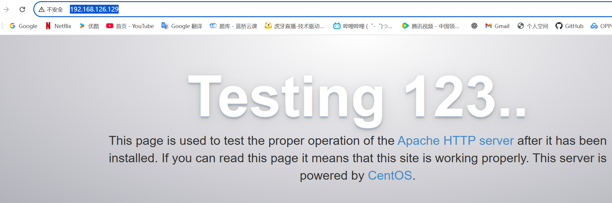
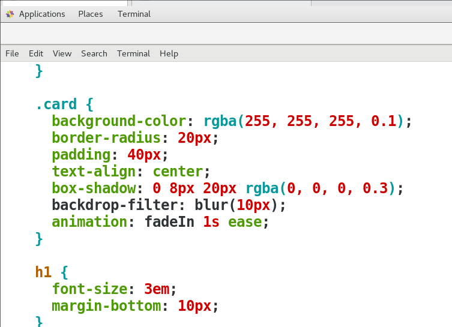
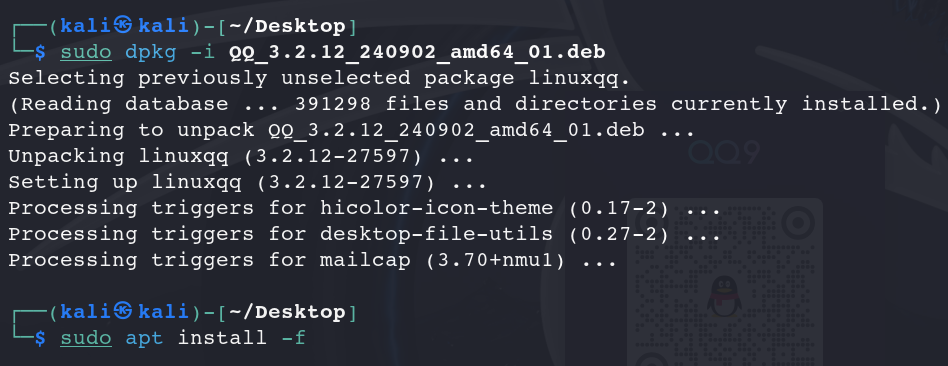

## **1. 去重并统计每个 IP 的攻击次数**

使用 `grep`、`awk`、`sort`、`uniq` 对 `/var/log/secure` 日志分析：

```bash
grep "Failed password" ./secure | awk '{print $11}' | sort | uniq -c | sort -nr
```



------

## **2. 在 /tmp/ 中创建 nd2025 目录，并生成一个 100M 的 bigfile 文件**

```bash
mkdir /tmp/nd2025
cd /tmp/nd2025
dd if=/dev/zero of=./bigfile bs=1M count=100
```



------

## **3. 使用 gzip 工具打包并压缩该目录到 /opt**

```bash
cd /tmp
tar -zcf /opt/1.tar.gz nd2025
```



------

## **4. 将压缩文件解压到桌面 /root/Desktop**

```bash
cd /opt
tar -zxf 1.tar.gz -C /root/Desktop/
```


------

## **5. 使用源码包安装 httpd 服务并发布网站（以自己名字作为内容）**

### 解压源码包

```bash
cd /root/Desktop
tar -zxvf httpd-2.2.15.tar.gz
cd httpd-2.2.15
```



------

### 编译配置

```bash
./configure --prefix=/usr/local/apache2 --enable-so --enable-rewrite --with-included-apr
```

------

### 编译并安装

```bash
make
make install
```



------

### 添加 apache 可执行路径到环境变量

```bash
echo 'export PATH=$PATH:/usr/local/apache2/bin' >> ~/.bashrc
source ~/.bashrc
```



------

### 启动 Apache 服务并验证

```bash
apachectl start
ps aux | grep httpd
```



------

### 浏览器访问测试页面

http://192.168.126.129/



------

### 修改主页内容

```bash
vim /usr/local/apache2/htdocs/index.html
```

或

```bash
vim /var/www/html/index.html
```

写入自己的名字，例如：

```html
<h1>ZGG01</h1>
```



------

### 访问验证主页修改成功


------

## **6. 在 Kali 系统中安装 QQ 并成功登录**

### 安装步骤

```bash
sudo dpkg -i QQ_3.2.12_240902_amd64_01.deb
sudo apt install -f
```



------

### 打开 QQ，登录成功

```bash
qq
```


