# 作业1

### 1. 建立名为 `top2022` 的组，组ID号为 2000

```bash
groupadd -g 2000 top2022
```

- `-g 2000` 指定组ID
- `top2022` 是组名

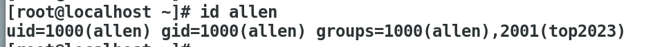

------

### 2. 建立名为 `allen` 的用户，UID为1500，基本组为 `top2022`，再建立一个附加组 `top2023`

先创建 `top2023` 组：

```bash
groupadd top2023
```

创建 `allen` 用户，指定UID和基本组：

```bash
useradd -u 1500 -g top2022 allen
```

将 `top2023` 添加为 `allen` 的附加组：

```bash
usermod -aG top2023 allen
```

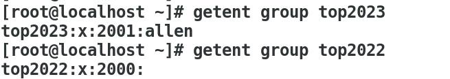

------

### 3. 为 `allen` 创建密码，并查看状态

设置密码：

```bash
passwd allen
```

查看用户密码状态：

```bash
passwd -S allen
```

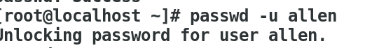

------

### 4. 锁定该用户使其不能登录

锁定：

```bash
passwd -l allen
```

解锁：

```bash
passwd -u allen
```

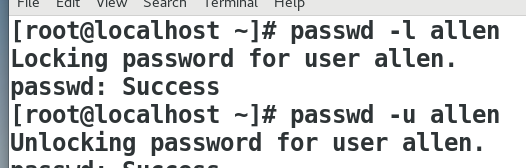

------

### 5. 修改 `allen` 用户密码最长有效期90天，并设定账户失效时间为本月底

修改密码最长有效期：

```bash
chage -M 90 allen
```

设定账户失效时间（假设今天是7月18日，月底为7月31日）：

```bash
chage -E 2025-07-31 allen
```

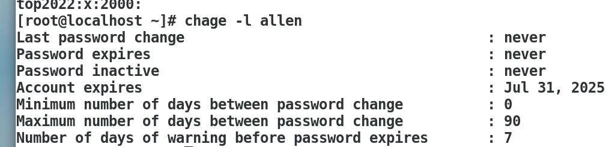

------

### 6. 建立名为 `topuser` 的用户，UID为200，没有家目录，不能登录系统

```bash
useradd -u 200 -M -s /sbin/nologin topuser
```

- `-M` 不创建家目录
- `-s /sbin/nologin` 禁止登录

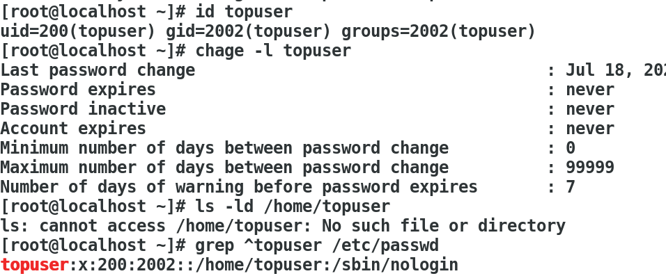

------

# 作业2

## 1. `/etc/passwd` 文件格式

每行一个用户，字段用冒号 `:` 分隔，共7个字段：

```
用户名:密码占位符:UID:GID:用户信息:家目录:登录Shell
```

- 字段1：用户名，例如 `root`
- 字段2：密码占位符，通常是 `x`，表示密码信息放在 `/etc/shadow` 文件里
- 字段3：用户ID（UID），数字标识用户身份，`0` 通常是 root
- 字段4：基本组ID（GID），数字标识用户所属基本组
- 字段5：用户详细信息（真实姓名、联系地址、电话等）
- 字段6：用户家目录路径，例如 `/root` 或 `/home/username`
- 字段7：用户登录后使用的 shell 环境，例如 `/bin/bash`, `/bin/sh`, `/sbin/nologin` 等

------

## 2. `/etc/shadow` 文件格式

存储用户密码和密码策略信息，字段用冒号 `:` 分隔，共9个字段：

```
用户名:加密密码:最后修改时间:最少使用天数:最大使用天数:提前提醒天数:密码非活跃期:账户过期时间:保留字段
```

- 字段1：用户名
- 字段2：加密后的密码（比如SHA512加密串）；如果是 `*` 或 `!` 表示该账户被锁定或无密码
- 字段3：密码最后修改时间，表示自1970-01-01以来的天数（Unix纪元）
- 字段4：密码最少使用天数，密码修改后需要过多少天才能再次修改
- 字段5：密码最大使用天数，密码到期需要修改的天数限制
- 字段6：密码过期前多少天提醒用户修改密码
- 字段7：密码失效后非活跃期，账户在密码失效后多少天后被停用
- 字段8：账户过期时间，账户超过此时间将被禁用，表示自1970-01-01以来的天数
- 字段9：保留字段，暂无使用

------

## 3. `/etc/group` 文件格式

存储系统组信息，每行一个组，字段用冒号 `:` 分隔，共4个字段：

```
组名:密码占位符:GID:组成员列表
```

- 字段1：组名
- 字段2：组密码占位符，通常为 `x`，很少使用组密码
- 字段3：组ID（GID），唯一数字标识组
- 字段4：组成员列表，逗号分隔的用户名，表示该组的附加成员（非基本组）

------

### 举例说明

**/etc/passwd 示例行：**

```
root:x:0:0:root:/root:/bin/bash
```

- 用户名：root
- 密码占位符：x（密码存放在shadow文件）
- UID：0（超级管理员）
- GID：0（基本组是root组）
- 用户信息：root
- 家目录：/root
- 登录Shell：/bin/bash

------

**/etc/shadow 示例行：**

```
root:$6$saltsalt$hashhashhashhashhashhash:18262:7:90:7:30:0:
```

- 用户名：root
- 加密密码：`$6$saltsalt$hashhashhashhashhashhash`（SHA512加密）
- 密码最后修改时间：18262天（1970-01-01开始计算）
- 密码最少使用天数：7天
- 密码最大使用天数：90天
- 提前提醒天数：7天
- 密码非活跃期：30天
- 账户过期时间：0（不限制）

------

**/etc/group 示例行：**

```
root:x:0:
wheel:x:10:root,allen
```

- 组名：root，wheel
- 密码占位符：x
- GID：0（root组）、10（wheel组）
- 组成员列表：wheel组中有 root 和 allen 作为附加组成员

------

# 作业三 挂载本地光盘yum

光盘位置：`/run/media/root/CentOS 7 x86_64`

注意，路径中空格需要转义，写成 `CentOS\ 7\ x86_64/` 或用双引号 `"CentOS 7 x86_64"/`。

------

### 查询lftp是否存在

```bash
rpm -qa | grep lftp
```

------

### 查询包描述、作用

```bash
rpm -qpi lftp-4.4.8-8.el7_3.2.x86_64.rpm
```

------

### 查询安装路径

```bash
rpm -qpl lftp-4.4.8-8.el7_3.2.x86_64.rpm
```

------

### 安装lftp

```bash
rpm -ivh lftp-4.4.8-8.el7_3.2.x86_64.rpm
```

------

### lftp解决乱码问题

中文文件名、目录名在 Linux 客户端显示乱码，常因 Windows 使用 GBK 编码，而 lftp 默认使用 UTF-8。

在 lftp 中设置编码：

```bash
set ftp:charset gbk
```

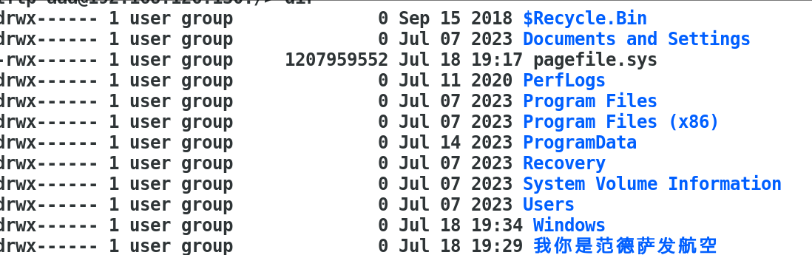

------

### 5.（选做）尝试伪造UID为0的账户

> ⚠️ 高危提醒：
>
> - 这样做完全绕过系统日志和审计
> - 容易造成系统被入侵后留下后门
> - 严重违反安全合规，不能用于生产系统

------

## 实验步骤（教学目的，仅限学习环境）

### 第 1 步：修改 `/etc/passwd`

先备份：

```bash
cp /etc/passwd /etc/passwd.bak
```

用编辑器打开：

```bash
vim /etc/passwd
```

添加一行伪 root 用户，例如：

```
fakeroot:x:0:0:Fake Root:/root:/bin/bash
```

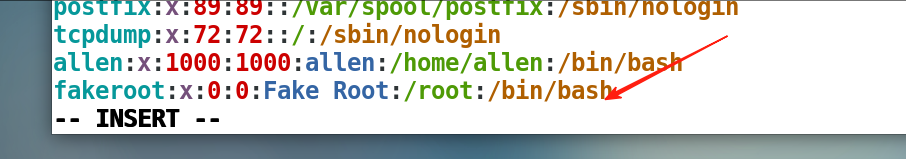

字段说明：

| 字段位置 | 含义       | 设置值                        |
| -------- | ---------- | ----------------------------- |
| 第1项    | 用户名     | fakeroot                      |
| 第2项    | 密码占位符 | x（密码存放在 `/etc/shadow`） |
| 第3项    | UID        | `0` ← 关键，表示root权限      |
| 第4项    | GID        | `0`（root组）                 |
| 第5项    | 用户描述   | Fake Root                     |
| 第6项    | 家目录     | /root（可自定义）             |
| 第7项    | Shell      | /bin/bash（或其他）           |

------

### 第 2 步：修改 `/etc/shadow`

备份：

```bash
cp /etc/shadow /etc/shadow.bak
```

编辑：

```bash
vim /etc/shadow
```

添加一行：

```bash
fakeroot:$7$randomsalt$W2BoR7NRHg.FKnwDAhdMeiAlEH.NFpIpQHZyXDHUIqPqoJZoZ3kFZXJ9hHCBMSV4BLwDb/cZ5x4T3UYbDHNeV/:19300:0:99999:7:::
```

> 说明：
>
> - `$6$...` 是加密后的密码，可以复制 root 用户的密码字符串

检查是否添加成功：

```bash
grep fakeroot /etc/passwd
grep fakeroot /etc/shadow
```

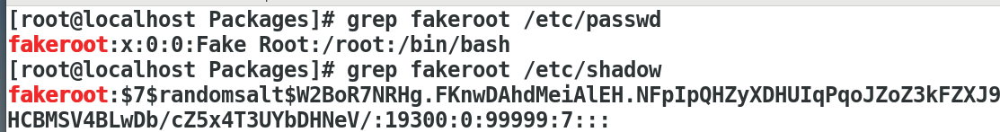

------

### 第 3 步：测试登录

```bash
su - fakeroot
```

输入密码，登录成功后：

```bash
whoami
```

输出应为：

```
root
```

因为UID=0。

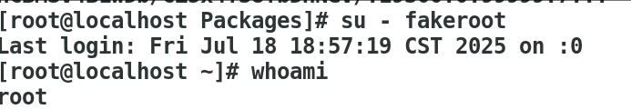

------

## 验证是否存在多个 UID=0 用户

```bash
awk -F: '$3 == 0' /etc/passwd
```

示例输出：

```
root:x:0:0:root:/root:/bin/bash
fakeroot:x:0:0:Fake Root:/root:/bin/bash
```

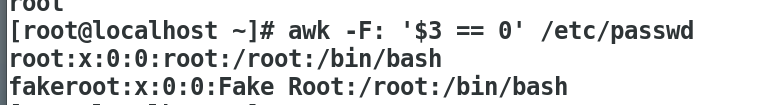

