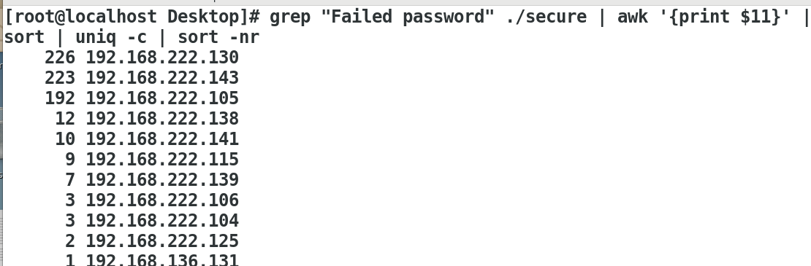
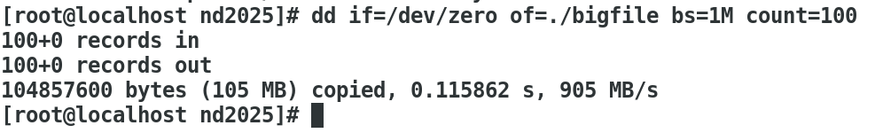
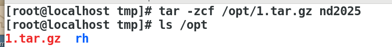
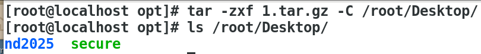
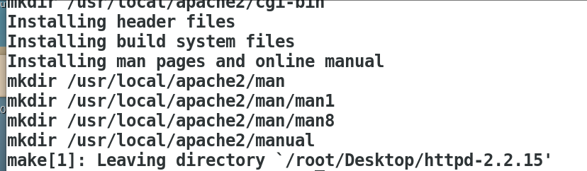
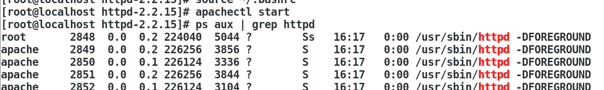
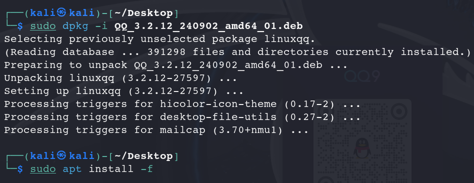

\# 去重并统计每个 IP 的攻击次数 

grep "Failed password" ./secure | awk '{print $11}' | sort | uniq -c | sort -nr

在/tmp/中建立nd2025目录，然后在其中建立bigfile文件大小100M

dd if=/dev/zero of=./bigfile bs=1M count=100
100+0 records in

3、要求将/tmp/nd2025目录 打包并压缩到 /opt目录中 压缩工具选择 gzip工具

tar -zcf /opt/1.tar.gz nd2025

4、将压缩后的文件nd2025.tar.gz  解压到 桌面上 /root/Desktop

tar -zxf 1.tar.gz -C /root/Desktop/

5、使用源码包安装httpd服务，并且可以发布网站，以自己的名字作为内容

解压

cd /root/Desktop
tar -zxvf httpd-2.2.15.tar.gz
cd httpd-2.2.15

安装

./configure --prefix=/usr/local/apache2 --enable-so --enable-rewrite --with-included-apr

编译，安装

make

make install

添加可执行文件路径

echo 'export PATH=$PATH:/usr/local/apache2/bin' >> ~/.bashrc
source ~/.bashrc

启动服务并查看是否正常运行

apachectl start

ps aux | grep httpd

成功在http://192.168.126.129/访问到测试界面

修改主页

vim /var/www/html/index.html

成功访问

6、在kali系统中成功安装QQ并登陆，

安装

sudo dpkg -i QQ_3.2.12_240902_amd64_01.deb

sudo apt install -f

输入qq，打开成功

