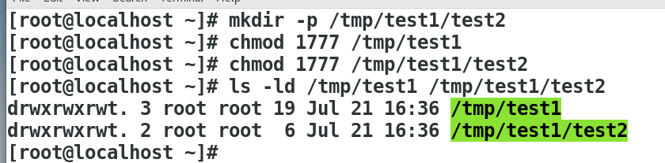
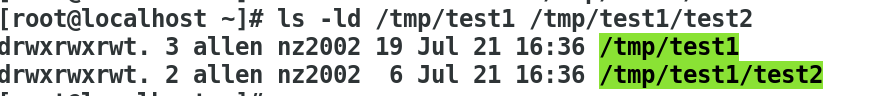
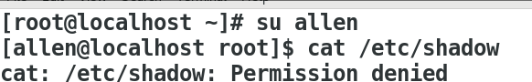
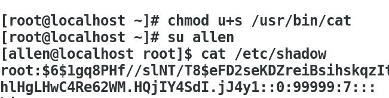
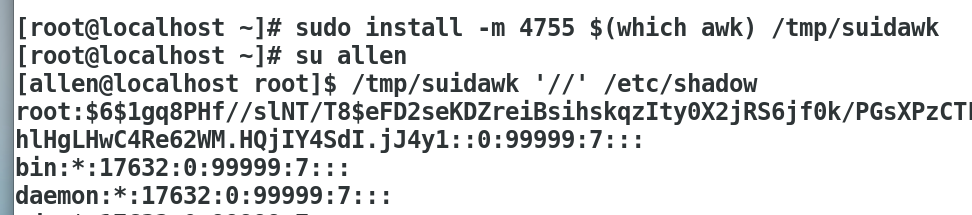
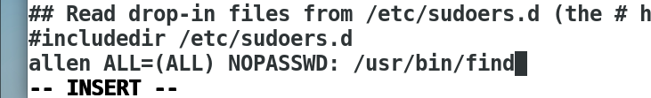
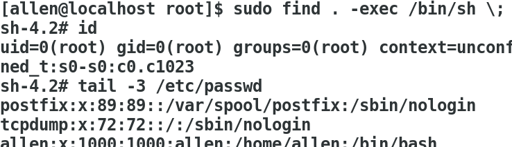

✅ 作业 1：设置 `/tmp/test1/test2` 的权限为 `rwxrwxrwt`（1777）

### 🔧 步骤 1. 创建目录：

```bash
mkdir -p /tmp/test1/test2
```

### 🔧 步骤 2. 修改权限为 1777（带粘滞位）

```bash
chmod 1777 /tmp/test1
chmod 1777 /tmp/test1/test2
```

### ✅ 验证：

```bash
ls -ld /tmp/test1 /tmp/test1/test2
```



| 权限数值 | 说明                               | 安全性 | 用途                   |
| -------- | ---------------------------------- | ------ | ---------------------- |
| `0777`   | 所有人可读写删，无限制             | ❌ 危险 | 禁用（极不安全）       |
| `1777`   | 粘滞位，所有人可写，不能删他人文件 | ✅ 安全 | `/tmp` 等公共临时目录  |
| `2777`   | SGID 位，文件自动继承目录组        | ⚠️ 中等 | 小组协作目录（需谨慎） |
| `3777`   | SGID + 粘滞位，组继承+安全删除机制 | ✅ 推荐 | 安全共享目录           |

------

## ✅ 作业 2：将 `test1` 和 `test2` 的所属者设定为 allen，所属组设定为 nz2002

### 🔧 步骤 1. 创建用户和组

```bash
groupadd nz2002
useradd -g nz2002 allen
```

### 🔧 步骤 2. 修改目录所属者和组

```bash
chown allen:nz2002 /tmp/test1
chown allen:nz2002 /tmp/test1/test2
```

### ✅ 验证：

```bash
ls -ld /tmp/test1 /tmp/test1/test2
```



------

## ✅ 作业 3：找到两种命令字，授予 SUID 权限，以普通用户运行，测试是否以 root 身份执行

### 🔧 示例命令 1：`/usr/bin/cat`（显示系统文件）

```bash
chmod u+s /usr/bin/cat
```

### 🔧 普通用户测试：

```bash
cat /etc/shadow
```

如果没有 SUID：**Permission denied**

 

加上 SUID 后：**普通用户可读 /etc/shadow**



------

### 🔧 示例命令 2：使用 `awk` 提权读取文件

```
sudo install -m 4755 $(which awk) /tmp/suidawk
```

🔧 普通用户测试：

```
/tmp/suidawk '//' /etc/shadow
```




------

## 🔧 示例命令 3：sudo find 提权

### 🧩 操作流程：

#### 【1】root 用户配置 sudo 权限

```bash
visudo
```

在文件末尾添加：

```bash
allen ALL=(ALL) NOPASSWD: /usr/bin/find
```

说明：允许 `allen` 无需密码以 root 身份执行 `/usr/bin/find` 命令



------

#### 【2】切换到 allen 用户，执行提权命令

```bash
su - allen
sudo find . -exec /bin/sh \; -quit
```

- `-exec /bin/sh \;`：调用 shell（继承 root 权限）
- `-quit`：只执行一次，避免遍历大量文件

------

#### 【3】提权验证

执行 `id` 查看 UID 是否为 0（即 root）：

```bash
id
```

输出示例：

```
uid=0(root) gid=0(root) groups=0(root)
```

说明：`allen` 已获取 root 权限！



