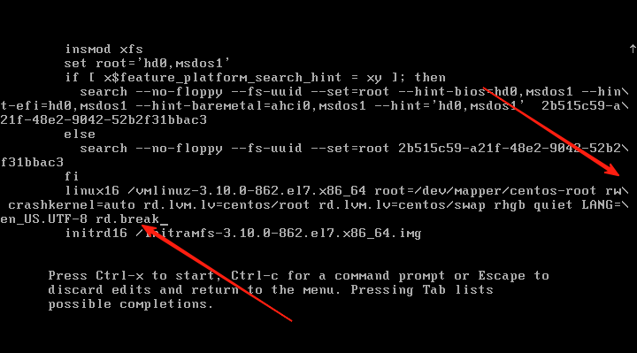

## 🔐 **1. GRUB菜单加密**

### 🎯 目标：为GRUB设置超级用户和密码

### 步骤如下：

#### （1）生成加密密码：

```bash
grub2-mkpasswd-pbkdf2
```

系统会提示输入密码，输出一个形如 `grub.pbkdf2.sha512...` 的字符串。

```
PBKDF2 hash of your password is grub.pbkdf2.sha512.10000.44F55C183CB950EE3908393F4B3D9541DDDA663515A8DB3FAEC2BA2738FF188D329327048446353D42E6261542096FD83B9E3F11E4CA875B8C67751C4F27A019.77160BA5D9E070C43BE43629CD767DBBBCE572F9CAEABEF2F2AA3F80C2CF816DA26B119DC108AF58E25EF5AEECF237CDAEDD040626F54A2BE392C426B6040DA1
```

#### （2）配置 `/etc/grub.d/40_custom` 添加超级用户配置：

```bash
cat << EOF >> /etc/grub.d/40_custom
set superusers="bob"
password_pbkdf2 bob grub.pbkdf2.sha512.10000.44F55C183CB950EE3908393F4B3D9541DDDA663515A8DB3FAEC2BA2738FF188D329327048446353D42E6261542096FD83B9E3F11E4CA875B8C67751C4F27A019.77160BA5D9E070C43BE43629CD767DBBBCE572F9CAEABEF2F2AA3F80C2CF816DA26B119DC108AF58E25EF5AEECF237CDAEDD040626F54A2BE392C426B6040DA1
EOF
```


#### （3）重新生成grub配置：

```bash
grub2-mkconfig -o /boot/grub2/grub.cfg
```


#### (4)进入grub需要密码


------

## 🛠️ **2. 忘记 root 密码的解决方法（救援模式恢复）**

### 步骤整理如下：

#### （1）重启系统，进入 **GRUB菜单**

- 按 `e` 进入编辑模式。

#### （2）修改内核参数：

找到以下行：

```bash
linux16 /vmlinuz-xxx ro ...
```

修改：

- 将 `ro` 改为 `rw`
- 在最后添加：`rd.break`



#### （3）启动救援模式：

- 按下 `Ctrl + x` 启动系统。

#### （4）挂载根文件系统并清空密码：

```bash
chroot /sysroot
passwd -d root        # 清除root密码
touch /.autorelabel   # SELinux重新标记
exit
exit
```


#### （5）重启系统：没有密码

```bash
reboot
```


------

## 🧠 **3. 进程管理**

### 基础命令回顾：

| 命令          | 功能                                  |
| ------------- | ------------------------------------- |
| `ps aux`      | 显示所有进程                          |
| `pstree -p`   | 树状显示进程及其 PID                  |
| `top`         | 实时监控系统进程（按 `k` 可杀死进程） |
| `jobs`        | 查看当前终端的后台/暂停任务           |
| `fg %编号`    | 唤醒任务到前台                        |
| `kill -9 PID` | 强制杀死某个进程                      |

### 作业3：写一个死循环脚本并通过 PID 杀死

#### 死循环脚本：

```bash
vim loop.sh
```

内容如下：

```bash
#!/bin/bash
while true
do
  echo "Running..."
  sleep 1
done
```


执行脚本：

```bash
chmod +x loop.sh
./loop.sh
```


使用 `ps aux | grep loop.sh` 找出进程 PID：


使用 `kill -9` 终止：

```bash
kill -9 3064
```


------

## 🔧 **4. 服务管理 systemctl**

### 常见命令：

```bash
systemctl start httpd        # 启动服务
systemctl stop httpd         # 停止服务
systemctl restart httpd      # 重启服务
systemctl status httpd       # 查看服务状态
systemctl enable httpd       # 设置开机自启
systemctl disable httpd      # 禁止开机自启
systemctl list-unit-files    # 列出所有服务
```

### 作业4：设置 `httpd` 服务开机自启

```bash
sudo systemctl start httpd
sudo systemctl enable httpd
```

验证是否成功：

```bash
systemctl is-enabled httpd
```


------

## 🌐 **5. 配置静态 IP（附带作业5）**

### NAT 模式下网络设置：

#### 方法一：临时配置（重启失效）

```bash
ip addr add 192.168.133.251/24 dev ens33
ip route add default via 192.168.133.2
echo "nameserver 8.8.8.8" > /etc/resolv.conf
```

#### 方法二：永久配置

编辑配置文件：

```bash
vim /etc/sysconfig/network-scripts/ifcfg-ens33
```

内容如下：

```bash
DEVICE=ens33
BOOTPROTO=static
ONBOOT=yes
IPADDR=192.168.126.88
NETMASK=255.255.255.0
GATEWAY=192.168.126.2
DNS1=114.114.114.114
DNS2=8.8.8.8
```

重启网络服务：

```bash
systemctl restart NetworkManager
```

验证：

```bash
ip addr show ens33
```


测试DNS解析：

```bash
nslookup www.baidu.com
```


