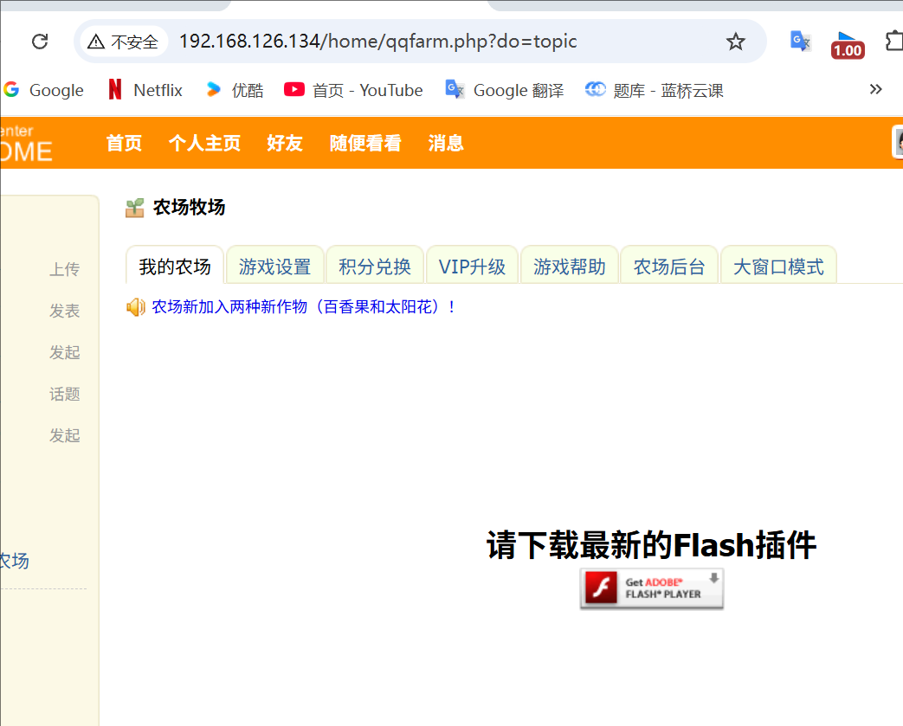

## ✅ 作业 1：实现 Apache 文件共享、访问控制功能

### 1.1 文件共享功能（网站发布）

1. 确保 Apache 安装：

   ```bash
   yum -y install httpd
   ```

2. 配置 Apache 主配置文件：
    文件路径：`/etc/httpd/conf/httpd.conf`

3. 发布目录（默认）：

   ```bash
   DocumentRoot "/var/www/html"
   ```

4. 把你的网站文件放到 `/var/www/html` 中，修改权限：

   ```
   cat > /var/www/html/index.html <<EOF
   <!DOCTYPE html>
   <html lang="zh-CN">
   <head>
       <meta charset="UTF-8">
       <title>欢迎来到我的网站</title>
   </head>
   <body>
       <h1>欢迎来到我的 Apache 网站主页！</h1>
       <p>这是一个静态主页页面。</p>
   </body>
   </html>
   EOF
   ```

   ```bash
   chown -R apache:apache /var/www/html
   ```

5. 启动并设置开机启动：

   ```bash
   systemctl start httpd
   systemctl enable httpd
   ```

### 1.2 设置访问控制（基于 IP 拒绝）

#### 方法一：使用 `Require not ip` 拒绝访问

编辑 `/etc/httpd/conf/httpd.conf` 找到 `<Directory "/var/www/html">` 段落，添加：

```apache
<Directory "/var/www/html">
    Options Indexes FollowSymLinks
    AllowOverride None
    <RequireAll>
        Require all granted
        Require not ip 192.168.126.0/24
    </RequireAll>
</Directory>
```


#### 方法二：使用传统方式（兼容老版本 Apache）

```apache
<Directory "/var/www/html">
    Order Deny,Allow
    Deny from 192.168.126
    Allow from all
</Directory>
```

保存后重启 Apache：

```bash
systemctl restart httpd
```


------

## ✅ 作业 2：实现 Apache 虚拟主机技术

### 示例：配置两个虚拟主机

1. 编辑配置文件：

   ```bash
   vim /etc/httpd/conf/httpd.conf
   ```

2. 在底部添加虚拟主机配置：

   ```apache
   <VirtualHost *:80>
       ServerName www.class1.com
       DocumentRoot /var/www/site1
   </VirtualHost>
   
   <VirtualHost *:80>
       ServerName www.class2.com
       DocumentRoot /var/www/site2
   </VirtualHost>
   ```

   

3. 创建目录和测试页面：

   ```bash
   mkdir -p /var/www/site1
   echo "This is site1" > /var/www/site1/index.html
   
   mkdir -p /var/www/site2
   echo "This is site2" > /var/www/site2/index.html
   ```

4. 客户机(windows sever2019)添加hosts记录

   ```bash
   192.168.126.133  www.class1.com
   192.168.126.133  www.class2.com
   ```

5. 重启 Apache：C:\Windows\System32\drivers\etc\hosts

   ```bash
   systemctl restart httpd
   ```

6. 浏览器访问测试：

   ```
   http://www.site1.com
   http://www.site2.com
   ```

   

------

## ✅ 作业 3：数据库增删改查、备份恢复

### 3.1 安装并启动 MariaDB

```bash
yum -y install mariadb-server
systemctl start mariadb
systemctl enable mariadb
```

### 3.2 数据库操作命令

#### 创建数据库和表

```sql
CREATE DATABASE class1;
USE class1;

CREATE TABLE users (
    id INT AUTO_INCREMENT,
    name VARCHAR(15),
    age INT,
    sex ENUM('b', 'g'),
    tel VARCHAR(15),
    PRIMARY KEY (id)
);
```

#### 插入数据

```sql
INSERT INTO users(name, age, sex, tel) VALUES ('tom', 26, 'b', '12345678901');
INSERT INTO users(name, age, sex, tel) VALUES ('jerry', 18, 'g', '12345678765');
INSERT INTO users(name, age, sex, tel) VALUES ('bob', 35, 'g', '12346578374');
```

#### 查询数据

```sql
SELECT * FROM users;
SELECT name, tel FROM users WHERE sex = 'g';
SELECT name, tel FROM users WHERE sex = 'g' AND age < 20;
```


#### 更新数据

```sql
UPDATE users SET tel='13838383838' WHERE id=1;
```

#### 删除数据

```sql
DELETE FROM users WHERE id=3;
```


### 删除表和库

> [!WARNING]
>
> ### **先做3.3的备份的相关内容**

```sql
DROP TABLE users;
DROP DATABASE class1;
```


------

### 3.3 备份与恢复

#### 备份数据库

```bash
mysqldump -u root -p123456 class1 users > /tmp/class1.users.sql
```


#### 恢复

```sql
-- 恢复：
mysql -u root -p123456 class1 < /tmp/class1.users.sql
```

或者在 mysql 中使用：

```sql
source /tmp/class1.users.sql;
```


------

# 作业4：Comsenz QQ农场动态网站完整部署流程

------

## 一、环境准备

### 1. 安装必备软件

```bash
yum -y install httpd php php-mysql php-mbstring mariadb-server unzip
systemctl enable httpd mariadb
systemctl start httpd mariadb
systemctl start httpd
```

### 2. 安装 Apache 文档（方便查看手册）

```bash
yum install httpd-manual.noarch -y
```

------

## 二、解压网站代码

### 1. 将压缩包解压到指定目录

```bash
unzip /root/Desktop/farm-ucenter1.5.zip -d /var/www/html/farm
```

### 2. 确认解压成功，主入口路径示例

```
/var/www/html/farm/upload/index.php
```

### 2.2   httpd.conf重新设置 DocumentRoot 为 `/var/www/html/farm/upload`


### 3. 开启 PHP 短标签

编辑 php.ini：

```bash
vim /etc/php.ini
# 找到并修改：
short_open_tag = On
```


------

## 三、设置目录和文件权限（非常重要）

### 1. 进入网站目录

```bash
cd /var/www/html/farm
```

### 2. 赋予 Apache 用户权限

```bash
chown -R apache:apache .
```

### 3. （可选）如果遇到 SELinux 限制，执行：

```bash
setsebool -P httpd_can_network_connect_db 1
setsebool -P httpd_unified 1
```

------

## 四、导入数据库

```bash
mysql -u root -p123456 farmdb < qqfarm.sql
```


------

## 五、启动服务并测试

### 1. 重启 Apache 服务

```bash
systemctl restart httpd
```

### 2. 在浏览器访问，进入 Comsenz 配置数据库并部署

访问网址示例：

```
http://服务器IP
```

- UCenter访问网址:
   `http://192.168.126.134/ucenter`
   UCenter创始人密码: `123.com`
- DISCUZ!访问网址:
   `http://192.168.126.134/bbs`
   管理员访问网址: `http://192.168.126.134/bbs/admincp.php`
   管理员帐号: admin
   管理员密码: 123.com
- UCenter Home访问网址:
   `http://192.168.126.134/home`
   管理员访问网址: `http://192.168.126.134/home/admincp.php`
   管理员帐号: admin
   管理员密码: 123.com

------

成功访问农场界面：



------

