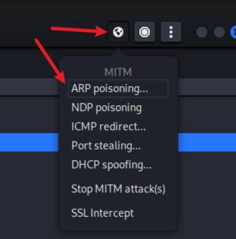

⚠️ **提醒：以下内容仅供授权测试和学习用途，严禁用于非法攻击或渗透行为。未获授权进行 ARP 欺骗和数据抓取属于违法行为，可能违反《中华人民共和国网络安全法》及相关法律法规。请严格遵守道德与法律底线。**

------

# 🛠 ARP 欺骗实验：抓取 HTTP 协议后台账号密码

------

## 🎯 实验目的

- 完成 ARP 欺骗
- 劫持 HTTP 登录数据
- 获取目标登录账号密码信息

------

## 🖥 实验环境

- **目标主机1**：Windows 7，IP：`192.168.126.141`
- **目标主机2（网关）**：IP：`192.168.126.2`
- **攻击机**：Kali Linux 

------

## ⚙ 操作步骤

------

### 1️⃣ 设置目标主机与网关

```bash
Host 192.168.126.141 added to TARGET1
Host 192.168.126.2   added to TARGET2
```


------

### 2️⃣ 启动 ARP 欺骗功能



------

### 3️⃣ 模拟受害者访问 HTTP 网站并登录

- Windows7 主机访问 HTTP 页面，并提交账号密码信息：


------

### 4️⃣ 成功抓取 HTTP 数据包

抓包日志如下：

```plaintext
GROUP 1 : 192.168.126.141  00:0C:29:BB:6C:2D
GROUP 2 : 192.168.126.2    00:50:56:FD:49:E8

HTTP : 44.228.249.3:80 -> 
USER: zhftest1  
PASS: 123.com  
INFO: http://testphp.vulnweb.com/login.php
CONTENT: uname=zhftest1&pass=123.com
```


------

## ✅ 实验结果

- ARP 欺骗成功，成为中间人
- 捕获 HTTP 明文用户名密码数据

------

## 📌 补充说明

- 此实验依赖目标访问 **明文 HTTP 协议**，HTTPS 无法通过普通 ARP 欺骗获取内容
- 推荐使用如 **Ettercap、Bettercap、dsniff** 等工具进行学习演练
- 若目标使用 HTTPS，可使用 SSLStrip 或 Burp Suite CA 签发中间证书配合浏览器绕过警告（需特别授权）

------


# VLAN 互通实验配置指导（基于华为 eNSP）

------

## 🎯 实验目标

- 实现 **VLAN10 与 VLAN30 互通**
- 确保 **同 VLAN 内设备可以通信**

------

## 🖥 设备连接拓扑


------

## 🔧 配置步骤

------

### 1️⃣ 创建 VLAN（所有交换机）

```plaintext
system-view
vlan batch 10 20 30
```

------

### 2️⃣ 配置 Access 接口（连接 PC 的端口）

#### ✅ LSW1 示例：

```plaintext
[sw1-Ethernet0/0/2] port link-type access
[sw1-Ethernet0/0/2] port default vlan 20

[sw1-Ethernet0/0/3] port link-type access
[sw1-Ethernet0/0/3] port default vlan 30
```

#### ✅ LSW2 示例：

```plaintext
[lsw2-Ethernet0/0/3] port link-type access
[lsw2-Ethernet0/0/3] port default vlan 20

[lsw2-Ethernet0/0/2] port link-type access
[lsw2-Ethernet0/0/2] port default vlan 30
```

#### ✅ LSW3（PC1，VLAN10）：

```plaintext
[lsw3-GigabitEthernet0/0/1] port link-type access
[lsw3-GigabitEthernet0/0/1] port default vlan 10
```

------

### 3️⃣ 配置 Trunk 接口（交换机之间链路）

允许 VLAN10、VLAN20、VLAN30 数据通过：

```plaintext
[sw1-Ethernet0/0/1] port link-type trunk
[sw1-Ethernet0/0/1] port trunk allow-pass vlan 10 20 30

[lsw3-GigabitEthernet0/0/2] port link-type trunk
[lsw3-GigabitEthernet0/0/2] port trunk allow-pass vlan 10 20 30

[lsw3-GigabitEthernet0/0/3] port link-type trunk
[lsw3-GigabitEthernet0/0/3] port trunk allow-pass vlan 10 20 30

[lsw2-Ethernet0/0/1] port link-type trunk
[lsw2-Ethernet0/0/1] port trunk allow-pass vlan 10 20 30
```

> 🔁 其它交换机之间的连接也需按照相同方式配置

------

### 4️⃣ 配置三层交换功能（LSW3）

#### 配置各 VLAN 接口 IP：

```plaintext
interface Vlanif10
 ip address 192.168.10.254 255.255.255.0

interface Vlanif20
 ip address 192.168.20.254 255.255.255.0

interface Vlanif30
 ip address 192.168.30.254 255.255.255.0
```

------

### 5️⃣ 配置 PC 的 IP、子网掩码及默认网关

| PC   | VLAN   | IP 地址       | 子网掩码      | 默认网关       |
| ---- | ------ | ------------- | ------------- | -------------- |
| PC1  | VLAN10 | 192.168.10.10 | 255.255.255.0 | 192.168.10.254 |
| PC2  | VLAN20 | 192.168.20.10 | 255.255.255.0 | 192.168.20.254 |
| PC3  | VLAN30 | 192.168.30.10 | 255.255.255.0 | 192.168.30.254 |
| PC4  | VLAN20 | 192.168.20.11 | 255.255.255.0 | 192.168.20.254 |
| PC5  | VLAN30 | 192.168.30.11 | 255.255.255.0 | 192.168.30.254 |

------

## ✅ 测试方法

在 PC 命令行中执行如下命令测试通信情况：

```bash
ping 192.168.30.11   # PC1 ping PC5（VLAN10 与 VLAN30 互通）
ping 192.168.20.11   # PC2 ping PC4（同 VLAN20 内通信）
```

------

## 🧩 实验验证截图

#### ✅ VLAN10 与 VLAN30 互通：


#### ✅ 同 VLAN 通信正常：


------


