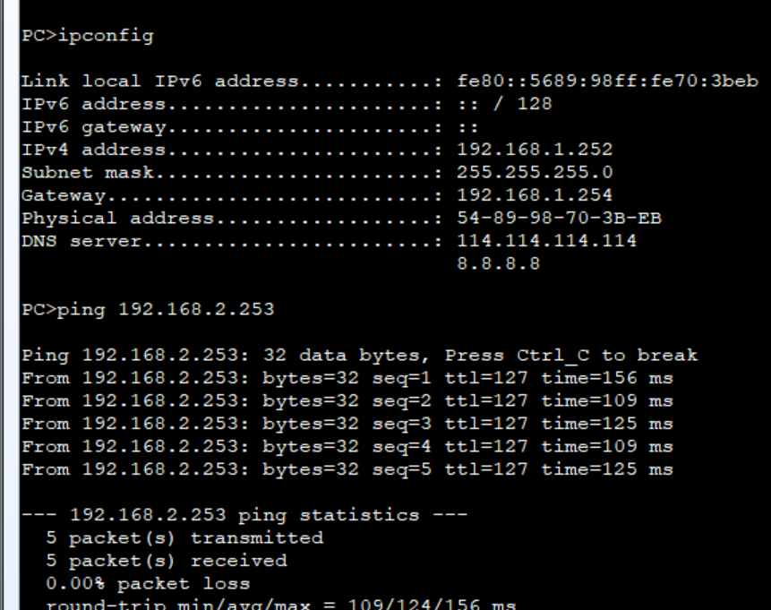
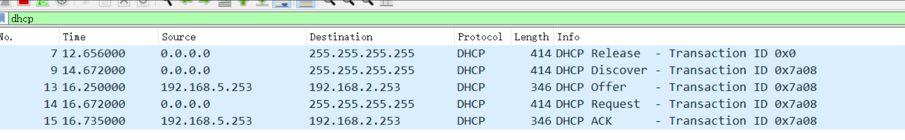

# DHCP中继实验

------

## 1. 基础概念回顾

- **DHCP 服务器**：分配 IP、网关、DNS 等给客户端
- **DHCP 中继**：当客户端和服务器不在同一网段（VLAN）时，中继转发 DHCP 请求和响应报文
- **VLAN 接口（Vlanif）**：三层交换机上用于不同 VLAN 的三层网关，配置 IP 地址

------

## 2. 实验网络环境

- 4 个 VLAN：10、20、30、40，分别对应4个PC，每个 VLAN 有独立的 IP 地址段
- 三层交换机（CORE）做路由网关并启用 DHCP 中继
- 另一台设备（DHCP-SERVER）做 DHCP 服务器，位于 VLAN 50 网段
- VLAN 50 用于三层交换机和 DHCP 服务器之间的通信

## ✅ 配置目标

```
                +--------------------+
                |      LSW4          |  DHCP Server
                |  VLAN50: 192.168.5.253
                +--------------------+
                         |
                  VLAN 50 (Trunk/Access)
                         |
                +--------------------+
                |      LSW3          |  三层交换机（网关 + DHCP Relay）
                | Vlanif10: 192.168.1.254
                | Vlanif20: 192.168.2.254
                | Vlanif30: 192.168.3.254
                | Vlanif40: 192.168.4.254
                | Vlanif50: 192.168.5.254
                +--------------------+
                 /             \
     Trunk (VLAN10,20)     Trunk (VLAN30,40)
        /                      \
  +-----------+            +-----------+
  |   LSW1    |            |   LSW2    |
  +-----------+            +-----------+
   |         |              |        |
PC1(VLAN10) PC2(VLAN20)  PC3(VLAN30) PC4(VLAN40)


```


------

## 3. DHCP 服务器（DHCP-SERVER）配置示例

```shell
system-view
vlan batch 10 20 30 40 50                     # 批量创建 VLAN 10、20、30、40、50

int GigabitEthernet0/0/1                      # 物理接口配置
 port link-type access                         # 设置为 access 端口
 port default vlan 50                          # 端口默认 VLAN 50，连接 DHCP Server 网段
 quit

dhcp enable                                   # 全局开启 DHCP 服务

interface Vlanif50                            # VLAN 50 三层接口配置（DHCP服务器所在网段）
 ip address 192.168.5.253 255.255.255.0      # 设置 VLAN50 接口 IP 地址
 dhcp select global                           # 选择全局地址池，表示此接口可为客户端提供 DHCP 服务
 quit

ip pool vlan10                                # 创建 VLAN10 地址池
 network 192.168.1.0 mask 255.255.255.0      # 定义地址池网段
 gateway-list 192.168.1.254                   # 默认网关地址（对应三层交换机Vlanif10接口）
 excluded-ip-address 192.168.1.1 192.168.1.100 192.168.1.253  # 排除这三个IP地址不分配
 dns-list 114.114.114.114 8.8.8.8            # 指定 DNS 服务器地址
 quit

ip pool vlan20                                # 创建 VLAN20 地址池
 network 192.168.2.0 mask 255.255.255.0
 gateway-list 192.168.2.254
 dns-list 8.8.8.8
 quit

ip pool vlan30                                # 创建 VLAN30 地址池
 network 192.168.3.0 mask 255.255.255.0
 gateway-list 192.168.3.254
 dns-list 8.8.8.8
 quit

ip pool vlan40                                # 创建 VLAN40 地址池
 network 192.168.4.0 mask 255.255.255.0
 gateway-list 192.168.4.254
 dns-list 8.8.8.8
 quit

ip route-static 0.0.0.0 0 192.168.5.254      # 配置默认路由，指向三层交换机CORE的Vlanif50接口（网关）

```

------

## 4. CORE 交换机（LSW3）配置示例（启用 DHCP Relay）

```shell
system-view
vlan batch 10 20 30 30 40 50          # 批量创建 VLAN 10,20,30,40,50

dhcp enable                          # 全局开启 DHCP 中继功能

# 配置物理接口 G0/0/1 为 access 模式，属于 VLAN 50
interface GigabitEthernet0/0/1
 port link-type access               # 访问端口模式
 port default vlan 50                # 端口默认 VLAN 50
 quit

# 配置 VLAN 10 的三层接口，并启用 DHCP 中继
interface Vlanif10
 ip address 192.168.1.254 255.255.255.0   # 设置 VLAN10 网关 IP
 dhcp select relay                        # 使能 DHCP 中继功能
 dhcp relay server-ip 192.168.5.253      # 指定 DHCP 服务器 IP 地址
 quit

# 配置 VLAN 20 的三层接口，并启用 DHCP 中继
interface Vlanif20
 ip address 192.168.2.254 255.255.255.0
 dhcp select relay
 dhcp relay server-ip 192.168.5.253
 quit

# 配置 VLAN 30 的三层接口，并启用 DHCP 中继
interface Vlanif30
 ip address 192.168.3.254 255.255.255.0
 dhcp select relay
 dhcp relay server-ip 192.168.5.253
 quit

# 配置 VLAN 40 的三层接口，并启用 DHCP 中继
interface Vlanif40
 ip address 192.168.4.254 255.255.255.0
 dhcp select relay
 dhcp relay server-ip 192.168.5.253
 quit

# 配置 VLAN 50 的三层接口，作为 DHCP 服务器所在的网段接口
interface Vlanif50
 ip address 192.168.5.254 255.255.255.0    # VLAN50 网关 IP（中继设备用）
 quit

# 配置交换机上连接下级交换机或设备的 trunk 接口，允许 VLAN 10,20,30,40,50 的流量通过
interface GigabitEthernet0/0/2
 port link-type trunk
 port trunk allow-pass vlan 10 20 30 40 50
 quit

interface GigabitEthernet0/0/3
 port link-type trunk
 port trunk allow-pass vlan 10 20 30 40 50
 quit

```

------

## 5. 交换机二层设备（LSW1、LSW2）端口配置示例

```shell
system-view

vlan batch 10 20 30 40

# LSW1 端口配置
interface Ethernet0/0/1
 port link-type access
 port default vlan 10
 quit

interface Ethernet0/0/3
 port link-type access
 port default vlan 20
 quit

interface Ethernet0/0/2
 port link-type trunk
 port trunk allow-pass vlan 10 20
 quit

# LSW2 端口配置
interface Ethernet0/0/1
 port link-type trunk
 port trunk allow-pass vlan 30 40
 quit

interface Ethernet0/0/2
 port link-type access
 port default vlan 30
 quit

interface Ethernet0/0/3
 port link-type access
 port default vlan 40
 quit
```

------

## 6. PC 配置

每台 PC 设置为 DHCP 自动获取 IP：

```shell
ip address dhcp
```

------

## 7. 验证

- 各 PC 成功从 DHCP 服务器获得对应 VLAN 的 IP 地址（同一 VLAN IP 段）
- 跨 VLAN 互通测试：PC1 ↔ PC3 等
- ping CORE 交换机 VLAN50 接口（192.168.5.254）



------

## 8. 抓包和报文流程简述

1. PC 发送 DHCP Discover 广播，CORE 三层交换机的 VLAN 接口收到后，根据 `dhcp select relay` 转发 DHCP Discover 到 DHCP 服务器 IP（192.168.5.253）
2. DHCP 服务器分配 IP 后发送 DHCP Offer，CORE 接收并转发给客户端
3. 客户端发 DHCP Request，服务器回应 DHCP ACK 完成地址分配



------

# 总结

- DHCP Relay 解决不同 VLAN/网段间 DHCP 服务的问题
- 华为交换机通过 `dhcp select relay` 和 `dhcp relay server-ip` 配置实现转发
- DHCP 服务器配置对应网段的 IP 池，并设置网关、DNS 等信息
- 三层交换机做各 VLAN 的三层网关，配置 VLAN 接口 IP 和 DHCP Relay
- 二层交换机配置 VLAN 和端口接入、trunk 设置

