# 🔧 网络配置实验报告

## ✅ 一、实验目标

搭建如下网络拓扑结构，通过静态路由实现不同子网间的互通。

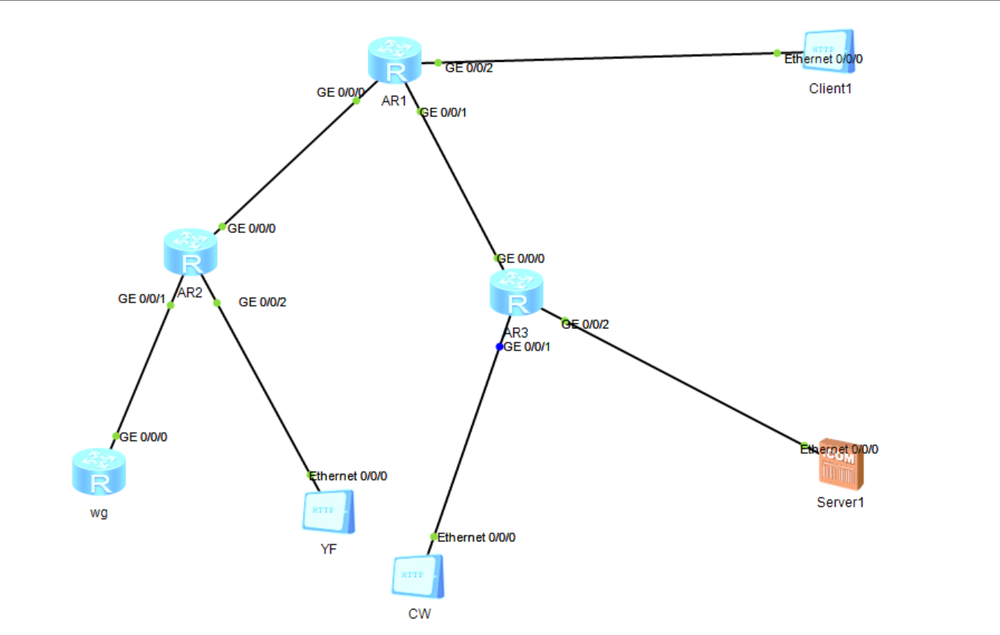

## 🌐 二、网络拓扑概览

```
                +-------------------------+
                |        Client1         |
                |     8.8.8.1/24         |
                | GW: 8.8.8.254 (R1)     |
                +-----------+------------+
                            |
                        g0/0/2
                      +--------+
                      |  R1    |
                      |        |
        +-------------+--------+--------------+
        |             |        |              |
     g0/0/0        g0/0/1   g0/0/2        (上面接 Client1)
   12.1.1.1       13.1.1.1   8.8.8.254
        |             |
        |             |
   +----+----+     +--+-----+
   |   R2    |     |  R3    |
   +----+----+     +--+-----+
        |             |
   +----+----+    +---+-----+
   |         |    |         |
g0/0/1   g0/0/2  g0/0/1   g0/0/2
10.1.1.254 11.1.1.254 14.1.1.254 15.1.1.254
   |         |    |         |
   |         |    |         |
+--+--+   +--+--+ +--+--+ +--+--+
| WG  |   | YF  | | CW  | |Server|
|PC   |   |PC   | |PC   | |Host  |
|10.1.1.1 |11.1.1.1|14.1.1.1|15.1.1.1|
+--------+ +------+ +------+ +--------+

```

## 📄 三、IP地址与设备配置

### Router R1 配置

```bash
[Huawei]sysname r1
[r1]int g0/0/0
[r1-GigabitEthernet0/0/0]ip address 12.1.1.1 255.255.255.0
[r1]int g0/0/1
[r1-GigabitEthernet0/0/1]ip address 13.1.1.1 255.255.255.0
[r1]int g0/0/2
[r1-GigabitEthernet0/0/2]ip address 8.8.8.254 255.255.255.0

[r1]ip route-static 10.1.1.0 255.255.255.0 12.1.1.2
[r1]ip route-static 11.1.1.0 255.255.255.0 12.1.1.2
[r1]ip route-static 14.1.1.0 255.255.255.0 13.1.1.2
[r1]ip route-static 15.1.1.0 255.255.255.0 13.1.1.2
```

------

### Router R2 配置

```bash
[Huawei]sysname r2
[r2]int g0/0/0
[r2-GigabitEthernet0/0/0]ip address 12.1.1.2 255.255.255.0
[r2]int g0/0/1
[r2-GigabitEthernet0/0/1]ip address 10.1.1.254 255.255.255.0
[r2]int g0/0/2
[r2-GigabitEthernet0/0/2]ip address 11.1.1.254 255.255.255.0

[r2]ip route-static 0.0.0.0 0.0.0.0 12.1.1.1
```

------

### Router R3 配置

```bash
[Huawei]sysname r3
[r3]int g0/0/0
[r3-GigabitEthernet0/0/0]ip address 13.1.1.2 255.255.255.0
[r3]int g0/0/1
[r3-GigabitEthernet0/0/1]ip address 14.1.1.254 255.255.255.0
[r3]int g0/0/2
[r3-GigabitEthernet0/0/2]ip address 15.1.1.254 255.255.255.0

[r3]ip route-static 0.0.0.0 0.0.0.0 13.1.1.1
```

------

### WG主机（模拟PC）

```bash
IP地址：10.1.1.1
网关：10.1.1.254（连接R2）
```

------

### YF主机

```bash
IP地址：11.1.1.1
网关：11.1.1.254（连接R2）
```

------

### CW主机

```bash
IP地址：14.1.1.1
网关：14.1.1.254（连接R3）
```

------

### Server主机

```bash
IP地址：15.1.1.1
网关：15.1.1.254（连接R3）
```

------

### Client1主机

```bash
IP地址：8.8.8.1
网关：8.8.8.254（连接R1）
```

------

## 🎯 需求+ACL控制策略方案

------

### 🔒 **1. R1只允许WG登录，WG能ping通Server1和Client1**

- **解释**：
  - WG的 `10.1.1.1` 可以 Telnet/SSH 登录 R1（管理用途）
  - 其他任何主机不允许登录 R1
  - WG 可以 ping 通 Client1（8.8.8.1） 和 Server1（15.1.1.1）
- **解决方案**：

```bash
[r1]acl number 2000
[r1-acl-basic-2000]rule permit source 10.1.1.1 0
[r1-acl-basic-2000]rule deny


[r1]user-interface vty 0 4
[r1-ui-vty0-4]acl 2000 inbound           // 设置只允许 ACL 2000 登录（只允许 10.1.1.1，即 WG）
[r1-ui-vty0-4]authentication-mode aaa    // 认证方式为 AAA（也可以使用 password）

[r1]aaa
[r1-aaa]local-user HCIE password cipher HUAWEI   // 创建用户名 HCIE，密码 HUAWEI（加密方式）
[r1-aaa]local-user HCIE service-type telnet      // 设置 HCIE 用户的登录方式为 telnet

```

WG可以telnet登录r1

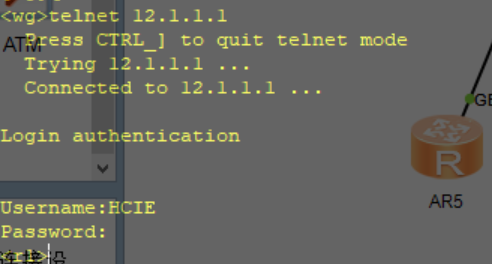

r2不能telnet登录r1


WG 可以 ping 通 Client1（8.8.8.1） 和 Server1（15.1.1.1）

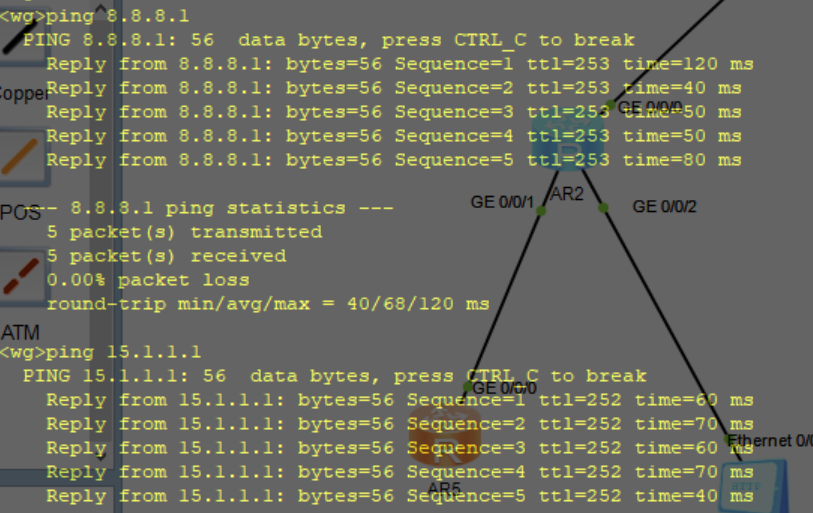

------

### 🔁 **2. YF 和 CW 不能互通，但都能与 WG 通信**

- **解释**：
  - YF: `11.1.1.1`，CW: `14.1.1.1`，WG: `10.1.1.1`
  - 所以要：
    - 阻止 YF <--> CW（双向）
    - 允许 YF <--> WG、CW <--> WG
- **解决方案**（在 R2 和 R3 上配置）

#### 在 R2 的 g0/0/0（对接 R1）口应用：

```bash
[r2]acl 3001
[r2-acl-adv-3001]rule deny ip source 11.1.1.0 0.0.0.255 destination 14.1.1.0 0.0.0.255
[r2-acl-adv-3001]rule permit ip

[r2]int g0/0/0
[r2-GigabitEthernet0/0/0]traffic-filter outbound acl 3001
```

#### 在 R3 的 g0/0/0（对接 R1）口应用：

```bash
[r3]acl 3002
[r3-acl-adv-3002]rule deny ip source 14.1.1.0 0.0.0.255 destination 11.1.1.0 0.0.0.255
[r3-acl-adv-3002]rule permit ip

[r3]int g0/0/0
[r3-GigabitEthernet0/0/0]traffic-filter outbound acl 3002
```

#### 思考：到底是放在入口（inbound）还是出口（outbound）？放在哪个接口更合理？


YF PING 不通 CW

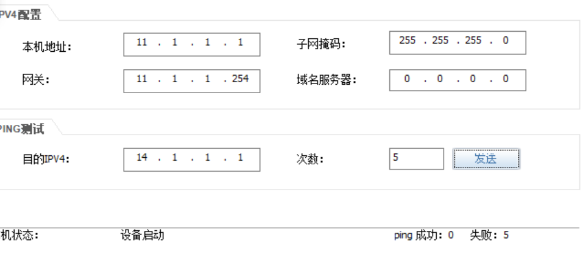

CW PING 不同 YF

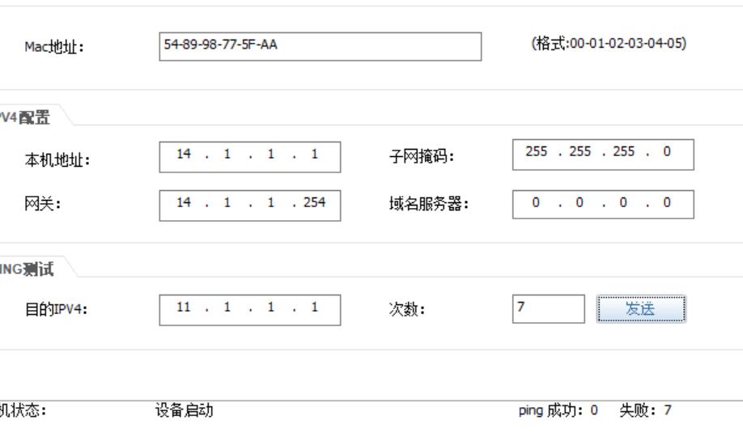

yf ping 通 wg

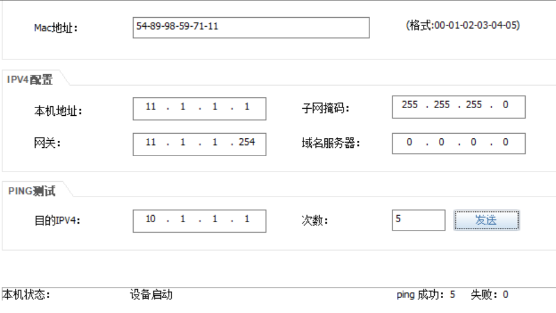

CW ping 通 WG

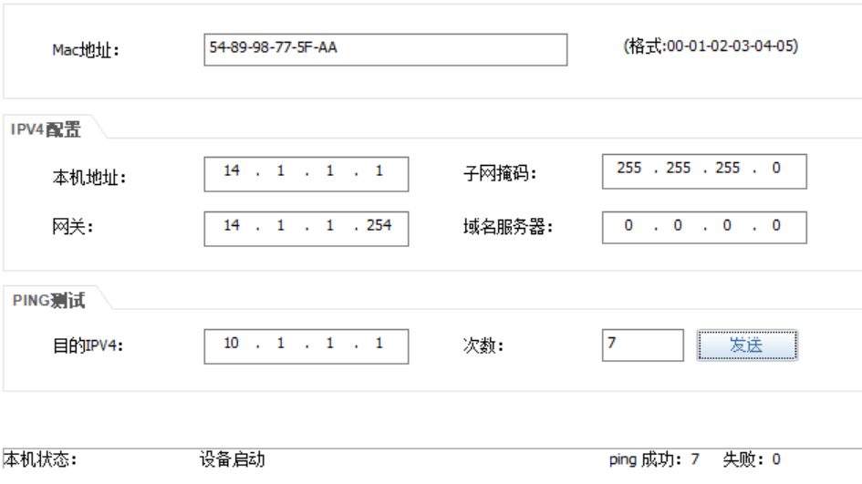

------

### 🌐 **3. YYF 可以访问 Client1（8.8.8.1）**

- **默认路由连通，不需要特别限制**
- **只要不阻断 YF --> Client1 即可**
- ✅ 已满足（不动即可）

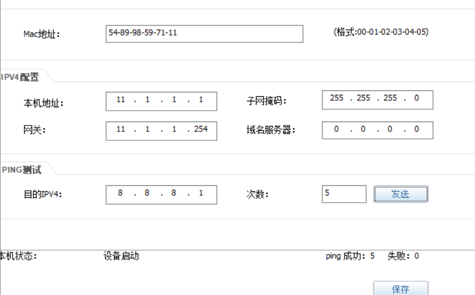

------

### ❌ **4. CW 不能访问 Client1**

- **在 R3 上限制 CW（14.1.1.1）访问 8.8.8.1**

```bash
[r3]acl 3003
[r3-acl-adv-3003]rule deny ip source 14.1.1.0 0.0.0.255 destination 8.8.8.1 0
[r3-acl-adv-3003]rule permit ip


[r3]int g0/0/0
[r3-GigabitEthernet0/0/0]undo traffic-filter outbound   (删除上个实验的绑定ACL3002,实际情况应该追加加到3002)
[r3-GigabitEthernet0/0/0]traffic-filter outbound acl 3003
```

> ⚠️ 注意：这条可以合并进上面的 3002 ACL，但分开更清晰
>
> 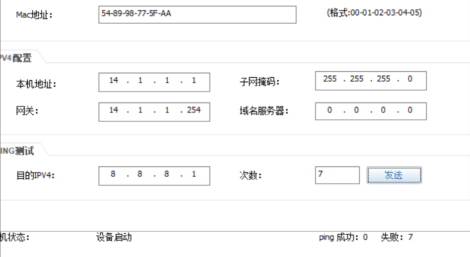

------

### 🌐 **5. YF 和 CW 只能访问 Server1 的 www 服务（TCP 80端口）**

- 限制：
  - 11.1.1.1 --> 15.1.1.1 的 TCP 80 ✅
  - 14.1.1.1 --> 15.1.1.1 的 TCP 80 ✅
  - 其余端口 deny ❌

#### 在 R3（Server1 所在路由器）配置 ACL 控制服务访问端口：

```bash
[r3]acl 3004
[r3-acl-adv-3004]rule permit tcp source 11.1.1.0 0.0.0.255 destination 15.1.1.1 0.0.0.0 destination-port eq 80
[r3-acl-adv-3004]rule permit tcp source 14.1.1.0 0.0.0.255 destination 15.1.1.1 0.0.0.0 destination-port eq 80
[r3-acl-adv-3004]rule deny ip 

[r3]int g0/0/2
[r3-GigabitEthernet0/0/2]traffic-filter outbound acl 3004
```

#### YF和CW可以访问80端口

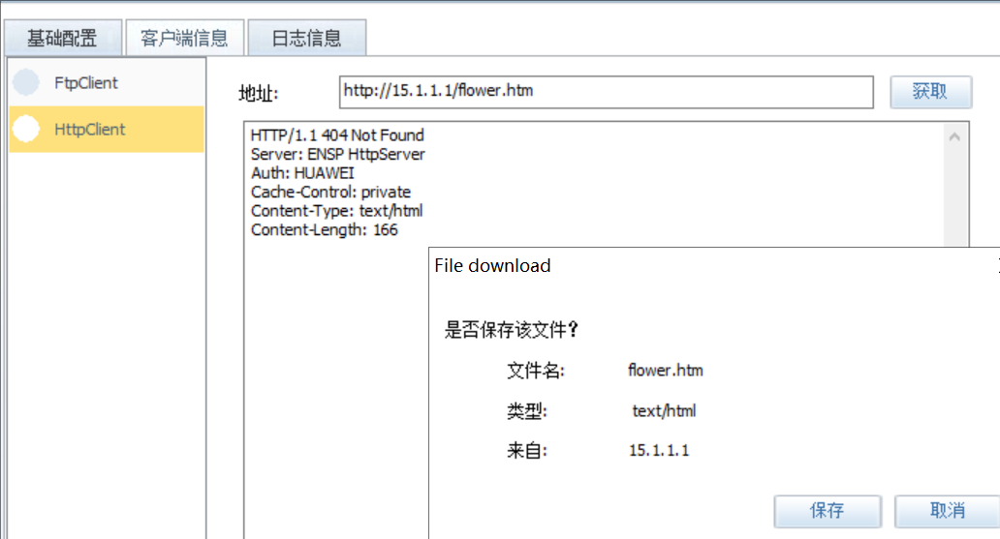

YF 和 CW ping 不通服务器

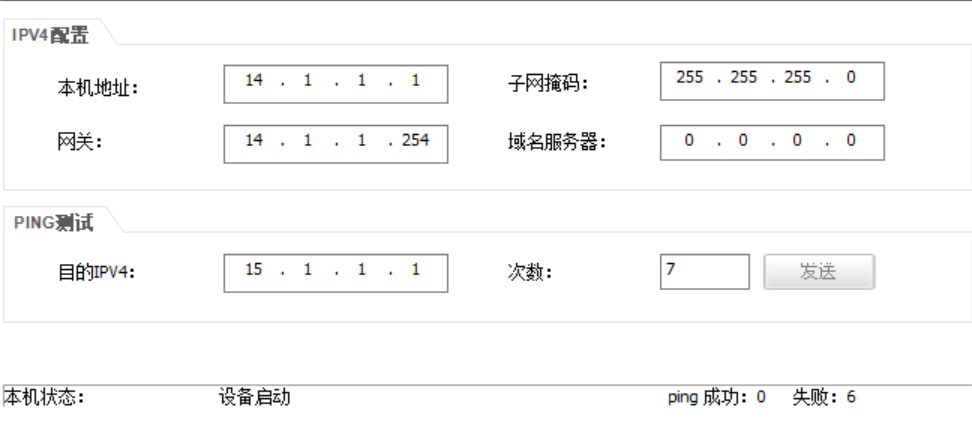


------

### 🛡️ **6. 只有 WG 才能访问 Server1 所有服务**

- WG: 10.1.1.1
- Server1: 15.1.1.1
- 实际上，**前面的规则已 deny 其他人访问 Server1 除了 TCP 80**
- 只需显式允许 WG 全部端口访问 Server1

#### 修改 ACL 3004：   

```bash
tips：display acl  ****  #显示当前规则
[r3]acl 3004
[r3-acl-adv-3004]rule 1 permit ip source 10.1.1.1 0 destination 15.1.1.1 0 #放到第一跳
```

WG 可以ping通  server

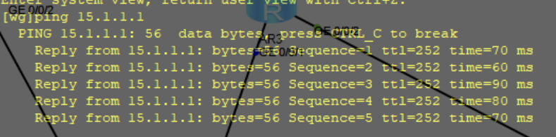

------

## ✅ 总结：ACL一览表

| 设备 | ACL ID | 功能说明                              |
| ---- | ------ | ------------------------------------- |
| R1   | 3000   | 只允许WG登录VTY                       |
| R2   | 3001   | 阻止YF访问CW                          |
| R3   | 3002   | 阻止CW访问YF                          |
| R3   | 3003   | 阻止CW访问Client1                     |
| R3   | 3004   | 控制Server1服务端口访问（含WG白名单） |

------

## 

