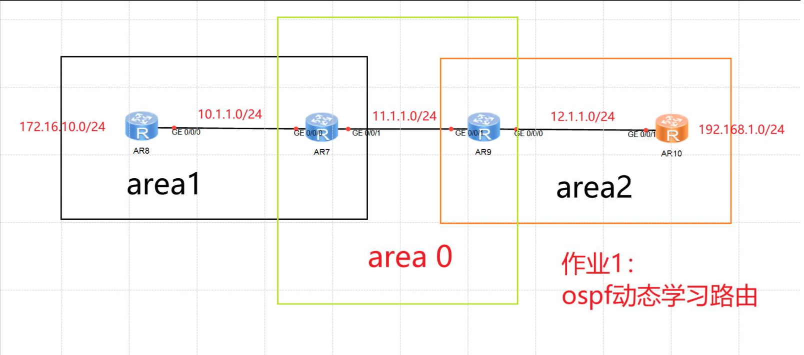
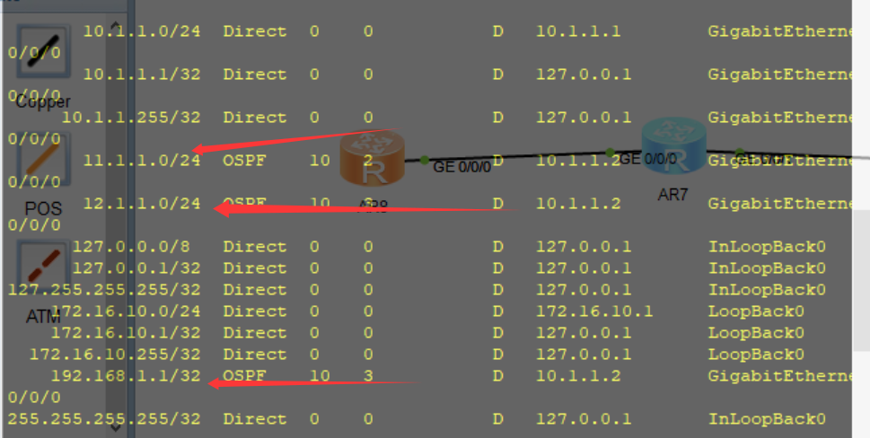
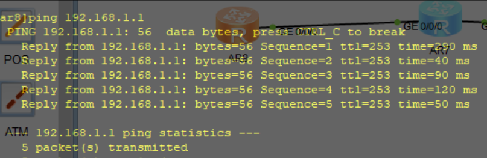
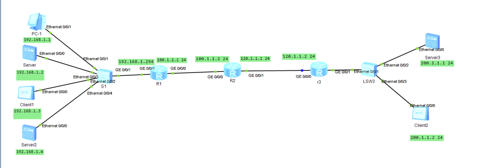
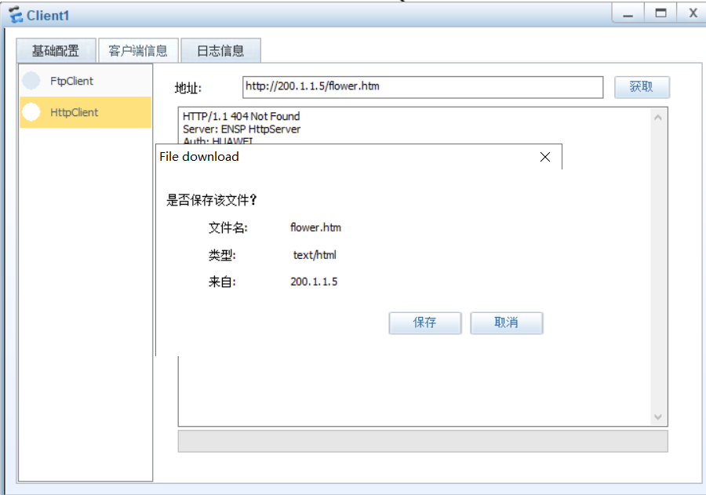
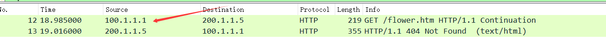
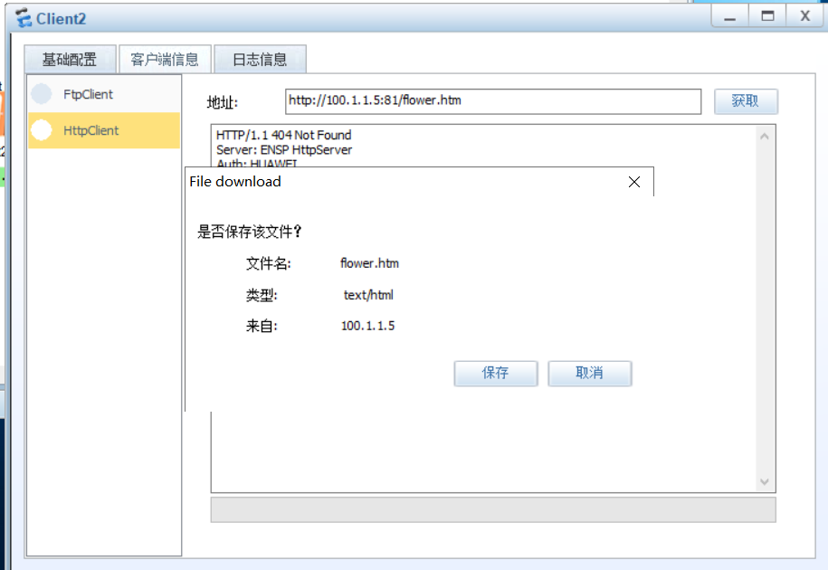
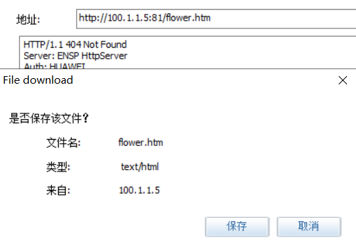
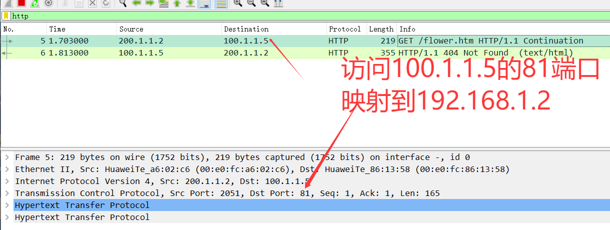
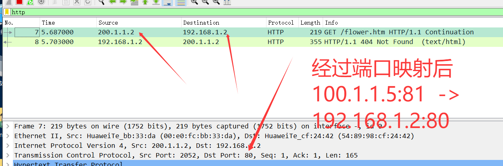

### ✅ 一、IP 地址划分（根据拓扑）



| 设备 | 接口       | IP 地址        | 对应网段       |
| ---- | ---------- | -------------- | -------------- |
| AR8  | GE0/0/0    | 10.1.1.1/24    | 10.1.1.0/24    |
| AR8  | Loopback 0 | 172.16.10.1/24 | 172.16.10.0/24 |
| AR7  | GE0/0/0    | 10.1.1.2/24    | 10.1.1.0/24    |
| AR7  | GE0/0/1    | 11.1.1.1/24    | 11.1.1.0/24    |
| AR9  | GE0/0/1    | 11.1.1.2/24    | 11.1.1.0/24    |
| AR9  | GE0/0/0    | 12.1.1.1/24    | 12.1.1.0/24    |
| AR10 | GE0/0/1    | 12.1.1.2/24    | 12.1.1.0/24    |
| AR10 | Loopback 0 | 192.168.1.1    | 192.168.1.0/24 |

------

### ✅ 二、配置步骤汇总（eNSP 中依次执行）

------

### ✅ 一、IP 地址配置部分

### 【AR8】

```bash
<Huawei> system-view                  // 进入系统视图
[Huawei] sysname AR8                 // 设置设备名称为 AR8
[AR8] interface g0/0/0               // 进入接口 GigabitEthernet0/0/0
[AR8-GigabitEthernet0/0/0] ip address 10.1.1.1 255.255.255.0  // 配置接口 IP 地址
[AR8-GigabitEthernet0/0/0] quit
[AR8] interface loopback 0          // 进入 Loopback0 接口（虚拟接口）
[AR8-LoopBack0] ip address 172.16.10.1 255.255.255.0  // 配置逻辑地址作为识别标志
```

------

### 【AR7】

```bash
<Huawei> system-view
[Huawei] sysname AR7
[AR7] interface g0/0/0
[AR7-GigabitEthernet0/0/0] ip address 10.1.1.2 255.255.255.0  // 与 AR8 同网段
[AR7-GigabitEthernet0/0/0] quit
[AR7] interface g0/0/1
[AR7-GigabitEthernet0/0/1] ip address 11.1.1.1 255.255.255.0  // 用于连接 AR9
```

------

### 【AR9】

```bash
<Huawei> system-view
[Huawei] sysname AR9
[AR9] interface g0/0/1
[AR9-GigabitEthernet0/0/1] ip address 11.1.1.2 255.255.255.0  // 与 AR7 通信
[AR9-GigabitEthernet0/0/1] quit
[AR9] interface g0/0/0
[AR9-GigabitEthernet0/0/0] ip address 12.1.1.1 255.255.255.0  // 用于连接 AR10
```

------

### 【AR10】

```bash
<Huawei> system-view
[Huawei] sysname AR10
[AR10] interface g0/0/1
[AR10-GigabitEthernet0/0/1] ip address 12.1.1.2 255.255.255.0  // 与 AR9 通信
[AR10-GigabitEthernet0/0/1] quit
[AR10] interface loopback 0
[AR10-LoopBack0] ip address 192.168.1.1 255.255.255.0  // 内部逻辑地址
```

------

### ✅ 二、OSPF 配置部分

### 【AR8】配置在 Area 1：

```bash
[AR8] ospf 1                                  // 启用 OSPF 进程 1
[AR8-ospf-1] area 1                           // 配置区域 Area 1
[AR8-ospf-1-area-1] network 10.1.1.0 0.0.0.255        // 将接口 10.1.1.1 加入 OSPF
[AR8-ospf-1-area-1] network 172.16.10.0 0.0.0.255     // 将 Loopback0 加入 OSPF
```

------

### 【AR7】连接 Area 1 和 Area 0（ABR）：

```bash
[AR7] ospf 1
[AR7-ospf-1] area 1
[AR7-ospf-1-area-1] network 10.1.1.0 0.0.0.255        // 通往 AR8 的链路属于 Area 1
[AR7-ospf-1] area 0
[AR7-ospf-1-area-0] network 11.1.1.0 0.0.0.255        // 通往 AR9 的链路属于 Area 0
```

------

### 【AR9】连接 Area 0 和 Area 2（ABR）：

```bash
[AR9] ospf 1
[AR9-ospf-1] area 0
[AR9-ospf-1-area-0] network 11.1.1.0 0.0.0.255        // 与 AR7 通信的链路
[AR9-ospf-1] area 2
[AR9-ospf-1-area-2] network 12.1.1.0 0.0.0.255        // 与 AR10 通信的链路
```

------

### 【AR10】配置在 Area 2：

```bash
[AR10] ospf 1
[AR10-ospf-1] area 2
[AR10-ospf-1-area-2] network 12.1.1.0 0.0.0.255       // 与 AR9 的物理链路
[AR10-ospf-1-area-2] network 192.168.1.0 0.0.0.255    // Loopback0 地址用于识别或测试
```


# ✅ 三、验证配置

1. **查看邻居关系是否建立**

```bash
[AR8] display ospf peer   (邻居是10.1.1.2也就是ar7)
```


2. **查看路由表是否学习到其他网段**

```bash
[AR8] display ip routing-table   (学到了11,12,192网段)
```



3.**测试连通性**

```bash
[AR8] ping 192.168.1.1
```

如果 ping 通说明路由学习成功。




# 作业二

为实现：

1. **192.168.1.0/24 网络通过 NAT 访问 200.1.1.1（Server3）**
2. **200.1.1.2（Client2）可以访问 192.168.1.2、192.168.1.4（Server、Server2）**



好的，以下是在原始配置上**添加注释说明**后的版本，内容不变，格式清晰标注，便于理解和查阅：

------

## ✅ 一、R1 上配置 NAT 实现内网访问公网

### ✅ Step 1：配置 Easy IP（源 NAT）让 192 网段上网访问公网

**R1**

```bash
# 配置 ACL 2000，匹配内网地址 192.168.1.0/24
[R1] acl 2000
[R1-acl-basic-2000] rule permit source 192.168.1.0 0.0.0.255

# 配置内网接口 IP 地址
[R1] interface GigabitEthernet 0/0/1
[R1-GigabitEthernet0/0/1] ip address 192.168.1.254 255.255.255.0

# 配置外网接口 IP 地址，并启用 NAT 出口
[R1] interface GigabitEthernet 0/0/0
[R1-GigabitEthernet0/0/0] ip address 100.1.1.1 255.255.255.0
[R1-GigabitEthernet0/0/0] nat outbound 2000

# 启动 OSPF 进程，通告外网段
[R1] ospf 1
[R1-ospf-1] area 0
[R1-ospf-1-area-0.0.0.0] network 100.1.1.0 0.0.0.255
```

**R2**

```bash
# 配置连接 R1 的接口
[R2] interface GigabitEthernet 0/0/0
[R2-GigabitEthernet0/0/0] ip address 100.1.1.2 255.255.255.0

# 配置连接 R3 的接口
[R2] interface GigabitEthernet 0/0/1
[R2-GigabitEthernet0/0/1] ip address 120.1.1.1 255.255.255.0

# 启动 OSPF 并通告相关网段
[R2] ospf 1
[R2-ospf-1] area 0
[R2-ospf-1-area-0.0.0.0] network 100.1.1.0 0.0.0.255
[R2-ospf-1-area-0.0.0.0] network 120.1.1.0 0.0.0.255
```

**R3**

```bash
# 配置连接 R2 的接口
[R3] 
[R3-GigabitEthernet0/0/0] ip address 120.1.1.2 255.255.255.0

# 配置连接公网的接口
[R3] interface GigabitEthernet 0/0/1
[R3-GigabitEthernet0/0/1] ip address 200.1.1.254 255.255.255.0

# 启动 OSPF 并通告相关网段
[R3] ospf 1
[R3-ospf-1] area 0
[R3-ospf-1-area-0.0.0.0] network 120.1.1.0 0.0.0.255
[R3-ospf-1-area-0.0.0.0] network 200.1.1.0 0.0.0.255
```

------

## ✅ 二、R1 上配置 DNAT 实现公网访问内网服务器（端口映射）

```bash
# 映射公网地址 100.1.1.5 的 TCP 80（www）端口 到内网主机 192.168.1.4 的 80 端口
[r1-GigabitEthernet0/0/0]nat server protocol tcp global 100.1.1.5 www inside 192.168.1.4 80

# 映射公网地址 100.1.1.5 的 TCP 81 端口 到内网主机 192.168.1.2 的 80 端口
[r1-GigabitEthernet0/0/0]nat server protocol tcp global 100.1.1.5 81 inside 192.168.1.2 80
```

------

# ✅ 四、验证测试

### 1️⃣ 在内网 PC-1 / Client1 执行：

```
http://200.1.1.5
```



抓包：经过nat 以公网ip访问



### 2️⃣ 在公网 Client2 执行：

```bash
http://100.1.1.5/flower.htm 访问内网 Server（192.168.1.4）
http://100.1.1.5:81/flower.htm 访问内网 Server（192.168.1.2）
```










# 

