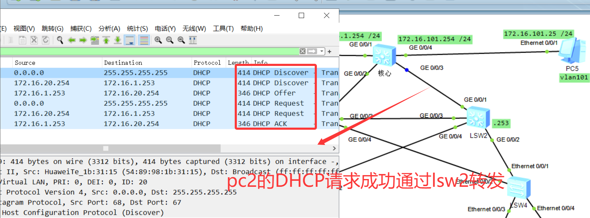
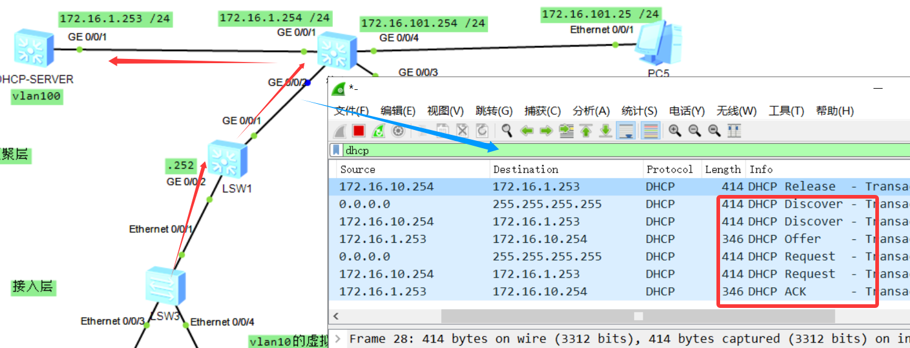

## 💡 ENSP网络整体说明：

- **接入层**：LSW3、LSW4（普通二层交换机）
- **汇聚层**：LSW1、LSW2（支持三层功能，承担VRRP、MSTP、DHCP中继）
- **核心层**：核心交换机（负责三层转发）、DHCP-SERVER服务器
- **管理vlan101**：管理核心及各汇聚交换机
- **服务器vlan100**：连接DHCP服务器
- **用户vlan**：
  - VLAN10：PC1、PC4
  - VLAN20：PC2
  - VLAN30：PC3

------

## 1️⃣ VLAN 划分

| VLAN ID | 用途      | 网段            | 网关设备         |
| ------- | --------- | --------------- | ---------------- |
| 10      | 用户接入1 | 172.16.10.0/24  | LSW1             |
| 20      | 用户接入2 | 172.16.20.0/24  | LSW2             |
| 30      | 用户接入3 | 172.16.30.0/24  | 核心交换机（？） |
| 100     | 服务器    | 172.16.1.0/24   | DHCP-SERVER      |
| 101     | 设备管理  | 172.16.101.0/24 | 核心交换机       |

------

## 2️⃣ VRRP 配置思路（在汇聚层 LSW1/LSW2）

| VLAN | 角色   | 虚拟网关      | 实际网关IP                     |
| ---- | ------ | ------------- | ------------------------------ |
| 10   | 主LSW1 | 172.16.10.254 | LSW1: 172.16.10.252   LSW2: 备 |
| 20   | 主LSW2 | 172.16.20.254 | LSW2: 172.16.20.253  LSW1: 备  |

------

## 3️⃣ 各设备接口连线 & 配置草图

### 🌐 核心交换机

| 接口    | 连接对象    | IP地址/说明                |
| ------- | ----------- | -------------------------- |
| GE0/0/2 | LSW1        | 中继链路                   |
| GE0/0/3 | LSW2        | 中继链路                   |
| GE0/0/1 | DHCP-SERVER | vlan100：172.16.1.254/24   |
| GE0/0/4 | PC5（管理） | vlan101：172.16.101.254/24 |

### 📟 DHCP-SERVER

| 接口    | 说明                                   |
| ------- | -------------------------------------- |
| GE0/0/1 | vlan100：172.16.1.253/24，提供DHCP服务 |

- 需要配置 DHCP 池：
  - VLAN10：172.16.10.100-200
  - VLAN20：172.16.20.100-200
  - VLAN30：172.16.30.100-200

------

### 📶 LSW1（三层交换机）

| 接口    | 连接对象   | IP地址/说明                |
| ------- | ---------- | -------------------------- |
| GE0/0/1 | 核心交换机 | 上联                       |
| GE0/0/2 | LSW3       | ?                          |
| GE0/0/3 | LSW2       | ?                          |
| GE0/0/4 | LSW4       | ?                          |
| VLAN10  | SVI接口    | 172.16.10.254/24（主VRRP） |
| VLAN20  | SVI接口    | 172.16.20.253/24（备VRRP） |

- 配置 MSTP 区域划分，启用 MSTP 实现环路避免。
- 配置 VRRP 虚拟网关（vlan10主）

------

### 📶 LSW2（三层交换机）

| 接口    | 连接对象   | IP地址/说明                |
| ------- | ---------- | -------------------------- |
| GE0/0/1 | 核心交换机 | 上联                       |
| GE0/0/2 | LSW4       |                            |
| GE0/0/3 | LSW1       |                            |
| GE0/0/4 | LSW3       |                            |
| VLAN10  | SVI接口    | 172.16.10.253/24（备VRRP） |
| VLAN20  | SVI接口    | 172.16.20.254/24（主VRRP） |

- 配置 MSTP，与LSW1处于同一区域。
- 配置 VRRP 虚拟网关（vlan20主）

------

### 🖧 LSW3（接入层交换机）

| 接口   | 连接对象 | VLAN  | 说明           |
| ------ | -------- | ----- | -------------- |
| E0/0/3 | PC1      | 10    | access         |
| E0/0/1 | LSW1     | trunk | 与LSW1中继链路 |
| E0/0/4 | PC2      | 20    | access         |
| E0/0/2 | LSW2     | trunk | 冗余链路       |

------

### 🖧 LSW4（接入层交换机）

| 接口   | 连接对象 | VLAN  | 说明         |
| ------ | -------- | ----- | ------------ |
| E0/0/3 | PC3      | 30    | access       |
| E0/0/1 | LSW2     | trunk | 上联中继链路 |
| E0/0/4 | PC4      | 10    | access       |
| E0/0/2 | LSW1     | trunk | 冗余链路     |

------

### 🖥 PC 配置

| PC   | VLAN | IP地址           | 备注       |
| ---- | ---- | ---------------- | ---------- |
| PC1  | 10   | 172.16.10.250/24 | 静态或DHCP |
| PC2  | 20   | 172.16.20.200/24 | 静态或DHCP |
| PC3  | 30   | 172.16.30.100/24 | 静态或DHCP |
| PC4  | 10   | 172.16.10.249/24 | 静态或DHCP |
| PC5  | 101  | 172.16.101.25/24 | 管理使用   |

------

## 📦 第一阶段：**VLAN划分 + VRRP配置 + IP地址规划**

### 🔧 LSW1（三层汇聚）

```bash
# 创建 VLAN
vlan batch 10 20 30 100 101

# 配置 trunk 接口（与核心、LSW2、接入层连接）
interface g0/0/1
 port link-type trunk
 port trunk allow-pass vlan all

interface g0/0/2
 port link-type trunk
 port trunk allow-pass vlan all

interface g0/0/3
 port link-type trunk
 port trunk allow-pass vlan all

interface g0/0/4
 port link-type trunk
 port trunk allow-pass vlan all

# VLAN10 接口配置 + VRRP 主设备
interface Vlanif10
 ip address 172.16.10.252 255.255.255.0
 vrrp vrid 10 virtual-ip 172.16.10.254
 vrrp vrid 10 priority 120

# VLAN20 接口配置 + VRRP 备设备
interface Vlanif20
 ip address 172.16.20.252 255.255.255.0
 vrrp vrid 20 virtual-ip 172.16.20.254
 vrrp vrid 20 priority 100

# VLAN100 接口（用于DHCP中继通信）
interface Vlanif100
 ip address 172.16.1.252 255.255.255.0

# 管理 VLAN101 接口
interface Vlanif101
 ip address 172.16.101.10 255.255.255.0
```

------

### 🔧 LSW2（三层汇聚）

```bash
vlan batch 10 20 30 100 101

# trunk链路配置
interface g0/0/1
 port link-type trunk
 port trunk allow-pass vlan all

interface g0/0/2
 port link-type trunk
 port trunk allow-pass vlan all

interface g0/0/3
 port link-type trunk
 port trunk allow-pass vlan all

interface g0/0/4
 port link-type trunk
 port trunk allow-pass vlan all

# VLAN10 接口配置 + VRRP 备设备
interface Vlanif10
 ip address 172.16.10.253 255.255.255.0
 vrrp vrid 10 virtual-ip 172.16.10.254
 vrrp vrid 10 priority 100

# VLAN20 接口配置 + VRRP 主设备
interface Vlanif20
 ip address 172.16.20.253 255.255.255.0
 vrrp vrid 20 virtual-ip 172.16.20.254
 vrrp vrid 20 priority 120

# VLAN100 接口
interface Vlanif100
 ip address 172.16.1.253 255.255.255.0

# 管理 VLAN101 接口
interface Vlanif101
 ip address 172.16.101.20 255.255.255.0
```

------

### 🔧 LSW3（二层接入）

```bash
vlan batch 10 20 30 100 101

# PC1 接口
interface Ethernet 0/0/3
 port link-type access
 port default vlan 10

# PC2 接口
interface Ethernet 0/0/4
 port link-type access
 port default vlan 20

# 上联 LSW1
interface Ethernet 0/0/1
 port link-type trunk
 port trunk allow-pass vlan all

# 冗余链路 LSW2
interface Ethernet 0/0/2
 port link-type trunk
 port trunk allow-pass vlan all
```

------

### 🔧 LSW4（二层接入）

```bash
vlan batch 10 20 30 100 101

# PC3 接口
interface Ethernet 0/0/3
 port link-type access
 port default vlan 30

# PC4 接口
interface Ethernet 0/0/4
 port link-type access
 port default vlan 10

# 上联 LSW2
interface Ethernet 0/0/1
 port link-type trunk
 port trunk allow-pass vlan all

# 冗余链路 LSW1
interface Ethernet 0/0/2
 port link-type trunk
 port trunk allow-pass vlan all
```

------

### 🔧 核心交换机

```bash
vlan batch 10 20 30 100 101

# 接口 g0/0/1 接 DHCP Server
interface g0/0/1
 port link-type access
 port default vlan 100

# 接口 g0/0/4 接 PC5 管理主机
interface g0/0/4
 port link-type access
 port default vlan 101

# 接口 g0/0/2 和 g0/0/3 分别接 LSW1、LSW2
interface g0/0/2
 port link-type trunk
 port trunk allow-pass vlan all

interface g0/0/3
 port link-type trunk
 port trunk allow-pass vlan all

# VLAN100 接口
interface Vlanif100
 ip address 172.16.1.254 255.255.255.0

# VLAN101 接口
interface Vlanif101
 ip address 172.16.101.254 255.255.255.0

# VLAN30 接口（PC3所用）
interface Vlanif30
 ip address 172.16.30.254 255.255.255.0
```

------

## ⚙ 第二阶段：MSTP配置（避免环路 + 负载均衡）

### 🧠 MSTP 设计目标：

- **生成树区域：整个网络设为一个 MSTP 区域（Region）**
- **划分实例（Instance）**：
  - **Instance 1**：vlan 10（用户VLAN10 流量通过 LSW1）
  - **Instance 2**：vlan 20（用户VLAN20 流量通过 LSW2）
  - **Instance 3**：vlan 30（PC3使用，默认谁都可以）
- **LSW1** 为 Instance1 的根（主）
- **LSW2** 为 Instance2 的根（主）

### 🔧 所有交换机（LSW1~LSW4）统一 MSTP 区域配置：

```bash
stp region-configuration
 region-name mstp-region
 revision-level 1
 instance 1 vlan 10
 instance 2 vlan 20
 instance 3 vlan 30
 active region-configuration
```

------

### 🔧 LSW1（主 VLAN10）

```bash
stp instance 1 root primary
stp instance 2 root secondary
```

### 🔧 LSW2（主 VLAN20）

```bash
stp instance 2 root primary
stp instance 1 root secondary
```

------

## 💡 第三阶段：DHCP中继配置

### 🎯 目标

- 所有接入主机（PC1~PC4）自动从 DHCP Server 获取 IP 地址
- DHCP Server 位于 VLAN100（IP为：`172.16.1.253`）
- 中继设备为汇聚层的 **LSW1、LSW2**

### 🔧 LSW1（DHCP中继）

```bash
dhcp enable  # 启用DHCP功能

interface Vlanif10
 dhcp select relay
 dhcp relay server-ip 172.16.1.253

interface Vlanif20
 dhcp select relay
 dhcp relay server-ip 172.16.1.253
```

------

### 🔧 LSW2（DHCP中继）

```bash
dhcp enable

interface Vlanif10
 dhcp select relay
 dhcp relay server-ip 172.16.1.253

interface Vlanif20
 dhcp select relay
 dhcp relay server-ip 172.16.1.253
```

------

### 🔧 核心交换机（VLAN30 中继）

```bash
interface Vlanif30
 dhcp select relay
 dhcp relay server-ip 172.16.1.253
```

------

## 🔧 DHCP Server 配置（假设为华为设备）

```bash
vlan batch 10 20 30 100 101

dhcp enable

interface g0/0/1
 port link-type access
 port default vlan 100

interface Vlanif100
 ip address 172.16.1.253 255.255.255.0
 dhcp select global

# 地址池配置
ip pool vlan10
 network 172.16.10.0 mask 255.255.255.0
 gateway-list 172.16.10.254
 dns-list 8.8.8.8

ip pool vlan20
 network 172.16.20.0 mask 255.255.255.0
 gateway-list 172.16.20.254
 dns-list 8.8.8.8

ip pool vlan30
 network 172.16.30.0 mask 255.255.255.0
 gateway-list 172.16.30.254
 dns-list 8.8.8.8

# 默认路由指向核心交换机
ip route-static 0.0.0.0 0 172.16.1.254
```

## 🔧 核心交换机路由

```
ip route-static 172.16.10.0 24 172.16.1.252
ip route-static 172.16.20.0 24 172.16.1.253
```


------

## 🧪 第四阶段：验证命令建议（可在汇聚或接入层查看）

```bash
# 查看生成树区域配置
display stp region-configuration

# 查看各实例状态
display stp instance 1
display stp instance 2

# VRRP 状态检查
display vrrp

# DHCP中继状态
display dhcp relay
```

------

### PC2成功通过DHCP获得ip



### PC1成功通过lsw1转发获得地址

