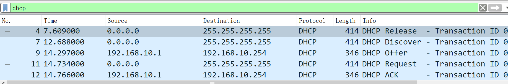
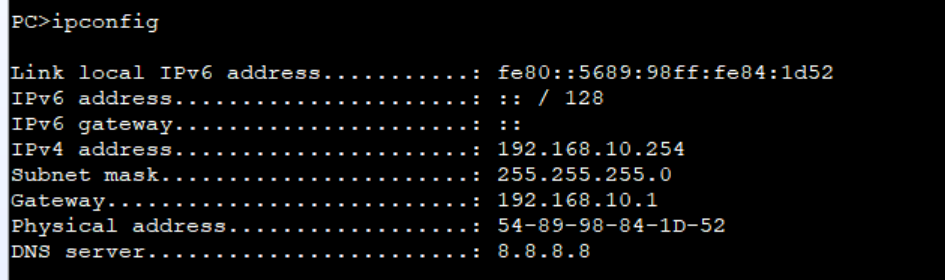
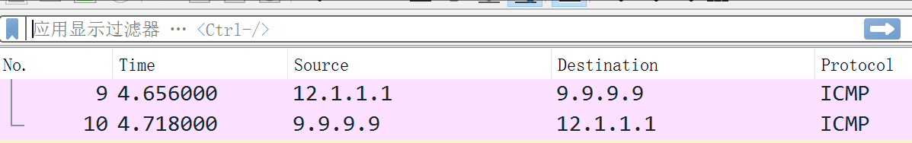
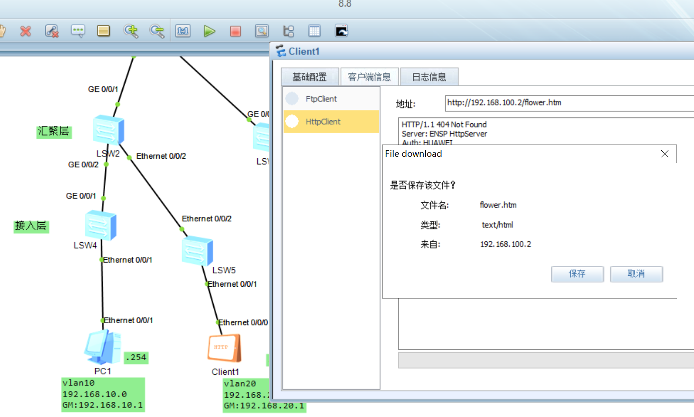
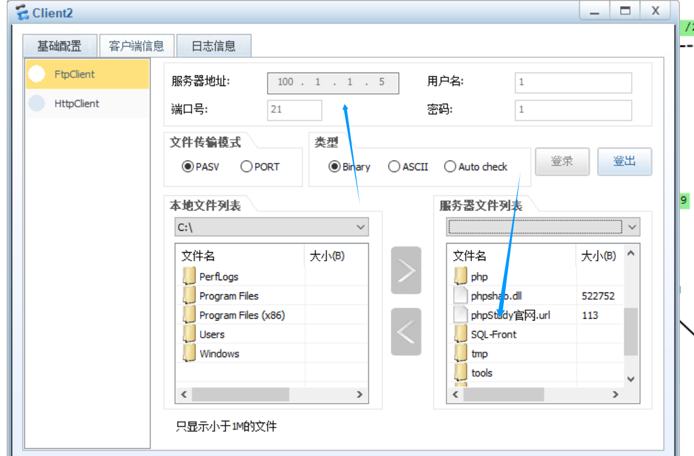

------

## 1. 核心交换机 LSW1

**角色**：核心层，网关配置位置，DHCP服务器
 **接口与VLAN**：

- VLAN10：192.168.10.1/24
- VLAN20：192.168.20.1/24
- VLAN200：192.168.200.1/24
- VLAN999（管理VLAN）：192.168.254.1/24
- 上联接口：
  - GE0/0/3 → LSW2
  - GE0/0/2→ LSW3
  - GE0/0/1 → AR1

**DHCP池**：

- VLAN10：192.168.10.0/24（网关 192.168.10.1）
- VLAN20：192.168.20.0/24（网关 192.168.20.1）
- VLAN200：192.168.200.0/24（网关 192.168.200.1）

------

## 2. 汇聚交换机 LSW2

**接口**：

- GE0/0/2 → LSW4
- GE0/0/1 → LSW1
- Ethernet0/0/2 → LSW5

**说明**：Trunk 方式与核心交换机互通，转发 VLAN 10、20、200、999

------

## 3. 汇聚交换机 LSW3

**接口**：

- GE0/0/1 → LSW1

- Ethernet0/0/0 → Server1 (VLAN200)

  

**说明**：Trunk 方式与核心交换机互通，转发 VLAN 10、20、200、999

------

## 4. 接入交换机 LSW4

**接口**：

- Ethernet0/0/1 → PC1 (VLAN10)
- GE0/0/2 → LSW5
- GE0/0/1 → LSW2

**说明**：PC1 由 DHCP 获取地址，默认网关 192.168.10.1

------

## 5. 接入交换机 LSW5

**接口**：

- Ethernet0/0/1 → PC2 (VLAN20)
- Ethernet0/0/2→ LSW2
- GE0/0/2  → LSW4

------

## 6. 出口路由器 AR1（总部出口）

**接口**：

- GE0/0/1：192.168.254.2  /24（连 LSW1）
- GE0/0/0：12.1.1.1/29（连 AR3 公网）
- Serial 接口：192.168.253.1/24（连 AR2）

**NAT**：

- 内网（192.168.10.0、192.168.20.0、192.168.200.0）源 NAT 出口 GE0/0/0

**PPP（服务端）**：

- 认证模式 CHAP
- 用户名 hcnp 密码 123

------

## 7. 分支路由器 AR2（武汉分部）

**接口**：

- Serial 接口：192.168.253.6   /24（连 AR1）
- GE0/0/1：192.168.100.1/24（连 Server2）

**PPP（客户端）**：

- chap user hcnp
- chap password 123

------

## 8. 路由器 AR3（公网模拟）

**接口**：

- GE0/0/0：12.1.1.2/29（连 AR1）
- Loopback0：9.9.9.9（模拟公网 IP）

------

## 9. 终端设备

- **PC1**：VLAN10，DHCP，网关192.168.10.1
- **PC2**：VLAN20，DHCP，网关192.168.20.1
- **Server1**：（北京）VLAN200，DHCP（192.168.200.x），网关192.168.200.1
- **Server2**（武汉）：192.168.100.2/24，网关192.168.100.1

------


# 总体实现步骤（按优先级）

1. 在核心 LSW1 上创建 VLAN（10/20/200/999），为每个 VLAN 建立 SVI（Vlanif）作为网关（要求：用户网关在核心交换机）。
2. 在 LSW1 上配置 DHCP 池（VLAN10/VLAN20/VLAN200），使终端自动获取 IP。
3. 配置管理 VLAN 为 VLAN999（192.168.254.0/24），把 LSW1 管理地址放在该 VLAN，**不要在 VLAN1 上放管理地址**。在所有设备上把管理接口/管理地址放在 VLAN999 或路由到 VLAN999。
4. 配置交换机间为 trunk（允许 10/20/200/999），接入口为 access 并指定对应 VLAN。
5. 在所有设备上配置本地帐号 + AAA，使得可通过 telnet（或 SSH）远程管理，并禁止 VLAN1 管理（即不在 VLAN1 上开启管理服务）。
6. 在出口路由 AR1 上配置 NAT（源 NAT，使内网访问 Internet；静态 DNAT/端口映射以允许外网访问总部 FTP 服务器）。
7. 配置总部与武汉（AR1 与 AR2）使用 PPP 链路（可选），服务端使用 CHAP 验证，客户端配置对应 chap user/password。
8. 配置路由（静态或动态）确保各网段互通（内网互访、到武汉 server 的路由、以及 Internet 可达性）。
9. 配置必要的 ACL 只开放需要的服务（如允许内网访问武汉的 web，允许公网访问 HQ 的 FTP），其余默认拒绝或限制。

------

# 设备配置模板

------

### 一、核心交换机 LSW1（网关 + DHCP + 管理）

#### 目标：

- 创建 VLAN10/20/200/999，建立 Vlanif 接口并配置 IP（网关）。
- 配置 DHCP 池，为 VLAN10/20/200 提供地址与默认网关/DNS。
- 把 LSW1 的管理 IP 放在 VLAN999（192.168.254.1）。
- 配置 telnet 管理（AAA + 本地用户），禁止 VLAN1 管理。

#### 配置命令：

```text
system-view

# 创建 VLAN
vlan batch 10 20 200 999

# 配置 trunk 端口（上联接口允许通过 VLAN 10/20/200/999）
interface GigabitEthernet0/0/1
port link-type access
port default vlan  999
quit

interface GigabitEthernet0/0/2
port link-type trunk
port trunk allow-pass vlan 10 20 200 999
quit

interface GigabitEthernet0/0/3
port link-type trunk
port trunk allow-pass vlan 10 20 200 999
quit

# 配置 Vlanif 接口并分配 IP 地址
interface Vlanif10
dhcp select global
ip address 192.168.10.1 255.255.255.0
quit

interface Vlanif20
dhcp select global
ip address 192.168.20.1 255.255.255.0
quit

interface Vlanif200
dhcp select global
ip address 192.168.200.1 255.255.255.0
quit

interface Vlanif999
ip address 192.168.254.1 255.255.255.0
quit

# 配置 DHCP 池
dhcp enable

ip pool vlan10
network 192.168.10.0 mask 255.255.255.0
gateway-list 192.168.10.1
dns-list 8.8.8.8
quit

ip pool vlan20
network 192.168.20.0 mask 255.255.255.0
gateway-list 192.168.20.1
quit

ip pool vlan200
network 192.168.200.0 mask 255.255.255.0
gateway-list 192.168.200.1
quit

# 配置 AAA 与 telnet 管理
aaa
local-user admin password cipher YourStrongPass

local-user admin service-type telnet
quit

telnet server enable

# 配置 vty 行与远程管理
user-interface vty 0 4
authentication-mode aaa
protocol inbound telnet
quit

# 配置默认路由到出口 AR1（下一跳 192.168.254.2）
ip route-static 0.0.0.0 0.0.0.0 192.168.254.2

# 禁用 VLAN1 管理接口（不配置 Vlanif1）
interface Vlanif1
undo ip address
quit

# 保存配置
save
```

------

### 二、汇聚与接入交换（LSW2 / LSW3 / LSW4 / LSW5）

#### 目标：

- 上联到 LSW1 的接口配置为 trunk（允许 VLAN 10/20/200/999）。
- 接入端口配置为 access 对应 VLAN。
- 管理口（和连到 LSW1 的链路）打通 VLAN999，保证可以远程管理。

#### LSW2 配置：

```text
system-view

# 创建 VLAN
vlan batch 10 20 200 999

# 配置到核心的接口为 trunk（示例 GE0/0/1）
interface GigabitEthernet0/0/1
port link-type trunk
port trunk allow-pass vlan 10 20 200 999
quit

# 配置其他上联端口为 trunk（GE0/0/2, Ethernet0/0/2）
interface GigabitEthernet0/0/2
port link-type trunk
port trunk allow-pass vlan 10 20 200 999
quit

interface Ethernet0/0/2
port link-type trunk
port trunk allow-pass vlan 10 20 200 999
quit

# 保存配置
save
```

#### LSW4 配置（PC1 在 VLAN10）：

```text
system-view

# 创建 VLAN
vlan batch 10 20 200 999

# 配置到 LSW2 的接口为 trunk（GE0/0/1）
interface GigabitEthernet0/0/1
port link-type trunk
port trunk allow-pass vlan 10 20 200 999
quit

# 配置接入端口给 PC1（Ethernet0/0/1，VLAN10）
interface Ethernet0/0/1
port link-type access
port default vlan 10
quit

# 保存配置
save
```

#### LSW5 配置：

```text
system-view

# 创建 VLAN
vlan batch 10 20 200 999

# 配置 VLAN999 管理 IP
interface Vlanif999
ip address 192.168.254.5 255.255.255.0
quit

# 配置端口模式
interface Ethernet0/0/1
port link-type access
port default vlan 20
quit

interface Ethernet0/0/2
port link-type trunk
port trunk allow-pass vlan 10 20 200 999
quit

interface GigabitEthernet0/0/2
port link-type trunk
port trunk allow-pass vlan 10 20 200 999
quit

# 配置 telnet 远程管理
aaa
local-user admin password irreversible-cipher Admin@123
local-user admin service-type telnet
quit
telnet server enable
user-interface vty 0 4
authentication-mode aaa
protocol inbound telnet
quit

# 禁用 VLAN1 管理
interface Vlanif1
undo ip address
quit

# 配置默认路由到核心交换机 LSW1
ip route-static 0.0.0.0 0.0.0.0 192.168.254.1

# 保存配置
save
```

#### LSW3 配置：

```text
vlan batch 10 20 200 999

# 配置 trunk 端口（GE0/0/1）
interface GigabitEthernet0/0/1
port link-type trunk
port trunk allow-pass vlan 10 20 200 999
quit

# 配置接入端口（Ethernet0/0/1，VLAN200）
interface Ethernet0/0/1
port link-type access
port default vlan 200
quit
```

------

### 三、出口路由器 AR1（总部出口）

#### 目标：

- GE0/0/1 连接到 LSW1（192.168.254.2/24）。
- GE0/0/0 连接公网/上游（12.1.1.1/29）。
- 配置源 NAT（内网 -> 外网）以及端口映射（公网访问内部 FTP）。
- 配置 PPP 服务端 CHAP 认证（用户名/密码 hcnp/123）。

#### 配置命令：

```text
system-view

# 配置接口地址
interface GigabitEthernet0/0/1
ip address 192.168.254.2 255.255.255.0
quit

interface GigabitEthernet0/0/0
ip address 12.1.1.1 255.255.255.248
quit

# 与 AR2 的 Serial 接口配置（示例 Serial1/0/0）
interface Serial1/0/0
ip address 192.168.253.1 255.255.255.0
quit

# 配置 PPP 认证（服务端）
aaa
local-user hcnp password cipher 123
local-user hcnp service-type ppp
quit

interface Serial1/0/0
ppp authentication-mode chap


# 配置 NAT（源 NAT）

acl number 3000
rule permit ip source 192.168.10.0 0.0.0.255
rule permit ip source 192.168.20.0 0.0.0.255
rule permit ip source 192.168.200.0 0.0.0.255
quit

nat outbound 3000 

# 配置端口映射（FTP）
int g/0/0/0
nat server protocol tcp global 100.1.1.5 21 inside 192.168.200.2 21


# 默认路由
ip route-static 0.0.0.0 0.0.0.0 12.1.1.2

# 路由到武汉 AR2
ip route-static 192.168.100.0 255.255.255.0 192.168.253.6

# 配置到 VLAN10 网络的静态路由
ip route-static 192.168.10.0 255.255.255.0 192.168.254.1

# 配置到 VLAN20 网络的静态路由
ip route-static 192.168.20.0 255.255.255.0 192.168.254.1

# 配置到 VLAN200 网络的静态路由
ip route-static 192.168.200.0 255.255.255.0 192.168.254.1


# 保存配置
save
```

------

### 四、分支路由 AR2（武汉）—— PPP 客户

端

#### 目标：

- Serial 接口（连接 AR1）配置为 PPP client，CHAP 用户 `hcnp` 密码 `123`。
- GE0/0/1 配 Server2（192.168.100.1/24）。

#### 配置命令：

```text
system-view

# 配置 Serial 接口为 PPP 客户端
interface Serial1/0/0
ip address 192.168.253.6 24
ppp chap user hcnp
ppp chap password simple 123
quit

# 配置 LAN 接口
interface GigabitEthernet0/0/1
ip address 192.168.100.1 255.255.255.0
quit

# 配置路由回总部
ip route-static 192.168.10.0 255.255.255.0 192.168.253.1
ip route-static 192.168.20.0 255.255.255.0 192.168.253.1
ip route-static 192.168.200.0 255.255.255.0 192.168.253.1
```

------

### 五、公网路由 AR3（模拟 Internet）

#### 目标：

- GE0/0/0: 12.1.1.2/29（与 AR1 互联）。
- Loopback0：9.9.9.9（公网模拟）。
- 配置到 12.1.1.1 的静态路由（或对外路由）。

#### 配置命令：

```text
system-view

# 配置接口地址
interface GigabitEthernet0/0/0
ip address 12.1.1.2 255.255.255.248
quit

interface LoopBack0
ip address 9.9.9.9 255.255.255.255
quit

# 配置默认路由指向 AR1
ip route-static 0.0.0.0 0 12.1.1.1
```

------


------

# 小结 & 注意事项

1. **管理 VLAN（VLAN999）**：务必把所有网管/设备管理 IP 放在 VLAN999，禁止 VLAN1 管理（不在 VLAN1 建 SVI，不在 VLAN1 上启用 telnet/ssh）。
2. **DHCP**：若交换机型号不支持 DHCP server，可把 DHCP 放在一个服务器上并在 SVI 上配置 `dhcp select relay` 并指向 DHCP 服务器。
3. **NAT 与 FTP**：FTP 模式（主动/被动）对 NAT 有额外要求（被动模式需开放一组端口并配置 FTP ALG 或 FTP helper）。如果出现 FTP 连接问题，请启用 FTP ALG/inspection。
4. **PPP CHAP**：你给的 `local-user hcnp service-type ppp` 与 `ppp chap user hcnp` 是对的，接口两端分别做 Server/Client。确保接口为 `ppp` 模式。
5. **逐步上线**：先确保 LSW1 SVI + DHCP 正常 ——> 再配置交换 trunk/access ——> 再做路由/NAT/PPP。每一步验证再进入下一步。

------


#### pc1 DHCP 自动获取ip





### PC1 ping 百度 

```
成功通过nat转化成公网ip访问
```




#### 内网访问武汉内网服务器，并且采用ppp广域网链路链接




公网客户端成功通过访问北京公网ip访问到内网的ftp服务器

