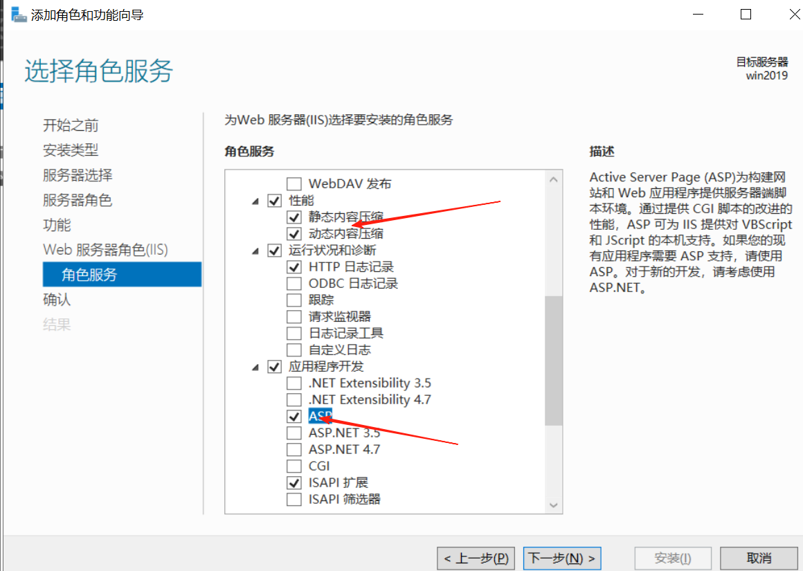
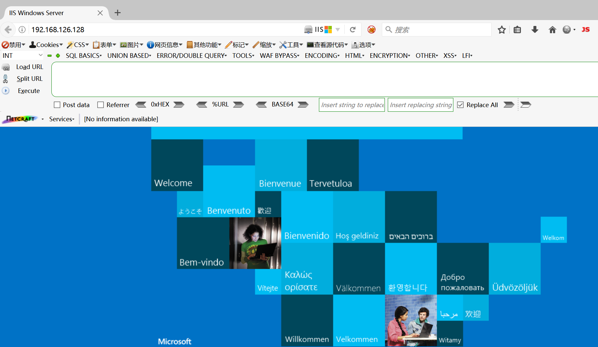
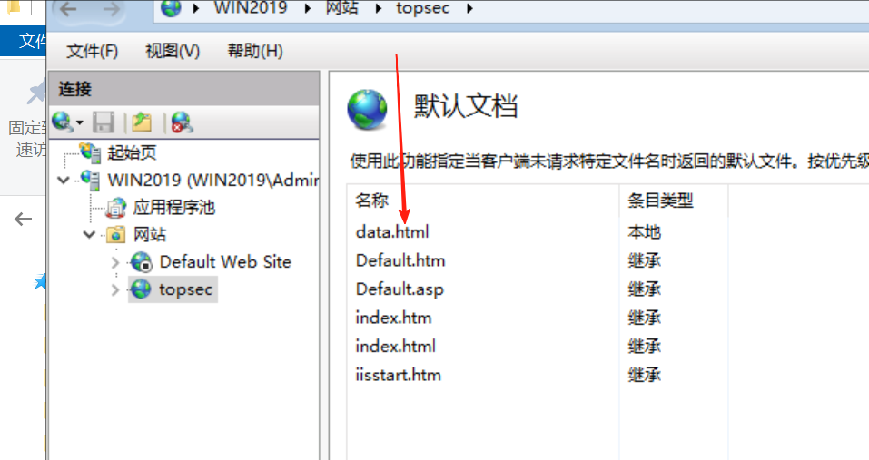
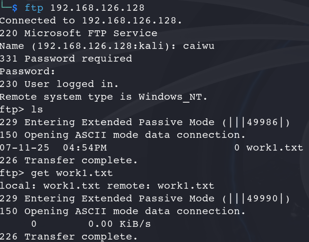
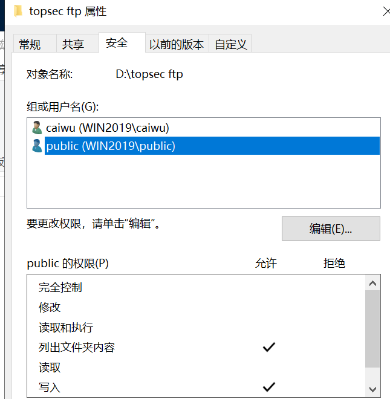

# 练习1

#### web服务器安装



#### 80端口默认主页




#### 写一个HTML文件并设置成主页，端口为81



#### 成功通过不同端口访问


动态网站需要把启动32位应用程序设置成true


#### 成功通过端口3213访问动态网站


# 练习二

#### 把两个网站都设置在80端口，并用基于域名的虚拟主机技术设置为不同的域名


#### 修改本地的hosts文件进行绑定


#### 成功通过域名访问网站


# 练习3

#### 搭建ftp站点


#### 以kali连接并成功下载work1文件




# 作业1

#### window2019搭建DHCP服务器和DNS服务器，DHCP服务器的dns指向2019自己


#### dns服务器添加动态网页域名记录


#### window7可以通过域名访问动态网站


# 作业2

#### 设置ftp域名为ftp.jd.com并在dns服务器添加记录（见作业1）

#### 设置ftp文件夹的权限，caiwu可读可写，public可以查看文件夹并上传，不可写



#### 因为FTP 协议没有 Host header

#### HTTP 协议:可以在 TCP连接里传 Host头部(比如 Host:ftp.jd.com)，lS 根据这个头部找对应站点。

#### FTP 协议:没有这个 Host 头部，连接就是连接，用户名和密码也跟主机名没直接绑定所以 IIS 的 FTP 多站点绑定主机名 是通过检査 TCP 连接的目标地址是否和绑定匹配

#### 所以我们在kali机通过高级工具lftp来连接，安装命令如下

#### 更新密钥

```
sudo apt-key adv --keyserver keyserver.ubuntu.com --recv-keys ED65462EC8D5E4C5
```

#### 更新软件源

```
sudo apt update
```

#### 安装lftp

```
sudo apt install lftp
```

#### 连接命令

```
lftp -u caiwu,123.com ftp.baidu.com
```


# 作业3

#### 切换成主动模式（port）并get一次文件

```
set ftp:passive-mode no   # 主动模式
```


#### 使用wireshark抓取数据包


```
42行显示 Request: PORT 192,168,100,12,175,245      
主动模式核心：客户端告诉服务器，“请你连接我 192.168.100.12 的 175 × 256 + 245 = 45005端口”
```

#### 这就是主动模式的特征：服务端连接客户端指定端口。


#### 切换成被动模式（PASV)

```
set ftp:passive-mode yes  # 被动模式
```


#### 抓取数据包


```
46. Request: PASV	证明是被动模式
47 Response: 227 Entering Passive Mode (192,168,100,1,194,149) 端口是194*256+149 = 49813
“我（服务器）开了个新端口等你来连！”   服务端被动等待客户端连接
```

#### 总结就是

**主动模式**：客户端告诉服务端自己的 IP 和端口，服务端来连客户端。

**被动模式**：服务端返回一个端口，客户端去连这个端口。
