# 练习1

#### win2019，win7，win2008接入vnet2（仅主机模式），并自行配置静态地址，实现通过主机名ping通

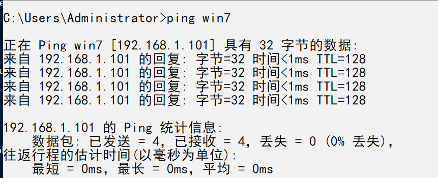


#### win2019安装域服务

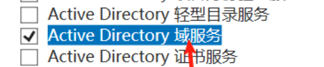

# 练习2

#### win2008/win7 将dns指向win2019后加入topsec.com域

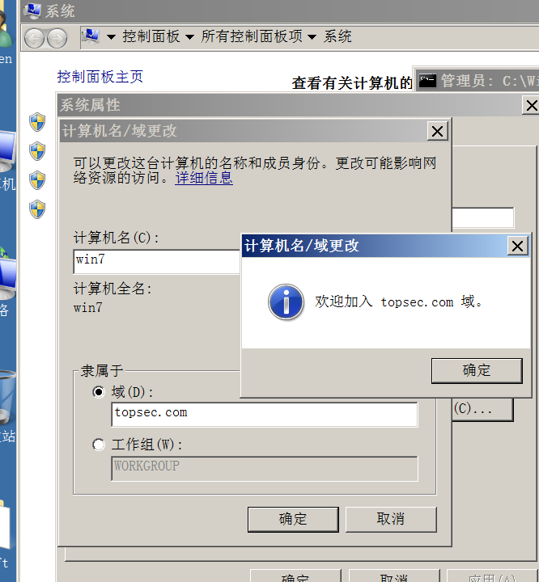

# 练习3

#### 新建用户

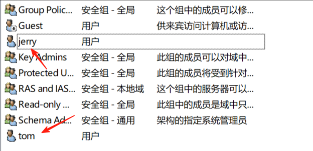

#### 使用Tom登录win7，发现无法访问本地用户allen

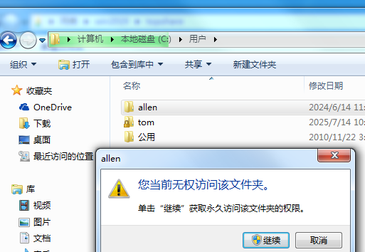

#### 登录本地allen，可以访问域用户tom

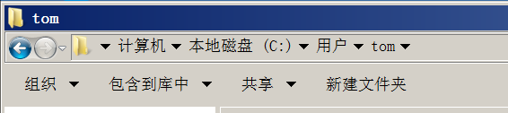

# 练习4

#### 限制Jerry登录时间


#### Jerry登录失败


# 练习5

#### 通过smb服务（高级共享）共享topdir后通过ntfs对权限进行设置，给tom可读可写，Jerry可读不可写

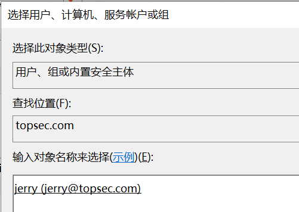

#### 验证Jerry确实可读不可写

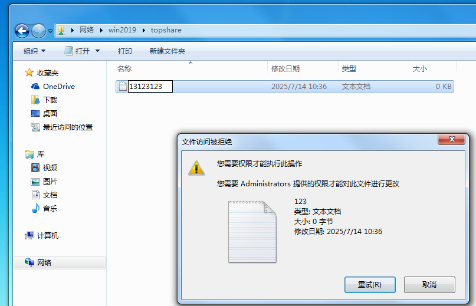

# 练习6


### 禁止Jerry使用win+r

1️⃣ 打开 **组策略管理器**
 在域控上，点开始 → 运行 → 输入 `gpmc.msc` → 回车。

2️⃣ 找到你的 **topsec.com（OU）**，右键 → “创建 GPO 并在此链接”。
 给它起个名字：`jerry禁止运行`

3️⃣ 右键新建的 GPO → “编辑”

4️⃣ 找到：

```
复制编辑
用户配置 → 管理模板 → 开始菜单和任务栏 → 删除“运行”菜单
```

启用该策略（设为“已启用”）。

🚫 这个会隐藏 **开始菜单的“运行”**，并且禁用 **Win+R** 快捷键。

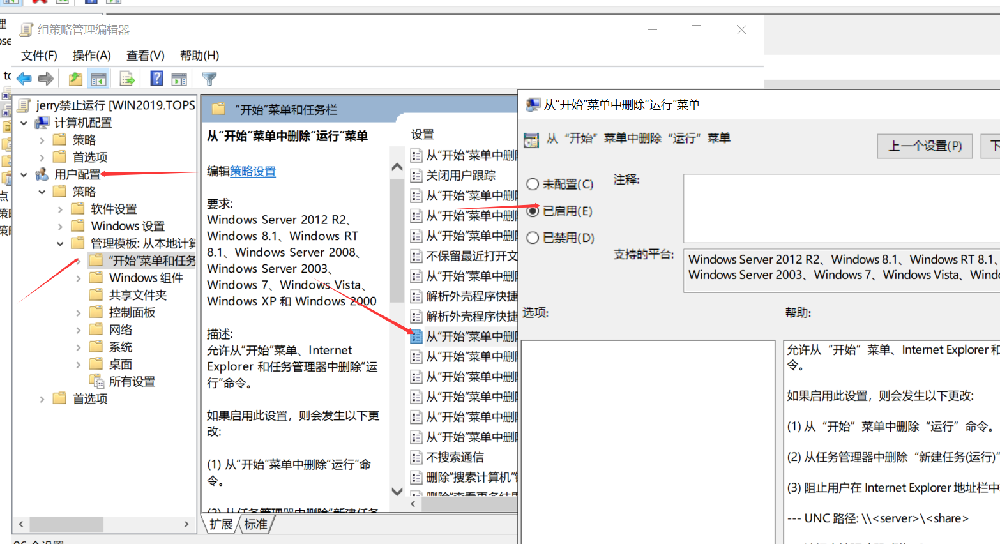

5️⃣设置gpo范围，只对Jerry生效（安全筛选删除原来的只添加Jerry）

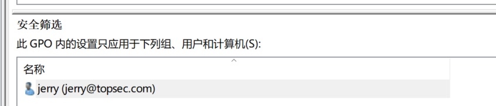

#### 验证Jerry用户确实无法使用运行菜单

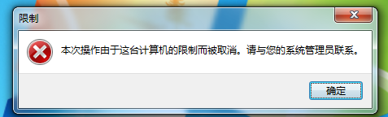


####  新建组织nandagongqing，并在里面添加class1和class2

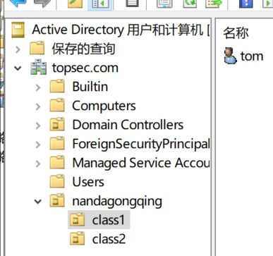

添加壁纸策略


