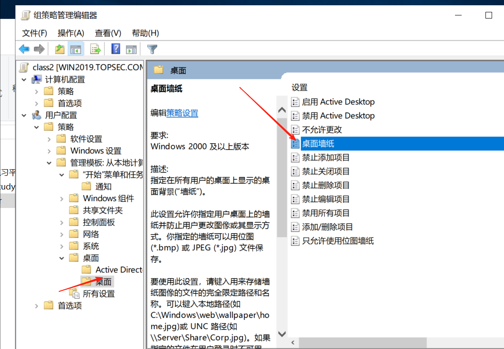
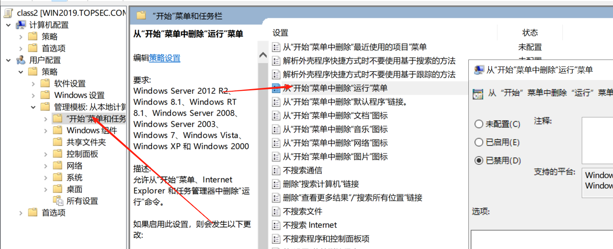
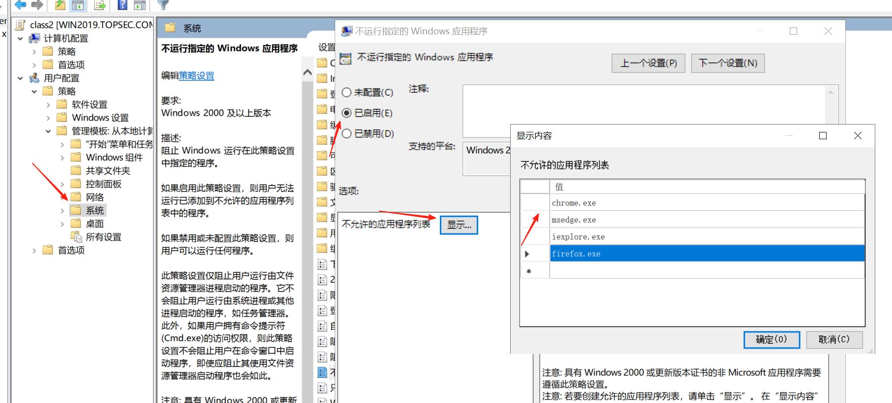
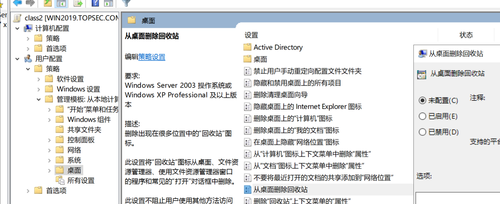
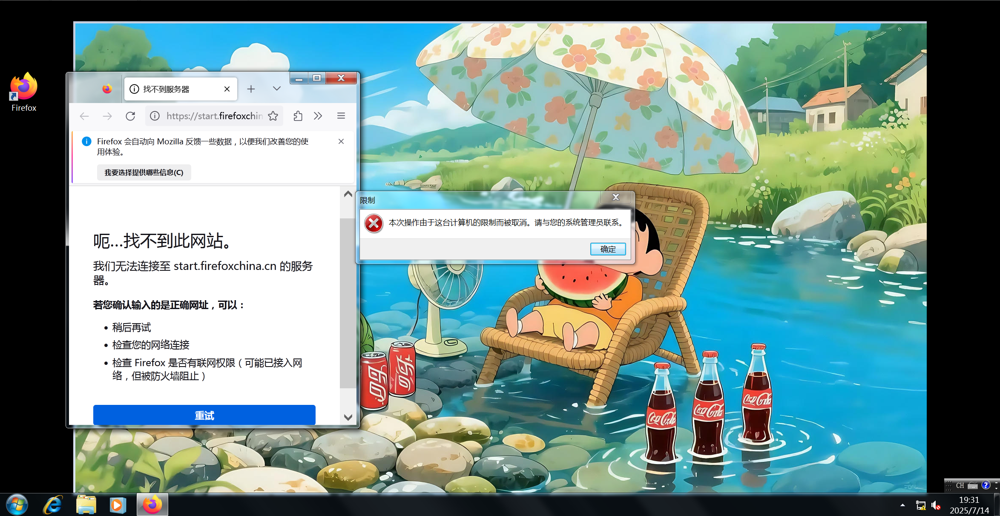
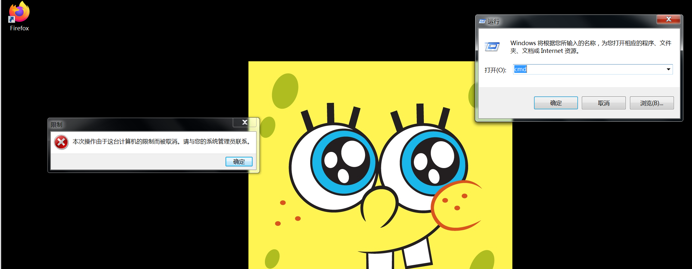
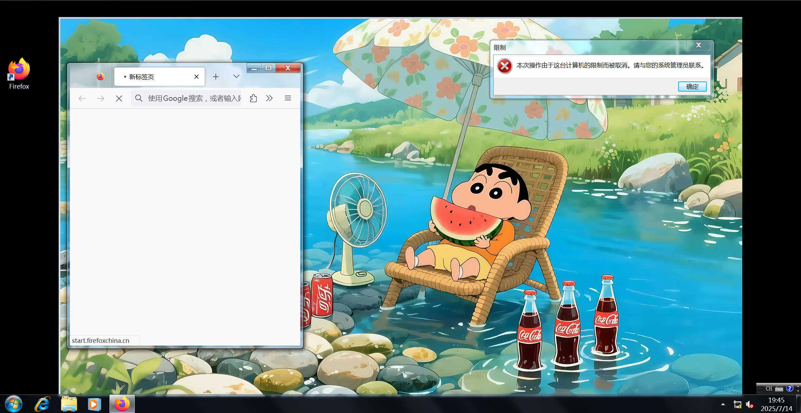
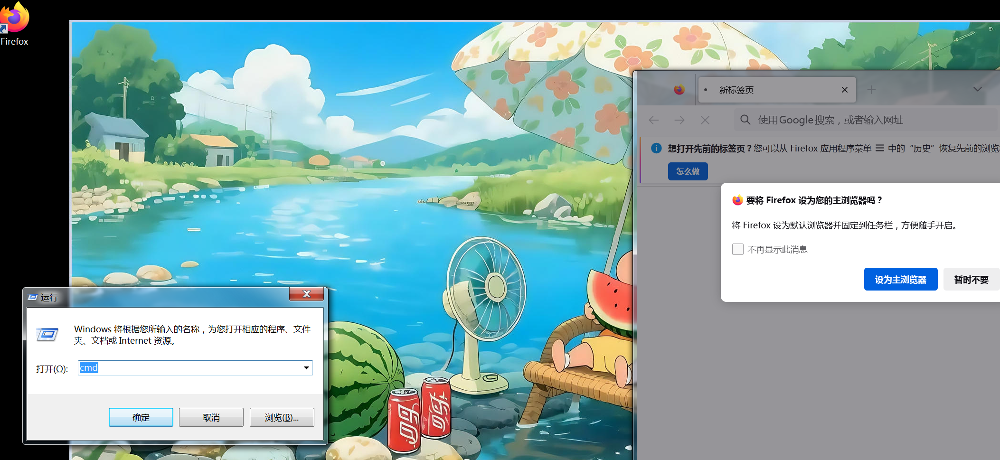
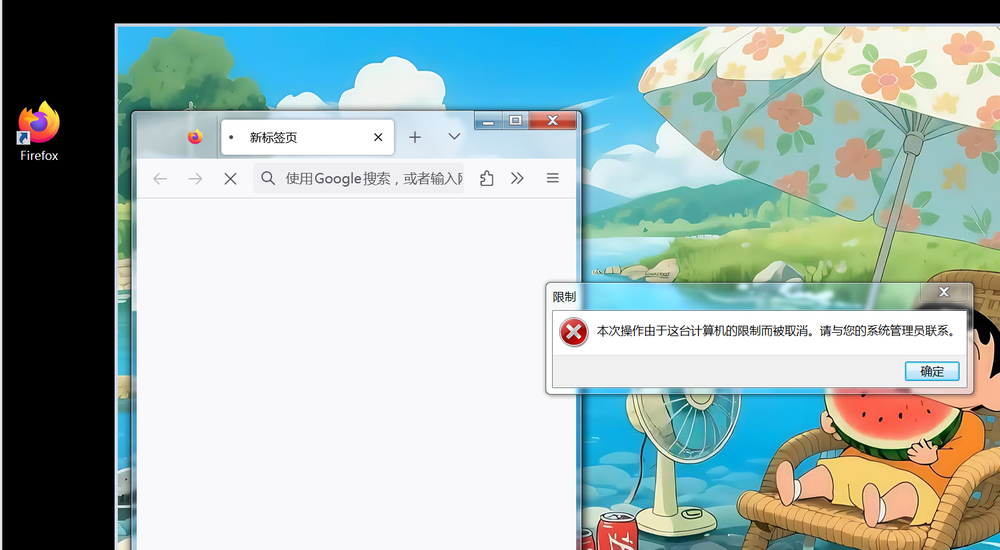

|         | 桌面    | 禁止运行功能 | 禁止上网 | 删除桌面回收站 |
| ------- | ------- | ------------ | -------- | -------------- |
| nanda   | 123.jpg | 未配置       | 不禁止   | 已启用         |
| class1  | 未配置  | 已启用       | 未配置   | 已启用         |
| class2  | hh.jpg  | 已禁用       | 已启用   | 未配置         |
| result↓ | result↓ | result↓      | result↓  | result↓        |
| class1  | 123.jpg | 不允许       | 可以上网 | 没有回收站     |
| class2  | hh.jpg  | 允许运行功能 | 不可以   | 没有回收站     |

#### 分别设置桌面壁纸：

```
用户配置 → 管理模板 → 桌面 → 桌面 → 桌面壁纸
```



禁止 “运行" 功能，

```
用户配置 → 管理模板 → 开始菜单和任务栏 → 删除“运行”菜单
```



禁止上网（禁止使用浏览器）

```
用户配置 → 管理模板 → 系统 → 不要运行指定的 Windows 应用程序
```



删除回收站

```
用户配置 → 管理模板 → 桌面 → 从桌面删除“回收站”图标
```




#### tom（class1） 没有回收站，不可以运行，墙纸是123.jpg，可以打开浏览器



#### Jerry（class2）没有回收站，有 运行窗口，墙纸是hh.jpg,无法打开浏览器上网




# 如果nanda开启强制

|               | 桌面    | 禁止运行功能 | 禁止上网 | 删除桌面回收站 |
| ------------- | ------- | ------------ | -------- | -------------- |
| nanda（强制） | 123.jpg | 未配置       | 不禁止   | 已启用         |
| class1        | 未配置  | 已启用       | 未配置   | 已启用         |
| class2        | hh.jpg  | 已禁用       | 已启用   | 未配置         |
| result↓       | result↓ | result↓      | result↓  | result↓        |
| class1        | 123.jpg | 不允许运行   | 可以上网 | 没有回收站     |
| class2        | 123.jpg | 允许运行     | 可以上网 | 没有回收站     |

tom，class1，壁纸是123.jpg，不可以运行，可以上网，没有回收站



Jerry,class2，壁纸是hh.jpg,可以运行，可以上网，没有回收站



#### 如果nanda开启强制，tom（class1）也开启强制

|                | 桌面    | 禁止运行功能 | 禁止上网 | 删除桌面回收站 |
| -------------- | ------- | ------------ | -------- | -------------- |
| nanda（强制）  | 123.jpg | 未配置       | 不禁止   | 已启用         |
| class1（强制） | 未配置  | 已启用       | 未配置   | 已启用         |
| result↓        | result↓ | result↓      | result↓  | result↓        |
| class1         | 123.jpg | 不允许运行   | 可以上网 | 没有回收站     |

tom:  123.jpg   无法运行    可以上网  没有回收站



# 总结

### ✅ **一、单独配置时**

| 用户                | 桌面    | 运行功能 | 上网     | 回收站     |
| ------------------- | ------- | -------- | -------- | ---------- |
| **class1（tom）**   | 123.jpg | 不允许   | 可以上网 | 没有回收站 |
| **class2（jerry）** | hh.jpg  | 允许     | 不可以   | 没有回收站 |


------

### ✅ **二、nanda 开启强制后**

| 用户                | 桌面    | 运行功能 | 上网     | 回收站     |
| ------------------- | ------- | -------- | -------- | ---------- |
| **class1（tom）**   | 123.jpg | 不允许   | 可以上网 | 没有回收站 |
| **class2（jerry）** | 123.jpg | 允许     | 可以上网 | 没有回收站 |


- **变化点：**
  - class1 的桌面壁纸继承 nanda 的（123.jpg），其他配置不变。
  - class2 的桌面壁纸也被 nanda 强制覆盖（123.jpg），原本的禁止上网被 nanda 的“不禁止”覆盖成“可以上网”。

------

### ✅ **三、nanda + class1 都开启强制后**

| 用户              | 桌面    | 运行功能 | 上网     | 回收站     |
| ----------------- | ------- | -------- | -------- | ---------- |
| **class1（tom）** | 123.jpg | 不允许   | 可以上网 | 没有回收站 |


- **变化点：**
  - class1 自身配置有强制，则优先级高于 nanda 的强制。壁纸依然被 nanda 覆盖，其他策略以 class1 自身的强制为准。

------

## 📝 结论

1️⃣ **桌面壁纸**：父策略（nanda）强制后，会覆盖子策略（class1、class2）的未强制或未配置项。
 2️⃣ **功能限制**：如果父策略未配置或不强制，子策略生效；如果父策略强制，且子策略未强制，则父策略覆盖子策略。
 3️⃣ **回收站**：删除配置只要启用就会生效，同理，父策略强制时，子策略会被覆盖。
 4️⃣ **优先级**：同一项策略，**同级强制 > 父级强制 > 同级未强制 > 父级未强制 > 默认**。


