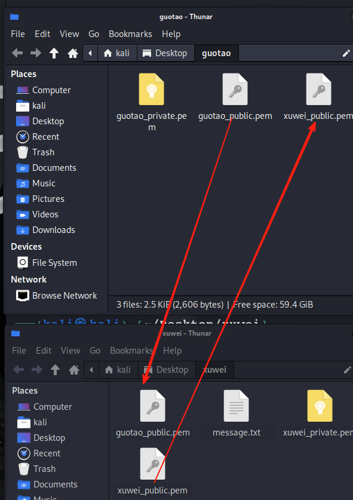
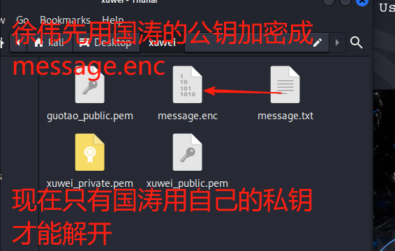
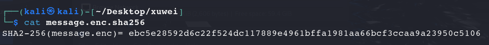
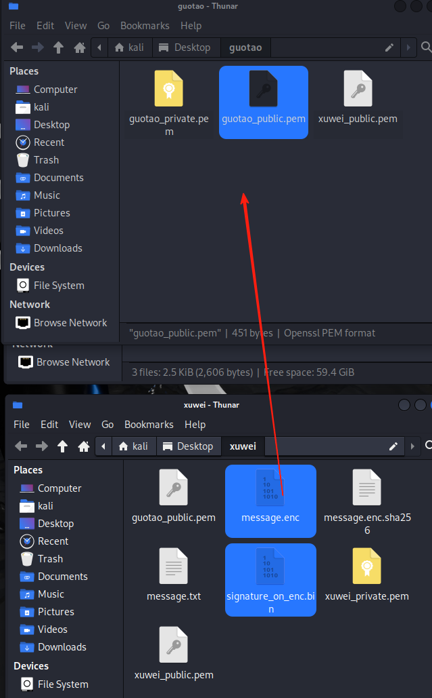
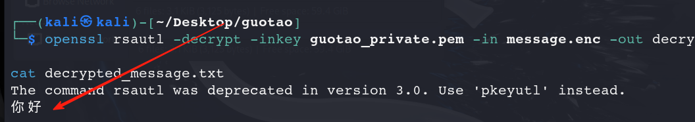

## ⚙️ 📂 文件夹结构

- `/home/kali/Desktop/xuwei` — 徐伟的密钥、明文、签名等
- `/home/kali/Desktop/guotao` — 国涛的密钥、密文、收到后解密、验签等

------

## 🔑 1️⃣ 在各自目录生成密钥对（非对称）

先切到各自目录：

```
cd /home/kali/Desktop/xuwei
# 生成徐伟RSA私钥
openssl genrsa -out xuwei_private.pem 2048
# 导出公钥
openssl rsa -in xuwei_private.pem -pubout -out xuwei_public.pem
`
```


## 🔗 2️⃣ 互换公钥

把：

- `/home/kali/Desktop/xuwei/xuwei_public.pem` 给国涛
- `/home/kali/Desktop/guotao/guotao_public.pem` 给徐伟

可以直接复制到各自目录：

```
cp /home/kali/Desktop/xuwei/xuwei_public.pem /home/kali/Desktop/guotao/
cp /home/kali/Desktop/guotao/guotao_public.pem /home/kali/Desktop/xuwei/
```



## ✏️ 3️⃣ 徐伟准备明文

```
cd /home/kali/Desktop/xuwei
echo "你好" > message.txt
```


## 🗝️ 4️⃣ 用国涛公钥加密（保证只有国涛能解密）

```
openssl rsautl -encrypt -inkey guotao_public.pem -pubin -in message.txt -out message.enc
```



## 🧩 5️⃣ 徐伟生成密文的哈希（SHA256）

```
openssl dgst -sha256 -out message.enc.sha256 message.enc
```

查看一下：

```
cat message.enc.sha256
```



## ✍️ 6️⃣ 徐伟用私钥对密文哈希签名（生成数字签名）

这里同样也是：
 先哈希 → 再用私钥签名

```
openssl dgst -sha256 -sign xuwei_private.pem -out signature_on_enc.bin message.enc
```

------

## 📤 7️⃣ 徐伟把以下文件发给国涛

- `message.enc` — 加密后的消息
- `signature_on_enc.bin` — 对密文做的数字签名
- `xuwei_public.pem` — 徐伟的公钥（如果国涛还没保存）



## ✅ 8️⃣ 国涛收到后，先验签（对密文）

（1）先验签，证明密文未被篡改：

```
openssl dgst -sha256 -verify xuwei_public.pem -signature signature_on_enc.bin message.enc
```

如果输出：

```
Verified OK
```

说明密文没被动过，并且确实是徐伟签过的。


------

## 🔓 9️⃣ 国涛再解密密文

```
openssl rsautl -decrypt -inkey guotao_private.pem -in message.enc -out decrypted_message.txt
```

#### 查看一下，得到信息"你好"

```
cat decrypted_message.txt
```

