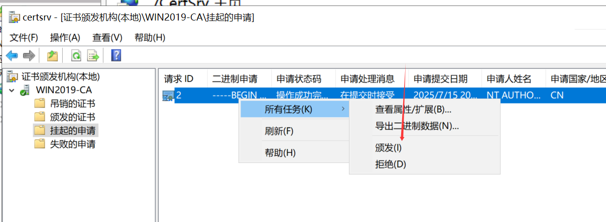

| 角色       | 系统                | IP            | 功能                        |
| ---------- | ------------------- | ------------- | --------------------------- |
| CA         | Windows Server 2019 | 192.168.1.100 | 证书颁发机构（CA）、DNS     |
| Web 服务器 | Windows Server 2008 | 192.168.1.20  | IIS，启用 ASP，支持动态内容 |
| 客户端     | Windows 7           | 192.168.1.10  | 浏览器访问，测试 HTTPS      |

------

## 📌 二、搭建步骤

------

### 1️⃣ Win2008 配置 IIS

- 安装 IIS，勾选：
  - **Web 服务器（IIS）**
  - **ASP**
  - **动态内容压缩**

- 创建新网站，设置根目录、主机名绑定，**启用 32 位应用程序**。


------

### 2️⃣ Win2019 配置 DNS

- 安装 DNS 服务器角色。
- 添加正向查找区域：`topsec.com`
- 添加主机记录 `www`，解析到 **192.168.1.20**

- 测试解析：

  ```bash
  nslookup www.topsec.com
  ```

------

### 3️⃣ 测试 HTTP 访问

- 客户端浏览器访问：

  ```
  http://www.topsec.com
  ```

- 验证是否正常返回页面。


------

### 4️⃣ Win2019 安装 CA

- 安装 **AD 证书服务**
  - 勾选：
    - 证书颁发机构
    - 证书颁发机构 Web 注册


- 完成安装后，配置 CA 类型（企业根 CA）。


------

### 5️⃣ 配置 CA Web 界面

- 启动 CA 管理控制台：

  ```
  certsrv.msc
  ```

- 验证 `http://192.168.1.100/certsrv` 可正常访问。

- 

------

### 6️⃣ Win2008 提交证书申请

- 访问 CA Web 注册页面：

  ```
  http://192.168.1.100/certsrv
  ```

- 创建新证书申请，选择 **Web 服务器证书**，填写公共名 `www.topsec.com`。


- 提交后，等待 CA 管理员审核。

------

### 7️⃣ CA 审批并颁发证书

- 在 Win2019 上打开 CA 管理控制台：

  ```
  certsrv.msc
  ```

- 在 **挂起的请求** 中找到申请，右键 ➜ 批准颁发。



- 客户端重新访问 `certsrv`，下载颁发好的服务器证书（`*.cer`）。

------

### 8️⃣ Win2008 IIS 导入服务器证书

- 打开 IIS 管理器 ➜ 服务器证书 ➜ 导入 `.cer` 文件。
- 绑定到网站：
  - 选择网站 ➜ 绑定 ➜ 添加 **https** ➜ 选择刚导入的证书。


------

### 9️⃣ Win2019 导出根证书

- 打开 CA 控制台，右键 CA 名称 ➜ 所有任务 ➜ 导出 CA 证书 ➜ 保存为 `CA根证书.cer`。

------

### 🔑 【可选】通过 `http://192.168.1.100/certsrv` ➜ 下载 CA 证书


------

### 🔟 客户端导入根证书

- 将 `CA根证书.cer` 复制到 Win7 客户端。

- 打开 `certmgr.msc` ➜ 找到：

  ```
  受信任的根证书颁发机构 > 证书
  ```

- 右键 `证书` ➜ 所有任务 ➜ 导入 ➜ 选择 `CA根证书.cer` ➜ 导入到 **受信任的根证书颁发机构**。


------

### 1️⃣1️⃣ 测试 HTTPS 访问

- 在客户端访问：

  ```
  https://www.topsec.com
  ```

- 浏览器显示安全锁，证明证书已被信任。


------

## 📌 三、常见故障与排查

| 错误         | 原因                   | 解决方案                                     |
| ------------ | ---------------------- | -------------------------------------------- |
| 不受信任     | 根证书没导入或导错     | 确认是 CA 根证书且放到“受信任根证书颁发机构” |
| 域名不匹配   | CSR 申请时公共名没写对 | 重新申请证书，CN 必须和域名一致              |
| 证书链不完整 | 有中间 CA 丢失         | 同时导入中间证书                             |
| 仍提示无效   | 客户端浏览器缓存       | 清理 SSL 状态，重启浏览器或重启机器          |

------

## 📌 四、关键要点

✅ **根证书** ➜ 证明 CA 的身份
 ✅ **服务器证书** ➜ 证明服务器的身份
 ✅ 客户端信任的是 CA，不是单独的服务器证书

