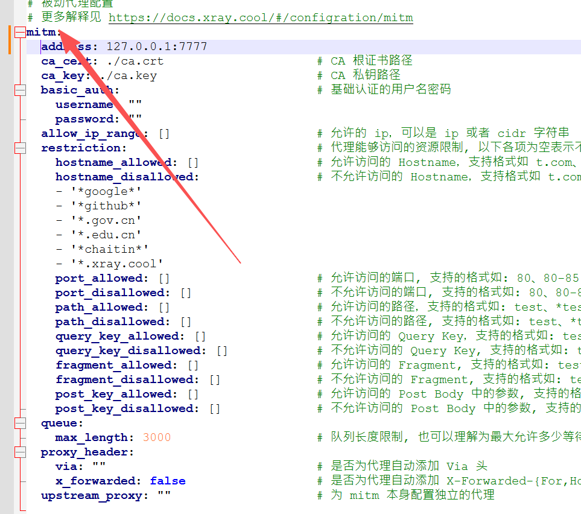
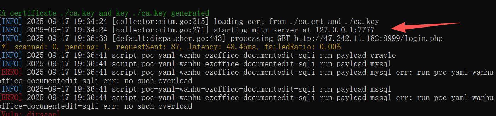
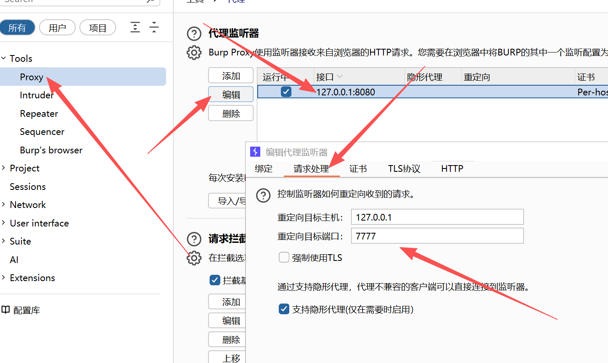
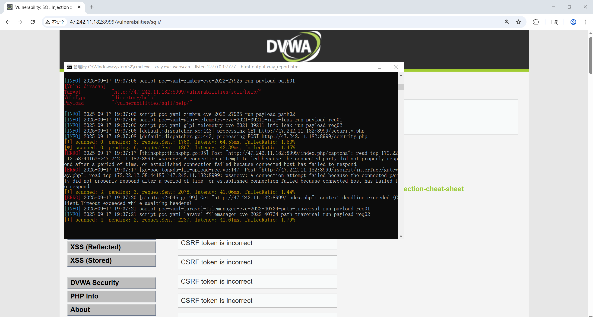
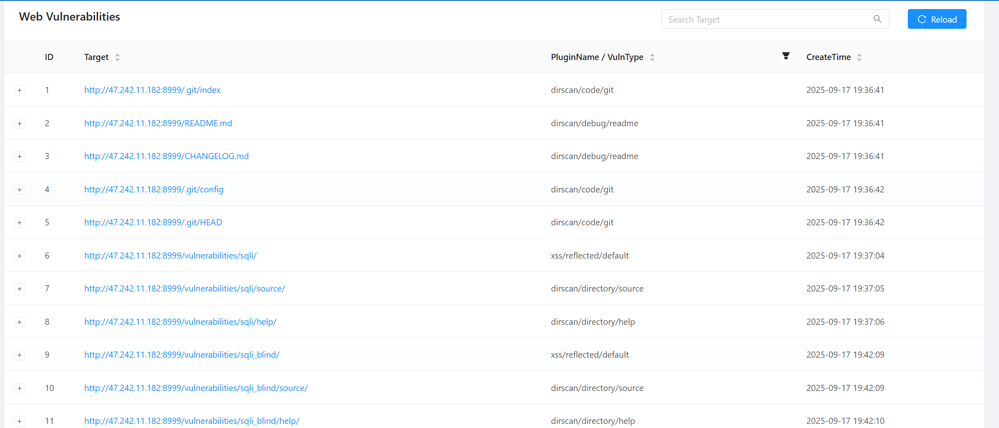

### Burp 与 Xray 联动扫描 DVWA

------


### 第三步：配置 Xray


你需要让 Xray 接收并扫描 Burp 转发过来的流量。有两种常见的联动模式：`mitm`（中间人）模式和 `burp-socket` 模式。我推荐使用更稳定和方便的 `mitm` 模式。


#### 使用 `mitm` 模式 (推荐)


1. **创建配置文件**：

   - 在 Xray 的安装目录下，创建一个名为 `config.yaml` 的配置文件。
   - 将以下内容复制到文件中：

   YAML

   ```
   # xray 的 mitm 配置
   # 此配置使 xray 作为一个中间人代理，接收 burp 的流量并进行扫描
   mitm:
     # 设置 xray 监听的地址和端口
     # burp 将把流量转发到这个地址
     address: 127.0.0.1:7777
   ```



1. **启动 Xray**：

   - 打开命令行或终端。
   - 使用以下命令启动 Xray，指定配置文件：

   Bash

   ```
   xray.exe webscan --listen 127.0.0.1:7777 --html-output xray_report.html
   ```

   - 命令解释：
     - `xray.exe`：Xray 可执行文件。
     - `webscan`：指定进行 Web 漏洞扫描。
     - `--listen 127.0.0.1:7777`：让 Xray 监听 `127.0.0.1:7777` 这个地址和端口，等待 Burp 的流量。**注意，这个地址必须和你在 `config.yaml` 中设置的一致。**
     - `--config config.yaml`：指定使用 `config.yaml` 配置文件。
     - `--html-output xray_report.html`：将扫描结果保存为 HTML 报告。
   - 启动后，你会看到 Xray 提示正在监听。

   

------


### 第四步：配置 Burp Suite 将流量转发给 Xray


1. **回到 Burp Suite**：

   - 进入 **Proxy** -> **Options** 选项卡。
   - 在 **Proxy Listeners** 部分，找到 `127.0.0.1:8080` 监听器。
   - 点击 **Edit**。
   - 在弹出的窗口中，勾选 **Redirect requests to host**。
   - 在 **Host** 字段中输入 `127.0.0.1`。
   - 在 **Port** 字段中输入 `7777`。
   - 点击 **OK** 保存设置。

   **注意**：现在，所有通过 Burp 代理 `127.0.0.1:8080` 的流量，都会被自动转发到 Xray 的 `127.0.0.1:7777` 端口。

   

------


### 第五步：开始扫描 DVWA


1. **在浏览器中设置代理**：

   - 将你的浏览器代理设置为 Burp Suite 的监听地址：`127.0.0.1:8080`。

2. **访问 DVWA**：

   - 在设置好代理的浏览器中，访问 DVWA 的登录页面： `http://47.242.11.182:8999/index.php`。
   - 登录 DVWA。
   - 浏览网站的各个页面，例如点击 **SQL Injection**、**XSS** 等功能。

3. **观察效果**：

   - 在 Burp Suite 的 **Proxy** -> **HTTP history** 选项卡中，你会看到你访问的所有流量。
   - 在 Xray 的命令行窗口中，你会看到 Xray 正在对这些流量进行分析和扫描。如果发现漏洞，它会实时地在终端输出提示。

   

4. **生成报告**：

   - 当你完成了 DVWA 的流量浏览后，可以关闭 Xray 的命令行窗口。
   - 在 Xray 启动的目录下，会生成一个名为 `xray_report.html` 的文件。
   - 用浏览器打开这个文件，你就可以看到详细的漏洞扫描报告了。

