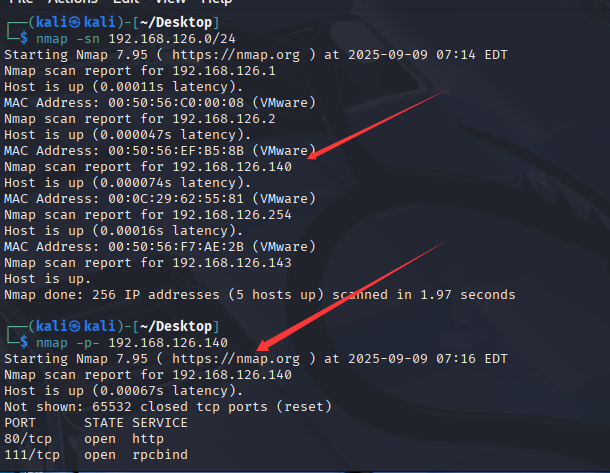
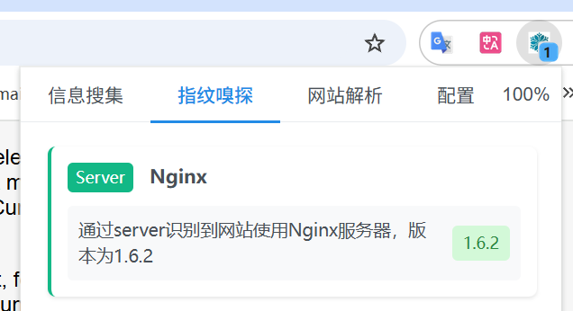
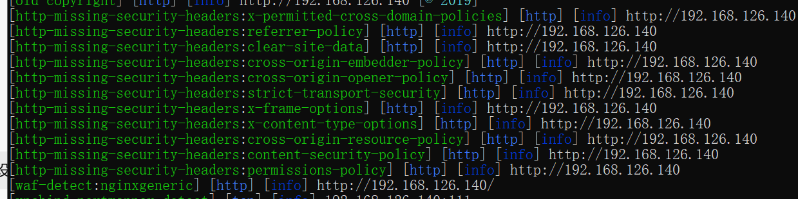
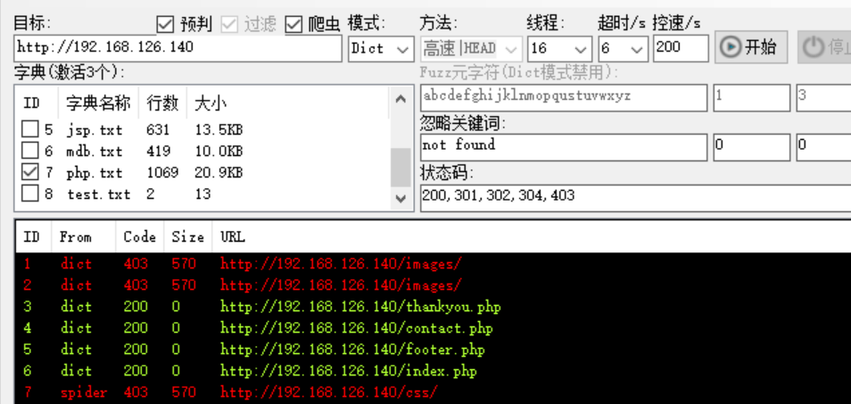

# DC1

```
nmap -sn 192.168.126.0/24 
```



访问80端口



扫描下有没有已知漏洞

```
nuclei -u http://192.168.126.140 -o results.txt
```



```
[nginx-version] [http] [info] http://192.168.126.140 [nginx/1.6.2]
[tech-detect:nginx] [http] [info] http://192.168.126.140
[old-copyright] [http] [info] http://192.168.126.140 [© 2019]
[http-missing-security-headers:x-permitted-cross-domain-policies] [http] [info] http://192.168.126.140
[http-missing-security-headers:referrer-policy] [http] [info] http://192.168.126.140
[http-missing-security-headers:clear-site-data] [http] [info] http://192.168.126.140
[http-missing-security-headers:cross-origin-embedder-policy] [http] [info] http://192.168.126.140
[http-missing-security-headers:cross-origin-opener-policy] [http] [info] http://192.168.126.140
[http-missing-security-headers:strict-transport-security] [http] [info] http://192.168.126.140
[http-missing-security-headers:x-frame-options] [http] [info] http://192.168.126.140
[http-missing-security-headers:x-content-type-options] [http] [info] http://192.168.126.140
[http-missing-security-headers:cross-origin-resource-policy] [http] [info] http://192.168.126.140
[http-missing-security-headers:content-security-policy] [http] [info] http://192.168.126.140
[http-missing-security-headers:permissions-policy] [http] [info] http://192.168.126.140
[waf-detect:nginxgeneric] [http] [info] http://192.168.126.140/
[rpcbind-portmapper-detect] [tcp] [info] 192.168.126.140:111
```

## 🔎 扫描结果解析

### 1. 服务器与技术栈

- **Nginx/1.6.2**
  - 版本非常老（2014 年的版本），存在多个公开漏洞（DoS、越权、反向代理绕过等）。
  - 建议：版本升级或至少加防护。
- **Copyright © 2019**
  - 表明网站可能是个老旧站点，没有持续维护。

------

### 2. HTTP 安全头缺失

Nuclei 报告了很多 **安全 HTTP 响应头缺失**，比如：

- `X-Frame-Options` 缺失 → 可能导致 **点击劫持（Clickjacking）**
- `X-Content-Type-Options` 缺失 → 可能导致 **MIME 混淆攻击**
- `Strict-Transport-Security` 缺失 → 没有启用 HTTPS 强制策略
- `Content-Security-Policy` 缺失 → 可能增加 **XSS 攻击风险**
- `Referrer-Policy`、`Permissions-Policy` 等缺失 → 泄露敏感信息或浏览器权限管理不足

> 这些属于 **配置问题**，风险等级中等，建议通过 Nginx 配置补齐。

------

### 3. 防护系统

- **WAF 检测：nginxgeneric**
  - 检测到网站可能有 **通用的 Nginx 防护规则**（不一定是真正的硬件 WAF，可能只是简单的 deny 规则）。
  - 意味着一些简单的攻击 payload 可能被拦截。

------

### 4. 其他服务

- **rpcbind-portmapper (111/tcp)**

  - 开放了 RPC 服务，这是一个比较危险的点。

  - 如果启用了 NFS 或其他基于 RPC 的服务，可能会导致 **目录泄露** 或 **未授权访问**。

  - 下一步可用：

    ```bash
    showmount -e 192.168.126.140
    rpcinfo -p 192.168.126.140
    ```

  - 来看看是否有挂载点或服务可利用。


### 目录扫描



```
http://192.168.126.140/images/
http://192.168.126.140/index.php
http://192.168.126.140/css/
http://192.168.126.140/contact.php
http://192.168.126.140/footer.php 
http://192.168.126.140/thankyou.php
```


