```
nmap -sn 192.168.126.0/24
```


```
nmap -p- 192.168.126.141
```

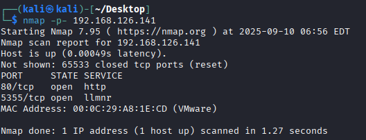

访问一看，没啥有用的信息

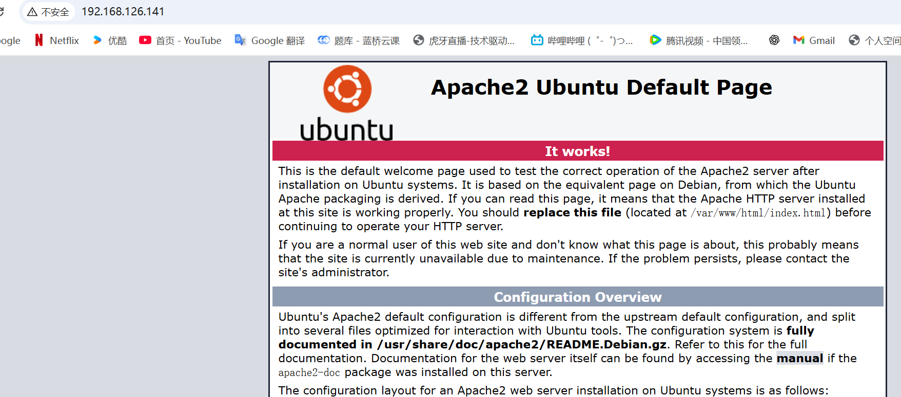

#### 进行目录扫描

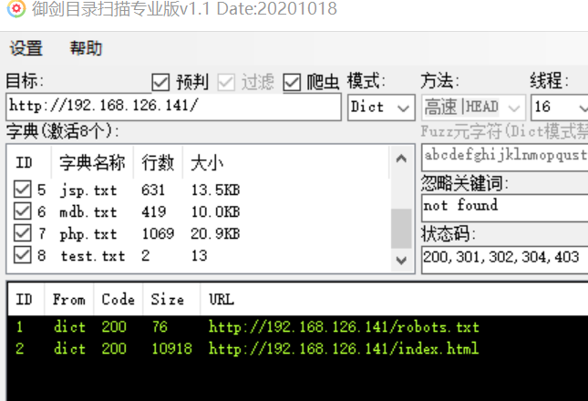

依旧是vulnhub标准提示

```
/xxe
/admin.php
```

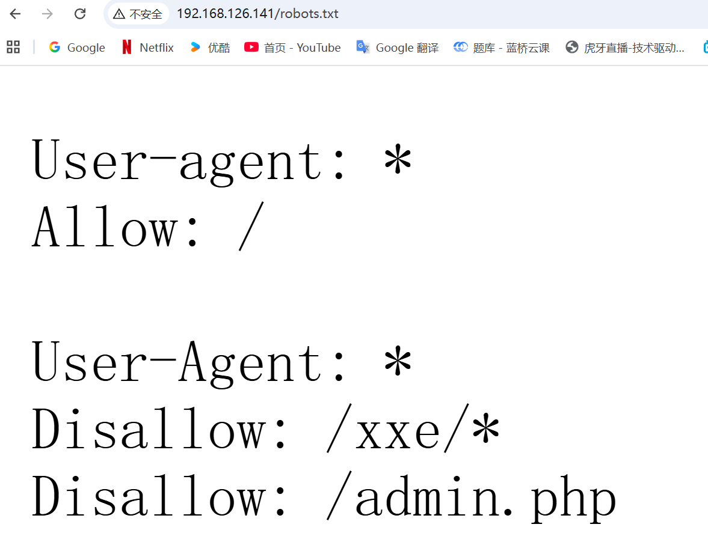

```
/admin.php不存在？
```

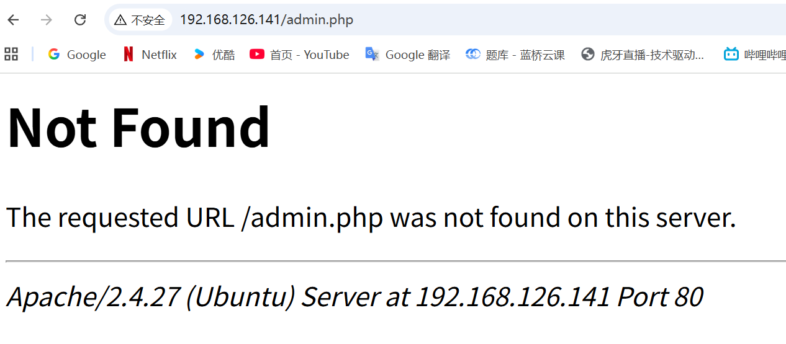

### 访问登录界面

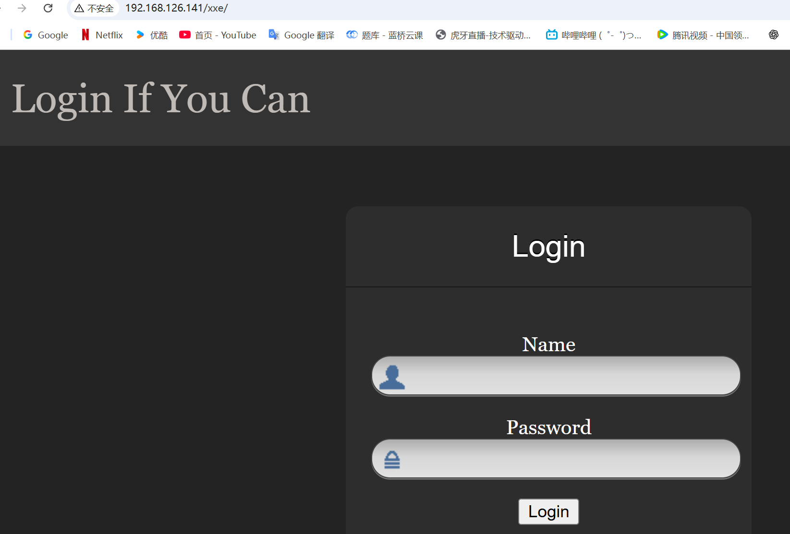

#### 抓包发现 账号密码是通过xml传输

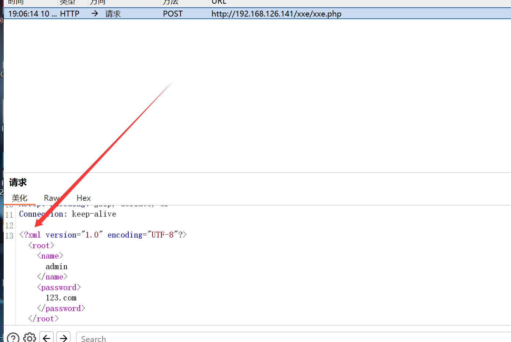

#### 尝试构造payload

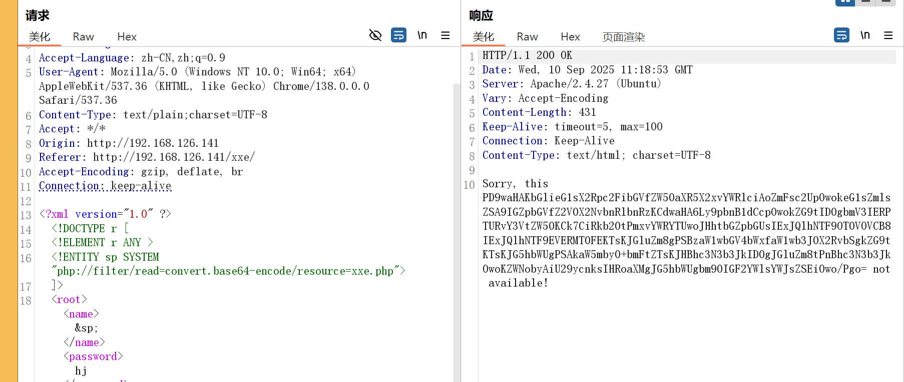

解码，没有什么重要的

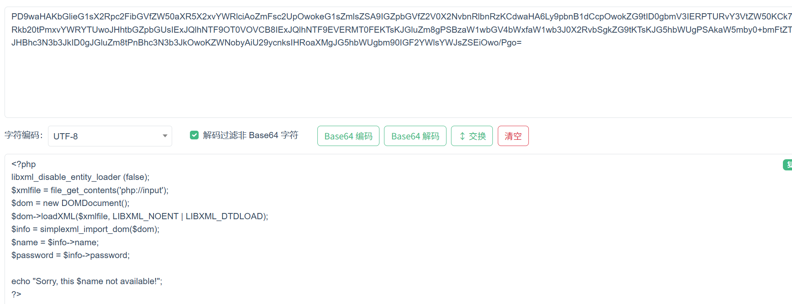

```
尝试看一下robot.txt里面暴露的另一个信息
```


解码

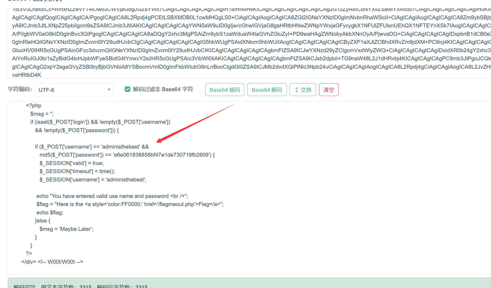

```
  if ($_POST['username'] == 'administhebest' && 
                  md5($_POST['password']) == 'e6e061838856bf47e1de730719fb2609') {
                  $_SESSION['valid'] = true;
                  $_SESSION['timeout'] = time();
                  $_SESSION['username'] = 'administhebest';
```

账号是administhebest  密码是加密过的，尝试解密 密码是 admin@123

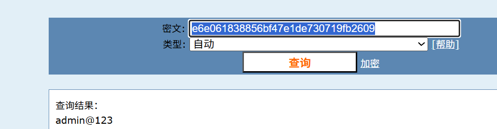


尝试登录

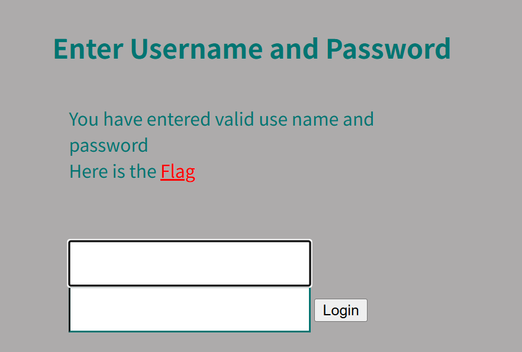

但是又 not found

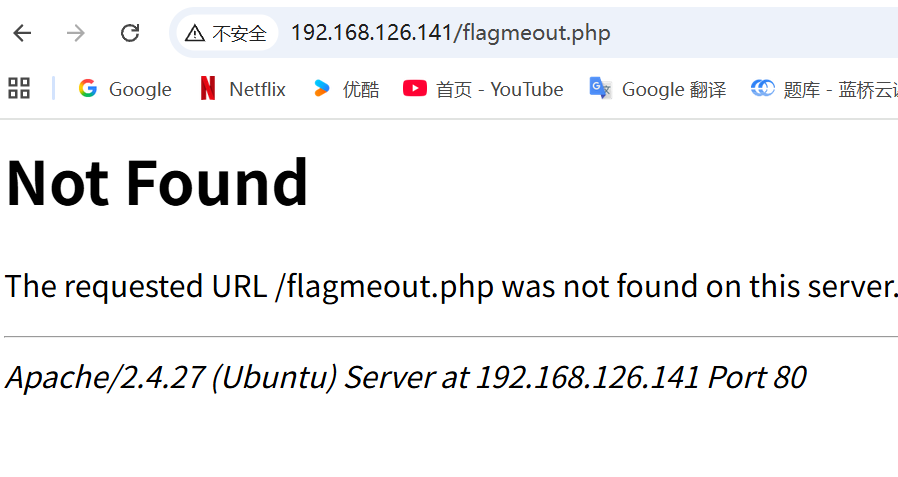

#### 继续尝试用xxe漏洞去读取

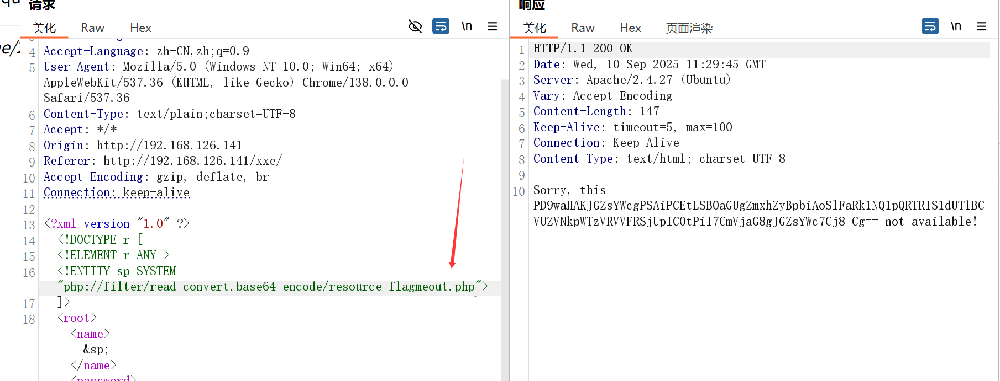


解码

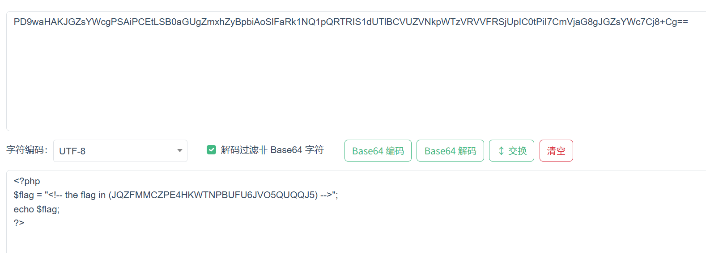


还要二次解密

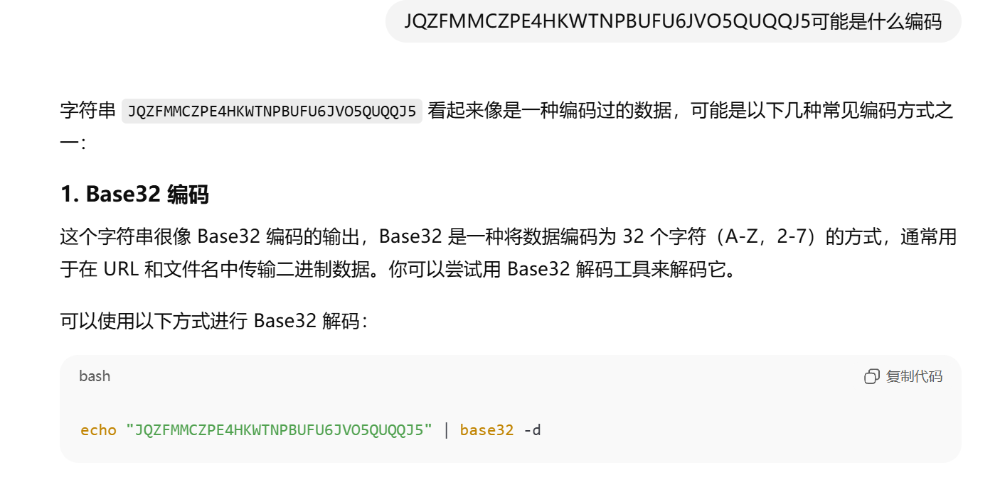

base32解密

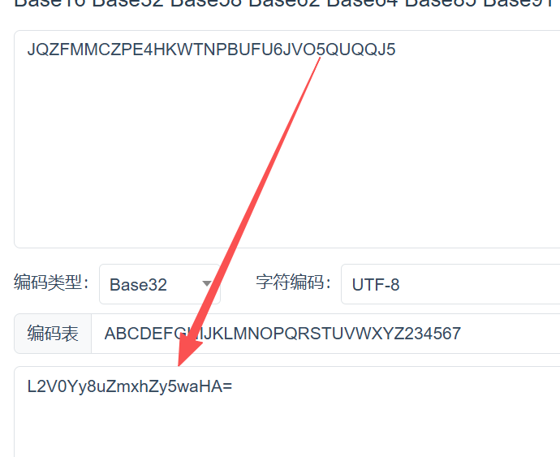

又是=结尾，可能是base64，再次解码

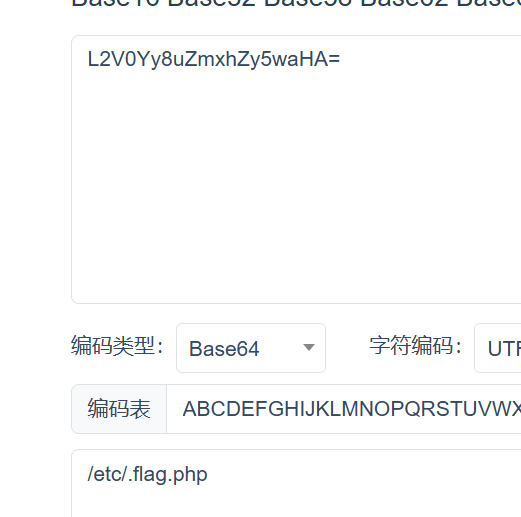

又是not found

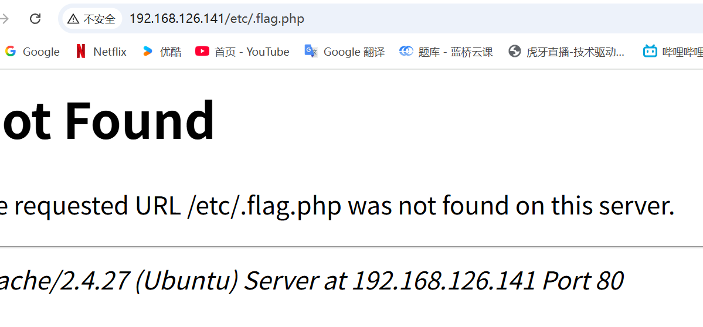

再次xxe读取

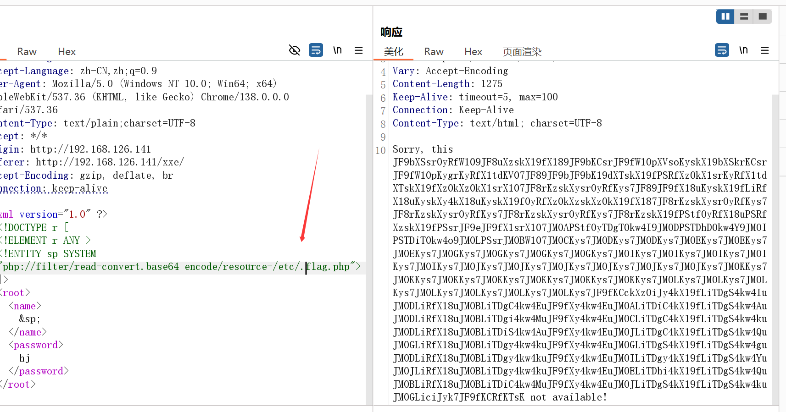

base64解码

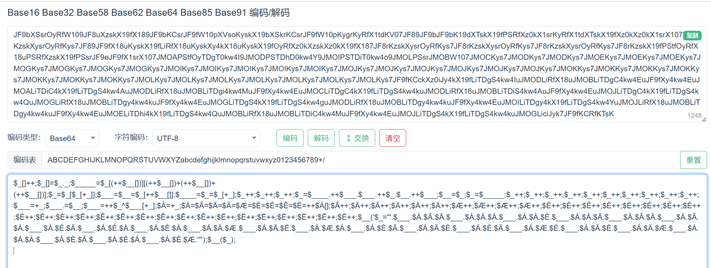

因为本身就是php文件，尝试用php解释器

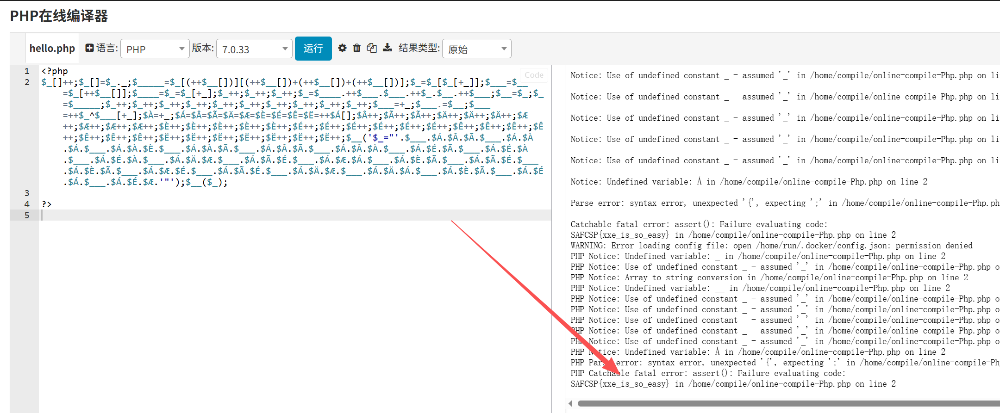

得到flag

```
xxe_is_so_easy
```

