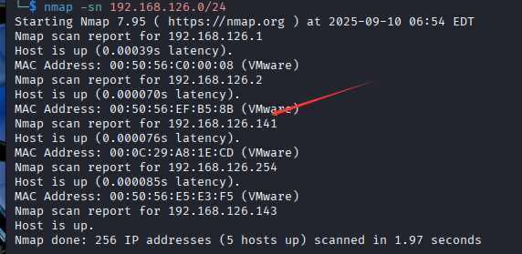
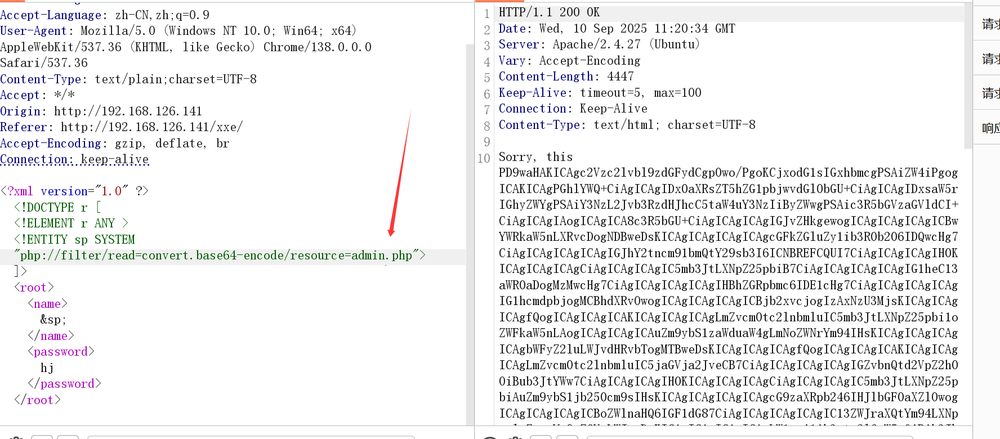

```
nmap -sn 192.168.126.0/24
```




```
nmap -p- 192.168.126.141
```


访问一看，没啥有用的信息


#### 进行目录扫描


依旧是vulnhub标准提示

```
/xxe
/admin.php
```


```
/admin.php不存在？
```


### 访问登录界面


#### 抓包发现 账号密码是通过xml传输


#### 尝试构造payload


解码，没有什么重要的


```
尝试看一下robot.txt里面暴露的另一个信息
```



解码


```
  if ($_POST['username'] == 'administhebest' && 
                  md5($_POST['password']) == 'e6e061838856bf47e1de730719fb2609') {
                  $_SESSION['valid'] = true;
                  $_SESSION['timeout'] = time();
                  $_SESSION['username'] = 'administhebest';
```

账号是administhebest  密码是加密过的，尝试解密 密码是 admin@123


尝试登录


但是又 not found


#### 继续尝试用xxe漏洞去读取


解码


还要二次解密


base32解密


又是=结尾，可能是base64，再次解码


又是not found


再次xxe读取


base64解码


因为本身就是php文件，尝试用php解释器


得到flag

```
xxe_is_so_easy
```

