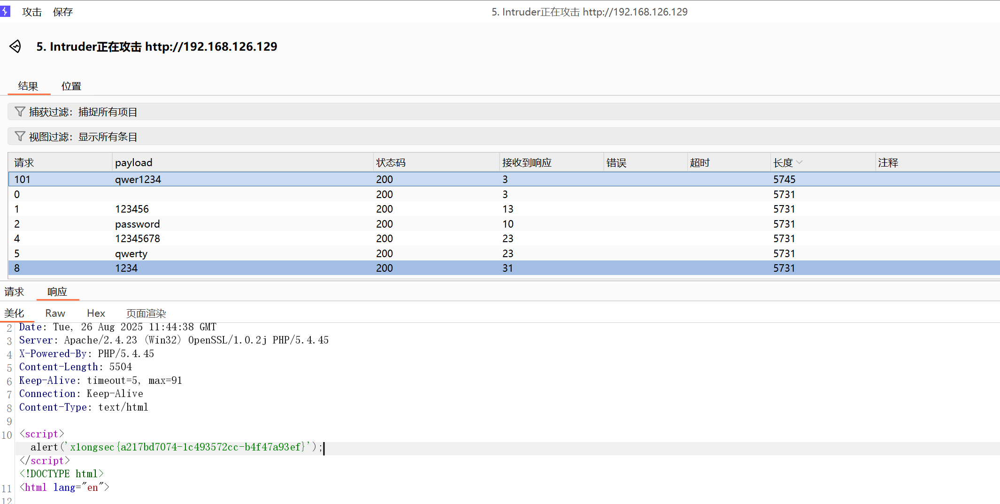
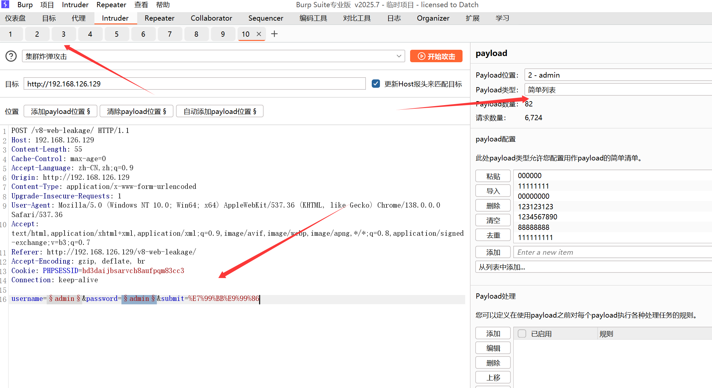

# 第一题 用ai生成密码字典生成脚本

```
请生成一个Python脚本，用于基于个人信息生成1θ00e个个性化密码，要求如下：
1．个性化规则（核心）：
-需支持输入个人信息：姓名（如“张三”）、生日（如“19900101”）、手机号（如“13800138000
－密码需包含以上信息的变形组合，例如：
-姓名拼音首字母（“zs”）+生日后4位（“0101”）+随机字符
-昵称前3位（“zs1”）+手机号后3位（“800）+特殊符号
未
-公司名首字母大写（“ABC”）+出生年份（“1990）+大小写混合字符
-避免直接使用完整个人信息（如不出现完整手机号或生日）
2．密码安全规则：
-长度8-16位（随机变化）
-每个密码必须包含：至少1个大写字母、1个小写字母、1个数字、1个特殊符号（!@#$%^&*）
-自动去重（避免重复密码）
3.性能与输出要求：
-内存占用小：生成1个密码就立即写入文件，不缓存全部密码
-速度快：优化组合逻辑，避免冗余计算
-输出到“personal_passwords.txt”，每行1个密码
-显示生成进度（每1000个打印一次）和总耗时
```


```
import itertools
import random
import string

def generate_passwords(data, min_passwords=1000):
    # 读取输入数据
    names = data['name']  # 姓名简拼、姓名全拼
    english_name = data['english_name']  # 英文名
    username = data['username']  # 用户名
    phone = data['phone']  # 手机号
    qq = data['qq']  # QQ号
    birth_date = data['birth_date']  # 出生日期
    special_number = data['special_number']  # 特殊数字
    email_prefix = data['email_prefix']  # 邮箱前缀
    history_password = data['history_password']  # 历史密码
    partner_names = data['partner_names']  # 伴侣姓名简拼、伴侣姓名全拼
    
    # 字段列表：包含每个输入的不同字段
    all_fields = [
        names, 
        [english_name], 
        [username], 
        [phone], 
        [qq], 
        [birth_date], 
        [special_number], 
        [email_prefix], 
        [history_password], 
        partner_names
    ]
    
    # 所有字段的组合
    all_combinations = []

    # 生成字段的不同形式，增加多样性
    for field in all_fields:
        for item in field:
            # 生成大写、小写、数字替换等多样形式
            all_combinations.append(item.lower())  # 小写形式
            all_combinations.append(item.upper())  # 大写形式
            all_combinations.append(item.title())  # 标题形式
            all_combinations.append(item[::-1])  # 反转字符串
            
            # 随机添加数字和特殊符号
            all_combinations.append(f"{item}{random.randint(10, 99)}")
            all_combinations.append(f"{random.randint(10, 99)}{item}")
            all_combinations.append(f"{item}{random.choice(string.punctuation)}")
            all_combinations.append(f"{random.choice(string.punctuation)}{item}")
    
    # 去重
    all_combinations = list(set(all_combinations))

    # 生成密码组合，确保至少有1000个密码
    password_dict = set()

    while len(password_dict) < min_passwords:
        # 随机选取不同的元素进行组合
        selected_combination = random.sample(all_combinations, 2)  # 选两个进行组合
        password_dict.add(''.join(selected_combination))

    # 返回生成的密码字典
    return password_dict

# 输入信息
data = {
    "name": ["ZH", "ZhangHengFeng"],
    "english_name": "Jack",
    "username": "jackchen123",
    "phone": "13812345678",
    "qq": "12345678",
    "birth_date": "2004-08-12",
    "special_number": "1234",
    "email_prefix": "jack",
    "history_password": "password123",
    "partner_names": ["LXY", "LiXiaoyan"]
}

# 生成密码字典，确保至少有1000个密码
password_dict = generate_passwords(data, min_passwords=1000)

# 输出字典大小
print(f"生成的密码字典包含 {len(password_dict)} 个密码")

# 可以选择输出到文件
with open("password_dict.txt", "w") as f:
    for password in password_dict:
        f.write(f"{password}\n")

```


第二题

burp开启代理，username：admin, password随便输入一个，拦截包


拦截到包，然后发送到intruder


设置鱼叉攻击，并添加变量

提取每次的torken


变量一设置简单爆破


变量2（token）设置为递归提取


并发设置成1


成功进行带token的爆破


## 靶场1 固定账户admin  密码0-9999


爆破出密码为 3781   flag为 x1ongsec{0544b8cbff-82f13668d7-de25581d61}


## 靶场2 弱口令

和第一题一样，换成弱口令字典


结果




## 靶场3

与2同理


## 靶场4 

禁用掉验证码


## 靶场五 md5


# 靶场7  UTF8搜索

还是爆破，但是中文字段搜索


# 靶场8

脚本分开账号密码

```
# 读取原字典文件
with open("wordlist.txt", "r") as file:
    lines = file.readlines()

# 初始化两个列表，存储账号和密码
usernames = []
passwords = []

# 遍历每行，分开账号和密码
for line in lines:
    parts = line.strip().split()  # 使用空格分开
    if len(parts) == 2:  # 确保每行有账号和密码
        usernames.append(parts[0])  # 添加账号
        passwords.append(parts[1])  # 添加密码

# 将分离的账号和密码保存到新文件
with open("usernames.txt", "w") as user_file:
    user_file.write("\n".join(usernames))  # 写入账号到文件

with open("passwords.txt", "w") as pass_file:
    pass_file.write("\n".join(passwords))  # 写入密码到文件

print("账号和密码已经分开并保存到 usernames.txt 和 passwords.txt")

```

## 集群炸弹




# 靶场9   token时间戳？？？


# 靶场10 和一开始一样


